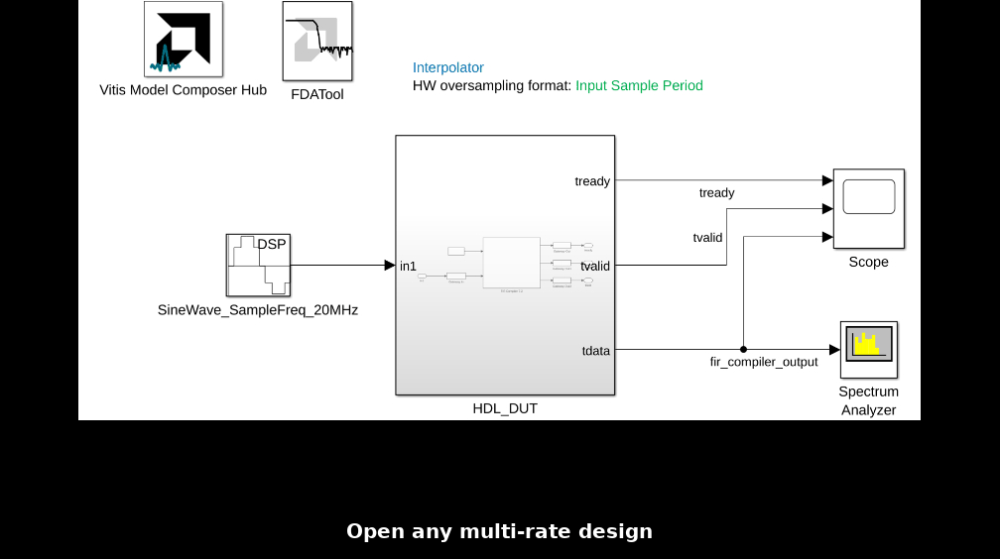

# Debugging Multirate designs

Selecting Sample Frequencies (MHz) in the Hub block helps visualize the available sampling frequencies for input and output ports in your multi-rate design. This is useful for debugging and validating timing.

# How to Debug Sampling requencies in the design ?

1. Open the design that contains multiple sample rates using one of the following:

    - At the MATLAB command prompt, type `interpolator.slx`
    - Double-click **interpolator.slx** in the Current Folder browser.

2. After opening the design, locate and open the Vitis Model Composer Hub block.

3. Double-click the Hub block and navigate to the Analyze tab.

4. In the Block Icon Display dropdown, choose `Sample Frequencies (MHz)`.

5. Click `Update the model` to apply the changes.

6. Input and output ports will now display their respective sampling frequencies in MHz.

The animation below demonstrates how to display sampling frequencies in the design:

**Input Sampling Frequency:** 20 MHz

**Output Sampling Frequency:** 100 MHz

**Note:** Ensure that the FPGA clock period in the Hub block matches the Simulink system period. Otherwise, the displayed sample frequencies across the design may not be accurate.

# Conclusions

:bulb: This feature provides a quick visual check of input and output sampling rates, making it easier to debug multi-rate designs and ensure correct timing.

