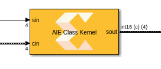
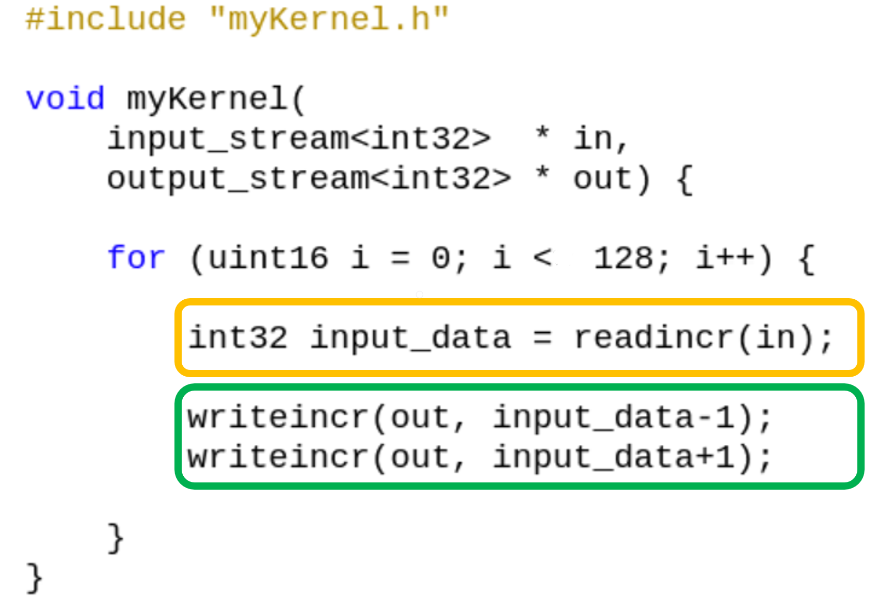
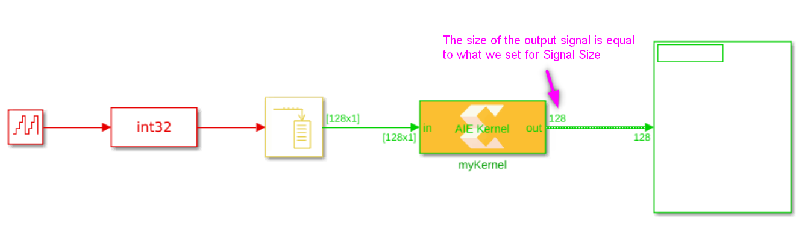

# How to properly set the Signal Size property on AI Engine kernel blocks with stream or cascade output?

This short tutorial goes over how to optimally set the signal size for AI Engine kernels with stream input and output. 

# What is "Signal Size"?

Signal Size is a block mask property assocaited with each stream or cascade output of an imported AI Engine block. 
This value is always set as samples and not bytes. Here is an example of  block mask for a kernel with a stream output.

In the case above, the stream output of this block will be a variable-size signal with a maximum size of 4 samples as shown below:

# How to set "Signal Size"?

# Example 1
Let's look at the following kernel function we are importing:

In each iteration of the for loop, we consume 16 samples and produce 16 samples (assume NSamples is equal to 16 for now).

## Feeding four samples at a time to the block

### Setting the "Signal Size" property to 4
If you feed four samples to this block, upon invocation of the block, the block produces four samples and the AI Engine kernel stalls on the second "readincr_v4" until the block gets invoked with another four samples. In this case you would normally set the output sample size to 4. And the block will produce a variable-size signal of maximum size four that will carry four samples at all time. (the variable-size signal is full). 

### Setting the "Signal Size" property to larger than 4
If you set the signal size to a value larger than 4, for example 8, the output will be a variable size signal with maximum size of 8 samples that carries only 4 samples. While numerically these values will be the same as when you set the signal size to 4, displaying the signal say on a scope will not be ideal as the scope will plot the four samples and leave empty spaces for the other void samples. 

### Setting the "Singal Size" property to smaller than 4
If in this case you set the singal size to a number smaller than 4, say 2, the kernel will still produce 4 samples. 
However two will be saved in an internal buffer to the block and only two will be presented in the output signal. 
In this case, if the simulation runs for long enough time, eventually the internal buffer will fill up and the simulation will stop.

## Feeding more than 4 samples at a time to the block
While you can feed four samples and produce four samples for the example above, it is best if you feed the block with at least 16 samples or multiples of 16 samples. 
This will reduce the overhead of calling the block many times and will increase the simulation speed. 
For example if you feed the kernel with 16 samples, you would want to set the output signal size to also 16 to both have a full variable-size signal 
(in case you want to view the signal on a scope) and also avoid memory overflows.

# Example 2
Here is another example of a kernel function we are importing into Vitis Model Composer:

  

And below is a screenshot of a design including this kernel:

  
The input signal size to the block is 128 samples. As such, at each invocation of the block, the kernel will consume all 128 samples and produces 256 samples. If we set the _Signal Size_ parameter for the output to a number smaller than 256 (say 128 as shown in the design above) and run the simulation long enough, eventually the internal buffer for the output port will fill up. The reason is that at each invocation of the kernel, the kernel will produce 256 samples, but we are only presenting 128 samples in Simulink and storing the rest in the internal buffer for the output port. At this point, the kernel can no longer write to the internal buffer for the output port and will block at one of the _wrtieincr_ functions. However, the input will continue to arrive to the kernel. Since the kernel is stalled, eventually the internal buffer for the input buffer port will also fill up and the simulation will stop with an error indicating the input buffer is full. 

# Conclusions
:bulb: Inspect the AI Engine kernel code to decide on the size of the "Signal Size" property.

:bulb: If possible avoid having a variable-size signal that is not full.

:bulb: If you set the "Signal Size" parameter to smaller than what it should be, you may encounter buffer overflow. 

