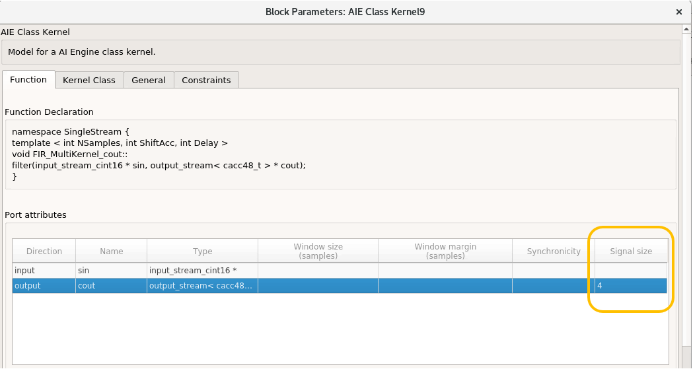
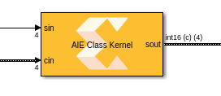
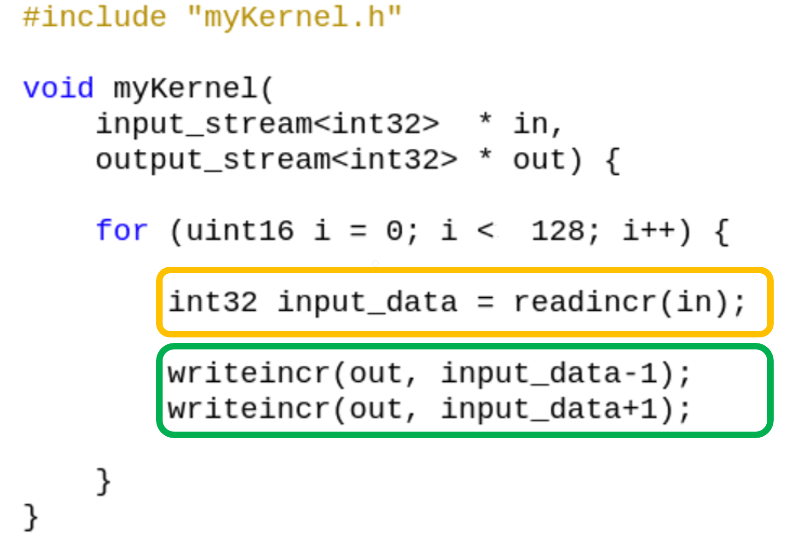
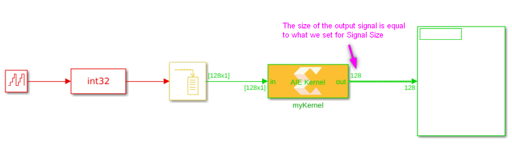
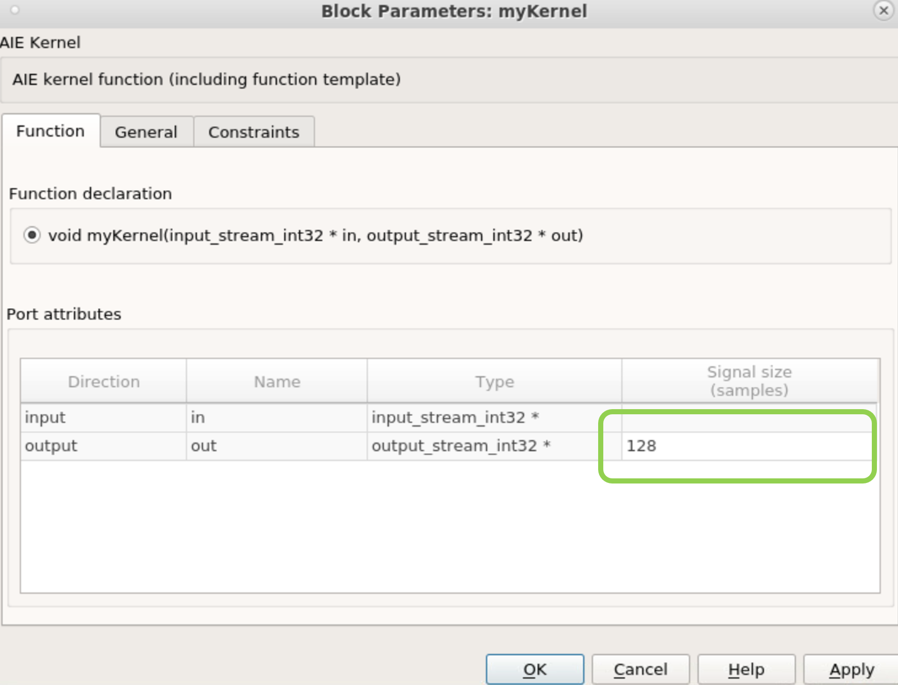
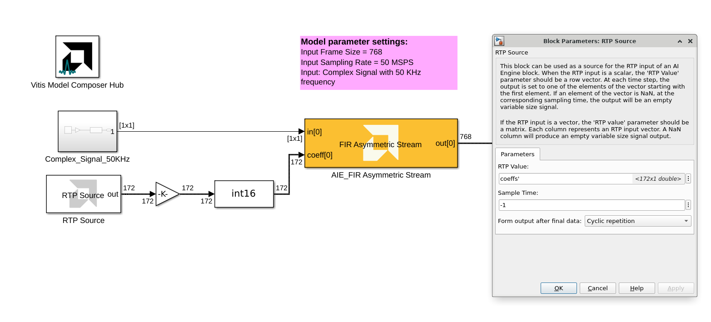
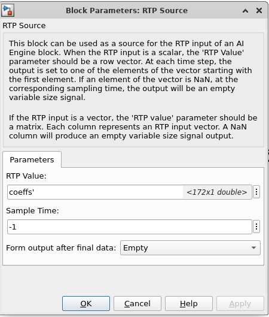
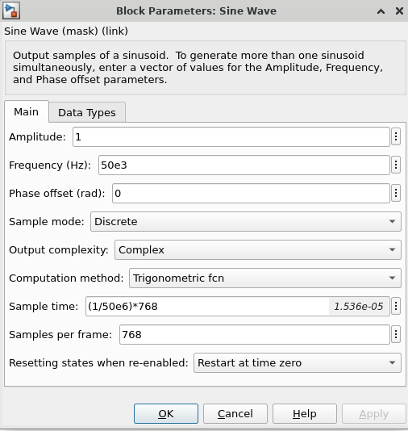

# How to properly set the Signal Size property on AI Engine blocks with stream or cascade output?

This short tutorial goes over how to optimally set the signal size for AI Engine blocks. These include kernels with stream input and output, as well as Run-Time Parameter (RTP) ports.

## What is "Signal Size"?

Signal Size is a block mask property associated with each stream or cascade output of an imported AI Engine block. This property is used only in Simulink simulation and is not reflected in the generated code. This value is always set as samples and not bytes. Here is an example of the block mask for a kernel with a stream output.

In the example above, the stream output of this block will be a [variable-size signal](../Variable_Size_Signals/README.md) with a maximum size of 4 samples as shown below:

## How to set "Signal Size"?

### Example 1 - Stream Inputs and Outputs

Here is an example of a kernel function we are importing into Vitis Model Composer:

  
And below is a screenshot of a design including this kernel:

The input signal size to the block is 128 samples. As such, at each invocation of the block, the kernel will consume all 128 samples (128 calls to _readincr_) and produce 256 samples (256 calls to _writeincr_). 

If we set the _Signal Size_ parameter for the output to a number smaller than 256 (say 128 as shown below) and run the simulation long enough, eventually the internal buffer for the output port will fill up. The reason is that at each invocation of the kernel, the kernel will produce 256 samples, but only 128 samples will be consumed by Simulink. The remaining samples will be stored in the kernel's internal buffer for its output port. 

Once the internal buffer for the output port fills up, the kernel can no longer write to it and will block at one of the _writeincr_ function calls. However, input samples will continue arriving to the kernel. Since the kernel is stalled, eventually its internal buffer for the input port will also fill up and the simulation will stop with an error indicating the input buffer is full.

The animation below demonstrates how buffer overflow occurs when the signal size is set to a value smaller than the number of samples that the kernel produces.

To avoid buffer overflows, ensure that you set the Signal Size property to a value equal to or greater than the number of the samples produced by the kernel on each invocation. If Signal Size is set to a larger value, the output will contain empty samples.

### Example 2 - Run-Time Parameters

Consider the following model with a FIR block with reloadable coefficients (RTP input):

We can observe the following simulation error: 

`ERROR-XMC-9003: Imminent buffer overflow on input coeff[0].
 Tried to write 688 bytes but succeeded in writing only 432 bytes.`

#### Scenario

- FIR input frame size = 768 samples

- Feed the block 1 sample per frame at 50 MHz

- Each frame update also provided a new set of coefficients (same values repeated)

Because the kernel processes data in 768-sample frames, the block was invoked 768 times before it could accumulate enough samples to run the kernel once. Each invocation added another coefficient frame into the RTP buffer. Eventually, the buffer filled up, causing a buffer overflow.

#### How to Fix Buffer Overflow issue?

You can use either of the following methods to avoid the buffer overflow issue:

**Method 1: Use an RTP Source Block:**

- Provide the coefficients once at sample time zero, and send empty frames thereafter.

- Since the RTP port is asynchronous, the FIR continues to use the initial coefficients, avoiding repeated writes and buffer accumulation.

**Method 2: Match the Frame Configuration:**

- Feed the FIR with 768 samples per frame (its input frame size).

- Set the sample time to `(1 / sample_rate) × frame_size`.

# Conclusions

:bulb: Inspect the AI Engine kernel code to decide on the size of the "Signal Size" property.

:bulb: If possible avoid having a variable-size signal that is not full.

:bulb: If you set the "Signal Size" parameter to smaller than what it should be, you may encounter buffer overflow. 

--------------

Copyright (c) 2025 Advanced Micro Devices, Inc.