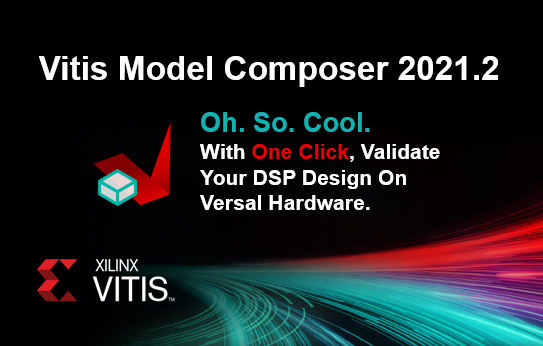

# Rapid design exploration using Vitis Model Composer

Vitis Model Composer provides a library of performance-optimized blocks for design and implementation of DSP algorithms on Xilinx devices. The Vitis Model Composer AI Engine, HLS and HDL libraries within the Simulink environment, enable the rapid design exploration of an algorithm and accelerates the path to production.

# How to access the examples and quick guides?
    
We are storing and managing Vitis Model Composer examples in GitHub. This way, users will have access to the most up-to-date examples. You can get the examples from GitHub. However we recommend you get them directly from Vitis Model Composer.

Click [here](./QuickGuides/Get_Examples/README.md) to learn how to access Vitis Model Composer examples.

# Explore Vitis Model Composer Examples

<table style="width:100%"; border: none>
 <tr>
 <td align="center">

     
 

 <td align="center"> <td align="center">

 </tr>
 <tr>
 <td align="center">

 <td align="center"> <td align="center">

 </tr>
</table>
    
# HLS Examples

<table style="width:100%">
 <tr>
 <td width="35%" align="center"><b>Topic</b>
 <td width="65%" align="center"><b>Description</b>
 </tr>
 <tr>
 <td align="left">
   <a href="./HLS/Examples/color_detection/README.md">Color Detection</a>
 </td>
 <td>This example demonstrates color detection on an input video. </td>
 </tr>
 <tr>
 <td align="left">
   <a href="./HLS/Examples/fir_import/README.md">Importing FIR Filter into Model Composer</a>
 </td>
 <td>This example demonstrates a 103 tap symmetric FIR filter </td>
 </tr>
 <tr>
 <td align="left">
   <a href="./HLS/Examples/import_function/README.md">Import Function feature examples</a>
 </td>
 <td>This is a set of simple examples to demonstrate importing C/C++ functions into Model Composer as a blocks.</td>
 </tr>
 <tr>
 <td align="left">
   <a href="./HLS/Examples/optical_flow/README.md">Optical Flow</a>
 </td>
 <td>This example demonstrates an implementation of dense optical flow in Model Composer.</td>
 </tr>
 <tr>
 <td align="left">
   <a href="./HLS/Examples/sobel_edge_detection/README.md">Sobel Edge Detection</a>
 </td>
 <td>This example demonestrates an implemntation of sobel edge detection algorithm in Model Composer
 </td>
 </tr>
 <tr>
 <td align="left">
   <a href="./HLS/Examples/video_frame_rotation/README.md">Video Frame Rotation</a>
 </td>
 <td>This example demonstrates rotating video frames by a certain angle in Model Composer.
 </td>
 </tr>
 </table>

# Quick Guides
 
 <table style="width:100%">
 <tr>
 <td width="35%" align="center"><b>Topic</b>
 <td width="65%" align="center"><b>Description</b>
 </tr>
 <tr>
 <td align="left">
   <a href="./QuickGuides/Variable_Size_Signals/README.md">What are Variable-Size Signals?</a>
 </td>
 <td>All you need to know about Variable-Size Signals in Simulink.
 </td>
 </tr>
 
 <tr>
 <td align="left">
   <a href="./QuickGuides/Setting_Signal_Size/README.md">How to properly set the Signal Size property on AI Engine kernel blocks with stream or cascade outputs?</a>
 </td>
 <td>Setting the signal size property for AI Engine kernels with stream and cascade outputs.
 </td>
 </tr>
    
 <tr>
 <td align="left">
   <a href="./QuickGuides/Connecting_AIE_to_HDL/README.md">Connecting AI Engine blocks with HDL blocks</a>
 </td>
 <td>Setting the properties of the AIE to HDL and HDL to AIE blocks can be tricky. This tutorial explains how to set these parameters.
 </td>
 </tr>
    
 </table>

# Videos
<table style="width:100%">
<tr>
    <td width="100%" align="center"><b>Design for Versal AI Engines (20 minutes)</b>
</tr>  
<tr>
<td width="100%" align="center">
</tr>
</table>

## What's new in 2021.2?

### AI Engines 
* With a click of a button,  run a design with AI Engines and PL (HLS, HDL) blocks into a Versal AI Core hardware. 
* Significant speed up in Simulink simulation by parallel compilation of AIE blocks.
* Enhancements to AI Engine constraint editor
* Addition of DDS and Mixer blocks in the AIE DSP library.
* Enhancements to "to fixed size" and "to variable size" blocks. 
* Support of int64 and uint64 data types.
* Support for accfloat and caccfloat
* Enhancement to GitHub examples and incorporation of HLS examples in GitHub
* Generated data flow graph code now includes PLIO specification
* Enhanced usability to download and browse examples from GitHub.
* Support for AIE source blocks.
* xmcVitisRead and xmcVitisWrite utilities to read/write data files for AIE Simulator and/or x86Simulator
* Systematize GUI parameters of AIE dsplib blocks
* New 64x32 Pseudo Inverse design example.
* New Dual-Stream SSR Filter example with 64 AI Engine kernels and upto 16 GSPS throughput.  
### HDL
* Support of Asymmetric read/write data widths for FIFO block
### HLS
* Supports simulation and implementation of HLS based C code that utilizes the Xilinx FIR, FFT, DDS Logicores
### General
* MATLAB Support - R2020a, R2020b, and R2021a
* Newly added support for Ubuntu 20.04
  

--------------
Copyright 2022 Xilinx

Licensed under the Apache License, Version 2.0 (the "License");
you may not use this file except in compliance with the License.
You may obtain a copy of the License at

    http://www.apache.org/licenses/LICENSE-2.0

Unless required by applicable law or agreed to in writing, software
distributed under the License is distributed on an "AS IS" BASIS,
WITHOUT WARRANTIES OR CONDITIONS OF ANY KIND, either express or implied.
See the License for the specific language governing permissions and
limitations under the License.
