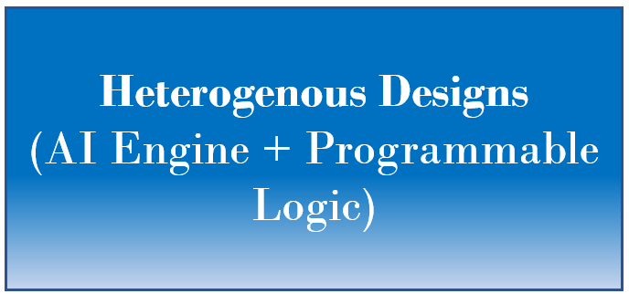
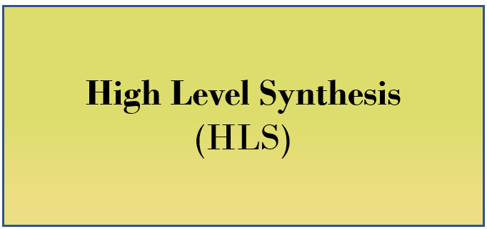

# Rapid design exploration using Vitis Model Composer

Vitis Model Composer provides a library of performance-optimized blocks for design and implementation of DSP algorithms on Xilinx devices. The Vitis Model Composer AI Engine, HLS and HDL libraries within the Simulink environment, enable the rapid design exploration of an algorithm and accelerates the path to production.

# How to access the examples and quick guides?
    
We are storing and managing Vitis Model Composer examples in GitHub. This way, users will have access to the most up-to-date examples. You can get the examples from GitHub. However we recommend you get them directly from Vitis Model Composer.

Click [here](./QuickGuides/Get_Examples/README.md) to learn how to access Vitis Model Composer examples.

# Explore Vitis Model Composer Examples

<table style="width:100%"; border: none>
 <tr>
 <td align="center">

     
 

 <td align="center"> <td align="center">

 </tr>
 <tr>
 <td align="center">

     

 <td align="center"> <td align="center">

     

 </tr>
</table>
    
# Quick Guides

<table style="width:100%"; border: none>
 <tr>
 <td align="center">

     
 

 </tr>
 </table>

# Videos
<table style="width:100%">
<tr>
    <td width="100%" align="center"><b>Design for Versal AI Engines (20 minutes)</b>
</tr>  
<tr>
<td width="100%" align="center">
</tr>
</table>

--------------
Copyright 2022 Xilinx

Licensed under the Apache License, Version 2.0 (the "License");
you may not use this file except in compliance with the License.
You may obtain a copy of the License at

    http://www.apache.org/licenses/LICENSE-2.0

Unless required by applicable law or agreed to in writing, software
distributed under the License is distributed on an "AS IS" BASIS,
WITHOUT WARRANTIES OR CONDITIONS OF ANY KIND, either express or implied.
See the License for the specific language governing permissions and
limitations under the License.
