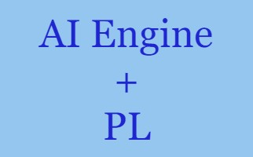
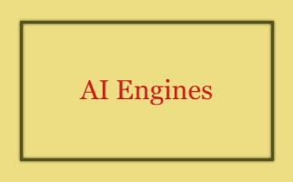
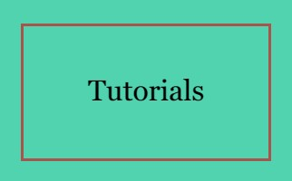
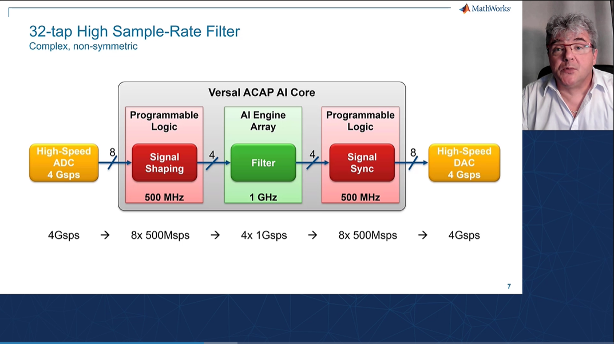

# Rapid design exploration using Vitis Model Composer

Vitis Model Composer provides a library of performance-optimized blocks for design and implementation of DSP algorithms on Xilinx devices. The Vitis Model Composer AI Engine, HLS, and HDL libraries within the Simulink environment, enable the rapid design exploration of an algorithm and accelerates the path to production.

# How to access the examples and tutorials?
    
We are storing and managing Vitis Model Composer examples and tutorials in GitHub. This way, users will have access to the most up-to-date material. You can get the examples and tutorials from GitHub. However, we recommend you get them directly from Vitis Model Composer.

Click [here](./QuickGuides/Get_Examples/README.md) to learn how to access Vitis Model Composer examples and tutorials.

# What is new?
* Take a look at the latest [tutorial series](./Tutorials) on AI Engines. This set of tutorials provides an excellent introduction to AI Engines and guides you through the process of developing a DSP algorithm on AI Engines using Vitis Model Composer.
* The new [Channelizer](./Examples/AIENGINE_plus_PL/AIE_HLS/Channelizer) example implements a high-speed channelizer design using a combination of AI Engine and Programmable Logic (PL) resources in Versal devices.
* The [filtering in frequency doamin]( /Examples/AIENGINE/Filtering_in_frequency_domain/) design showcases filtering in frequency domain in AI Engines and also shows how to increase the throughput using different techniques.

# Examples

    
  
  
  

# Tutorials

   

    
# Quick Guides

   

# Videos
<table style="width:100%">
<tr>
    <td width="100%" align="center"><b>Design for Versal AI Engines (20 minutes)</b>
</tr>  
<tr>
<td width="100%" align="center">
</tr>
</table>

--------------
Copyright 2022 Xilinx

Licensed under the Apache License, Version 2.0 (the "License");
you may not use this file except in compliance with the License.
You may obtain a copy of the License at

    http://www.apache.org/licenses/LICENSE-2.0

Unless required by applicable law or agreed to in writing, software
distributed under the License is distributed on an "AS IS" BASIS,
WITHOUT WARRANTIES OR CONDITIONS OF ANY KIND, either express or implied.
See the License for the specific language governing permissions and
limitations under the License.
