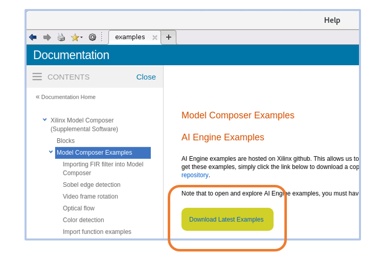
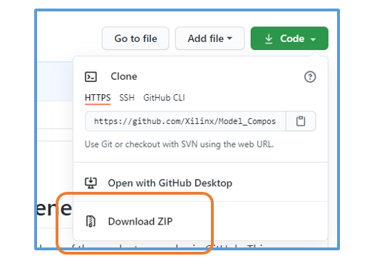
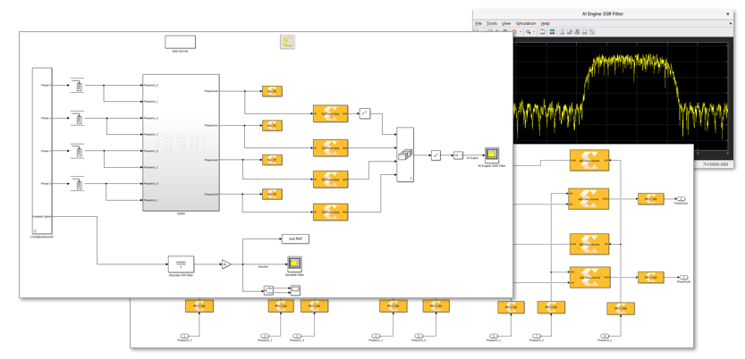

# Vitis Model Composer


## How to access the content of this repository?
    
Starting from the 2020.2 version, we are storing and managing a subset of the product examples in GitHub. This way, users will always have access to the latest and most up-to-date examples. You can get the examples from this repository or directly from the tool.

<details>
  <summary>Click here to learn more!</summary>
  
<br/>:warning:**To see the examples for older versions of the tool in GitHub, switch to the branch corresponding to your version of Model Composer by clicking 'main' above**


To get the examples and explore them in Model Composer, use one of the three methods below:

## Directly download the examples from Model Composer
This is the recommended way to get the latest examples for Model Composer. Type 'doc' in the MALTAB command window. In the 'Supplemental Software' section, click on 'Xilinx Model Composer', and then click on 'Model Composer Examples'. This method will automatically get you the right version of the examples.


## Clone this repository
You can directly use git locally to clone this repository or use [MATALB git integration](https://www.mathworks.com/help/simulink/ug/clone-git-repository.html). After you clone this repository, switch the branch to the version of the Model Composer version you have. For example:
```
git checkout 2020.2
```

## Download a zipped version directly from GitHub
First switch to the branch corresponding to the version of Model Composer you have. Then click "Download ZIP".


</details>

## AI Engine Examples

<table style="width:100%">
 <tr>
 <td width="35%" align="center"><b>Topic</b>
 <td width="65%" align="center"><b>Description</b>
 </tr>
 <tr>
 <td align="left">
   <a href="./Importing_AIE_blocks/README.md">Importing Kernels and Graphs into Model Composer</a>
 </td>
 <td>Examples on importing Kernels and Graphs into Model Composer as blocks. This include importing templatized class based kernels, templatized AI Engine functions, and graphs. </td>
 </tr>
 <tr>
 <td align="left">
   <a href="./Run_Time_Parameters/README.md">Run time parameters (RTP)</a>
 </td>
 <td>Examples of kernels with RTP input. RTP inputs can be sync or async. </td>
 </tr>
 <tr>
 <td align="left">
   <a href="./DSPlib/README.md">DSP Functions</a>
 </td>
 <td>AI Engine FIR filters, importing FFT and Matrix Multiply as a graph into Model Composer.</td>
 </tr>
 <tr>
 <td align="left">
   <a href="./AIE_HDL/README.md">Designs with both AI Engine and RTL blocks</a>
 </td>
 <td>Examples of designs with both AI Engine kernels and RTL functions. Here you can see examples of importing RTL code into Model Composer and co-simulation with AI Engine   blocks at high speeds.
 </td>
 </tr>
 <tr>
 <td align="left">
   <a href="./AIE_HLS/README.md">Design with both AI Engines and HLS kernels</a>
 </td>
 <td>Example of a design with both AI Engine kernels and an HLS kernel.
 </td>
 </tr>
 </table>
 
 ## Design Examples
 
 <table style="width:100%">
 <tr>
 <td width="35%" align="center"><b>Topic</b>
 <td width="65%" align="center"><b>Description</b>
 </tr>
 <tr>
 <td align="left">
   <a href="./Designs/SingleStreamSSR_FIR">Super Sample Rate FIR filter</a>
 </td>
 <td> This design showcases a Super Sample Rate FIR filter to process a 4GSPS input stream. In this design we also compare the output of our AI Engine subsystem with the output of a Simulink FIR block (our golden refernece) both in time and in frequency. 
 </td>
 </tr>
 </table>

  ## Mini Tutorials
 
 <table style="width:100%">
 <tr>
 <td width="35%" align="center"><b>Topic</b>
 <td width="65%" align="center"><b>Description</b>
 </tr>
 <tr>
 <td align="left">
   <a href="./Variable_Size_Signals/README.md">What are Variable-Size Signals?</a>
 </td>
 <td>All you need to know about Variable-Size Signals in Simulink.
 </td>
 </tr>
 
 <tr>
 <td align="left">
   <a href="./Setting_Signal_Size/README.md">How to properly set the Signal Size property on AI Engine kernel blocks with stream or cascade outputs?</a>
 </td>
 <td>Setting the signal size property for AI Engine kernels with stream and cascade outputs.
 </td>
 </tr>
 </table>

## What's new in 2020.2?
### Model Composer and System Generator are unified and you can have blocks from both in the same design
  * Cosimulate AI Engines blocks and System Generator HDL based blocks.
  * Import VHDL and Verilog code using System Generator black box and cosimulate with AI Engine blocks.
  
### Support for [Versal](https://www.xilinx.com/products/silicon-devices/acap/versal.html) AI Engines
* Developing algorithms for AI Engines is now much simpler with Model Composer. Here is a subset of new features that were added:
  * Design AI Engine based algorithms by importing AI Engine kernels into Model Composer as blocks
  * Use optimized AI Engine blocks such as FIR filters directly from the library browser
  * Run functional simulation
  * Use MATLAB and Simulink powerful visualization tools to view signals between AI Engine blocks and analyze them in MATLAB workspace
  * Generate graph code
  * Run cycle accurate system C simulation
  * Generate test benches
  
  
<p align="center">

</p>

--------------
Copyright 2020 Xilinx

Licensed under the Apache License, Version 2.0 (the "License");
you may not use this file except in compliance with the License.
You may obtain a copy of the License at

    http://www.apache.org/licenses/LICENSE-2.0

Unless required by applicable law or agreed to in writing, software
distributed under the License is distributed on an "AS IS" BASIS,
WITHOUT WARRANTIES OR CONDITIONS OF ANY KIND, either express or implied.
See the License for the specific language governing permissions and
limitations under the License.
