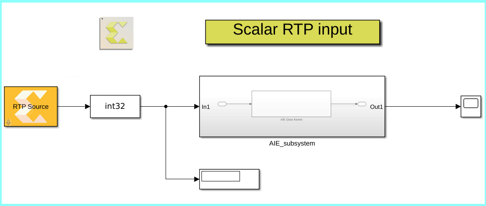

# Scalar Run Time Parameter (RTP)
This is an example of an AIE Kernel that is controlled by a synchronous RTP input. Note that the kernel produces results only if there is an input RTP value. When there is no input RTP, i.e. the input variable size signal is empty, the kernel produces no output.

It is best to run this model step by step in Simulink and observe the RTP input value and the output of the kernel on the scope. 

## Knowledge nuggets
:bulb: For a synchronous RTP input, when there is no RTP triggering the kernel at a cycle, the kernel does not execute. This behavior is similar to the behavior of the hardware. 

:bulb: For its functionality, this kernel needs persistent variables. Note how this is coded in the 'dds' class as class parameters. 

:bulb: Note the usage of 'RTP Source' block which can be used as a source of the RTP input of an AI Engine block.

------------
Copyright 2020 Xilinx

Licensed under the Apache License, Version 2.0 (the "License");
you may not use this file except in compliance with the License.
You may obtain a copy of the License at

    http://www.apache.org/licenses/LICENSE-2.0

Unless required by applicable law or agreed to in writing, software
distributed under the License is distributed on an "AS IS" BASIS,
WITHOUT WARRANTIES OR CONDITIONS OF ANY KIND, either express or implied.
See the License for the specific language governing permissions and
limitations under the License.
