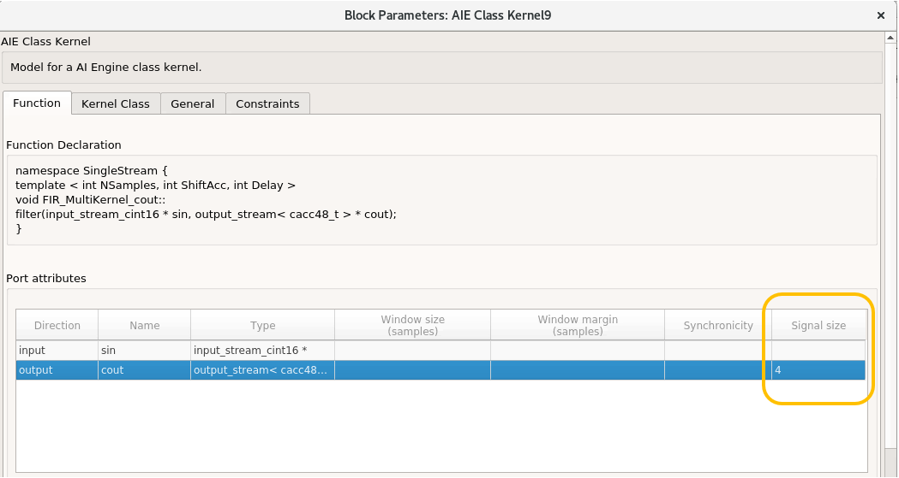

# How to properly set the Signal Size property on AI Engine kernel blocks?

This short tutorial goes over how to optimally set the signal size for AI Engine kernels with stream input and output. 

# What is "Signal Size"?

Signal Size is a field in the imported AI Engine block mask when the kernel has a stream or cascade output. 
This value is always set as samples and not bytes. Here is an example of  block mask for a kernel with a stream output.

The stream output of this block will be a variable-size signal with a maximum size of 4 samples as shown below:

# How to set "Sample Size"?

Let's look at the kernel function for a kernel we are importing:

In each iteration of this for loop, we consume 16 samples and produce 16 samples (assume NSamples is equal to 16 for now). 
If you feed four samples to this block, upon invocation of the block, the block produces four samples and the AI Engine kernel stalls on the second "readincr_v4" until the block gets invoked with another four samples. In this case you can set the output sample size to 4. If you set it to a value larger than 4, for example 8, the output will be a variable size signal with maximum size of 8 samples that carries only 4 samples. While numerically these values will be the same as if when you set the signal size to 4, displaying the signal say on a scope will not be ideal as the scope will plot the four samples and leave empty spaces for the other void samples. If in this case you set the sample size to a number smaller than 4, say 2, the kernel will still produce 4 samples. 
However two will be saved in an internal buffer to the block and only two will be presented in the output signal. 
In this case, if the simulation runs for long enough time, eventually the internal buffer will fill up and the simulation will stop.

While you can feed four samples and produce four samples for the example above, it is best if you feed the block with at least 16 samples or multiples of 16 samples. 
This will reduce the overhead of calling a block many times and will increase the simulation speed. 
For example if you feed the kernel with 16 samples, you would want to set the output signal size to also 16 to both have a full variable-size signal 
(in case you want to view the signal on a scope) and also avoid memory overflows. 

# Conclusions
:bulb: Inspect the AI Engine kernel code to decide on the size of the "Signal Size" property.

:bulb: If possible avoid having a variable-size signal that is not full.

:bulb: If you set the "Signal Size" parameter to smaller than what it should be, you may encounter buffer overflow. 

