<table class="sphinxhide" width="100%">
 <tr width="100%">
    <td align="center"><h1>AI Engine Development</h1>
    <a href="https://www.xilinx.com/products/design-tools/vitis.html">See Vitis™ Development Environment on xilinx.com</br></a>
    <a href="https://www.xilinx.com/products/design-tools/vitis/vitis-ai.html">See Vitis™ AI Development Environment on xilinx.com</a>
    </td>
 </tr>
</table>

# Connecting AI Engine and HLS Subsystems

This tutorial will explore how to model heterogeneous systems (consisting of AI Engine and PL components) in Vitis Model Composer.

This tutorial will show how to use the **AIE to HLS** and **HLS to AIE** blocks to connect the HLS and AIE simulation domains to accurately model how the AIE-PL interface will behave in hardware. 

## Review the Tutorial Model

1. Open the model `AIE_HLS.slx`. 

2. Right-click on an empty part of the canvas. In the context menu that displays, ensure that the following options are selected:
* **Sample Time Display -> All**
* **Other Displays -> Signals & Ports -> Signal Dimensions**
* **Other Displays -> Signals & Ports -> Port Data Types**.

3. On the **Modeling tab**, select **Update Model**.

4. Open the **Timing Legend** by pressing `Ctrl+J`.

This model implements a simple passthrough design that sends integer data from the PL to the AI Engine and back.

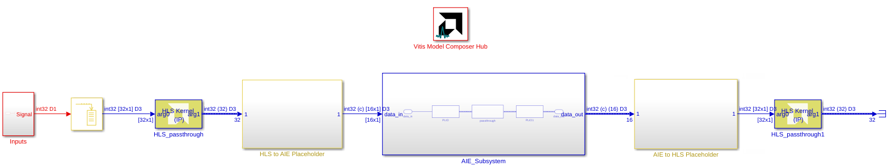

The interfaces between the AI Engine and HLS parts of the design are initially implemented with placeholder blocks. In this tutorial, we will see how to replace these placeholders with the **HLS to AIE** and **AIE to HLS** blocks.

## HLS Kernel Block

In order to interface a PL kernel written in HLS with an AI Engine design, the PL kernel must be brought into Vitis Model Composer using the **HLS Kernel** block. This block lets you import HLS C/C++ code that is compiled and executed when simulating the Simulink model. The simulation of the HLS Kernel in Simulink is not cycle-accurate.

>**IMPORTANT:** Vitis Model Composer also allows you to import HLS code into your design using the `xmcImportFunction`, or to build a design out of blocks from the HLS block library. **These approaches are not supported for connecting an HLS design to the AI Engine.** For a detailed discussion on the differences between these approaches and using the **HLS Kernel** block, see [Interconnecting AI Engines and HLS Kernels](https://docs.xilinx.com/r/en-US/ug1483-model-composer-sys-gen-user-guide/Interconnecting-AI-Engines-and-HLS-Kernels) in the Vitis Model Compouser User Guide. 

5. Focus on the **HLS_passthrough** block on the canvas.

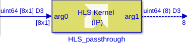

The notations on the block canvas show that the HLS Kernel inputs and outputs vectors of length 8.

According to the Timing Legend, the sample period of the HLS Kernel block is 16 ns, corresponding to a sample rate of 62.5 MHz.

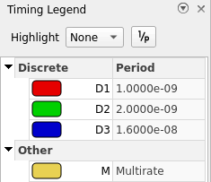

This sample rate is calculated by buffering the input signal (green color, rate of 500 MHz) into vectors of 8 elements each. (500 MHz / 8 = 62.5 MHz) This calculated sample rate is used only for Simulink simulation and does not have any relationship to the design running on the hardware.

6. Double-click on the **HLS_passthrough** block.

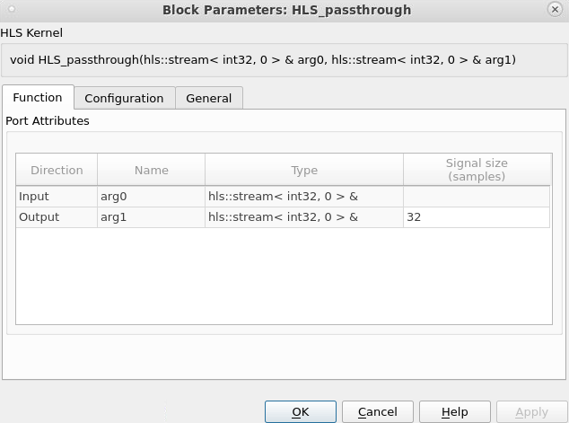

The HLS Kernel's inputs and outputs are displayed. This function has a streaming `uint64_t` input and output. The function interfaces are determined from the kernel's source code (see below).

Also note that the HLS Kernel's output signal size is `8`. This means that on each invocation of the kernel function, it is expected to produce 8 `uint64_t` values. This parameter must be specified by the user.

We can confirm that the interfaces and output signal size are correct by studying the HLS kernel function's source code.

7. Open the file `HLS_passthrough.cpp` and study the function's source code. This function implements a simple passthrough that sends the input data to the output.

```
void
HLS_passthrough(hls::stream< uint64_t >& arg0, hls::stream< uint64_t >& arg1)
{
    #pragma HLS INTERFACE axis port=arg0
    #pragma HLS INTERFACE axis port=arg1
    #pragma HLS INTERFACE ap_ctrl_none port=return
    #pragma HLS dataflow
    uint64_t data;
    data = arg0.read();
    arg1.write(data);
}
```

Note the pragmas that define the `axis` interface on the input and output. When this function is implemented in hardware, it will have AXI4-Stream interfaces. This is a requirement for any PL component that interfaces with an AI Engine. For more information, see [How AXI4-Stream Works](https://docs.xilinx.com/r/en-US/ug1399-vitis-hls/How-AXI4-Stream-Works).

Additional requirements to interface an HLS Kernel with an AI Engine graph, specific to the Vitis Model Composer hardware validation flow, are listed in [Design Considerations](https://docs.xilinx.com/r/en-US/ug1483-model-composer-sys-gen-user-guide/Design-Considerations) in the Vitis Model Composer User Guide.

## AIE Subsystem

Now let's examine the AI Engine subsystem.

8. Return to the top-level `AIE_HLS` model and double-click the **AIE_Subsystem** to open it.

The AIE subsystem contains a single kernel that performs a simple passthrough. You can view the AIE kernel code in the `passthrough.cpp` file.

9. Double-click on the **passthrough** block.

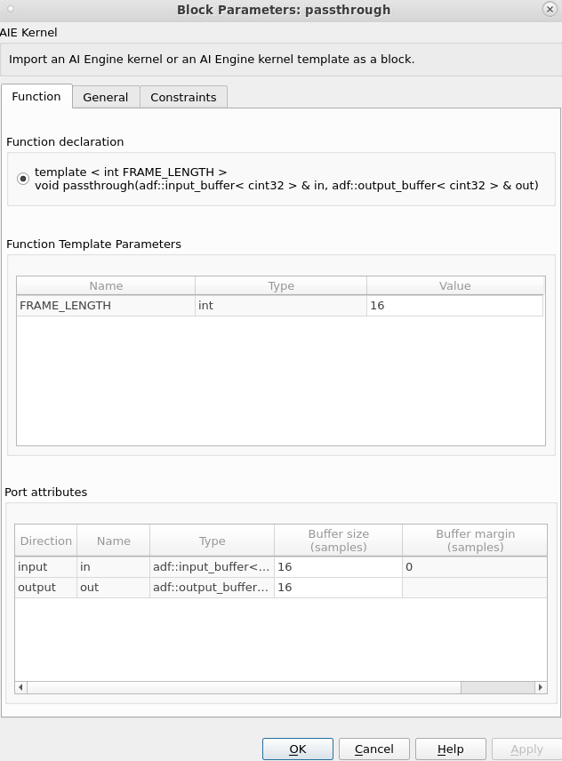

In the function declaration, note that this kernel's input and output are `cint16` values. Also note the `FRAME_LENGTH` parameter, set to 16, which also corresponds to the size of the input and output buffers.

10. Close the **passthrough** block parameters and open the first **PLIO** block.


The PLIO block defines the hardware interface between the AI Engine and the PL. 

The **PLIO width** determines how much data is transferred to the AI Engine on each PL clock cycle. This value should be identical to the bit width of the HLS kernel's output.

The **PLIO frequency** is 500 MHz, which matches the expected rate of our PL clock (see above).

64 bits of data will be transferred from the PL to the AI Engine shim at a rate of 500 MHz. This data is passed from the shim to the AI Engine array as a 32-bit wide AXI-Stream. As long as the AI Engine array is clocked at a rate of at least 1 GHz, there will be no loss of throughput when transferring data from PL to AI Engine.

The combination of the PLIO width and frequency mean that the AI Engine effectively consumes 32-bit `cint16` values at a rate of 1 GHz.

>**IMPORTANT:** The parameters specified in the PLIO block do not affect the functional simulation or observed sample times in Simulink. These parameters only affect the generated AI Engine graph code and how the design is simulated in the cycle-approximate `aiesimulator`.

The second PLIO block is configured identically to transfer `cint16` values from AIE to PL at a rate of 1 GHz.

## Interface From HLS to AIE

HLS Kernels and AI Engine kernels may operate on different data types. For example, an HLS Kernel may generate `uint64` data while the AI Engine consumes `cint16` samples at twice the rate. In these situations, the **HLS to AIE** and **AIE to HLS** blocks may be used to reformat the data to the necessary type and length without losing any information.

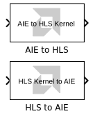

11. Remove the **HLS to AIE Placeholder** subsystem.

12. Click an open area of the canvas, type `HLS to AIE`, and select the **HLS to AIE** block (or select the block from the Simulink Library Browser).

13. Connect the **HLS to AIE** block where the placeholder block used to be.

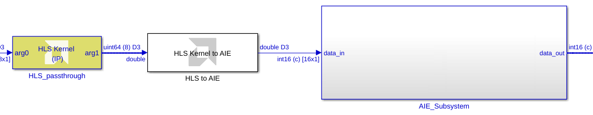

14. Double-click the **HLS to AIE** block to open its parameters.


15. Configure the block as follows:

* **AIE Input Type:** `cint16` The AI Engine kernel expects a `cint16` input.
* **Output Size:** `16` The AI Engine kernel expects an input vector of length 16. Since the HLS Kernel output is of length 8, the HLS to AIE block will create 2 `cint16` output values from each `uint64` input value, without modifying or losing any data bits.

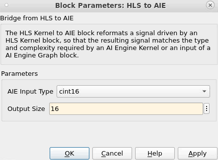

16. Press **Apply** and **OK**.

17. Press `Ctrl+D` to update the model.

The **HLS to AIE** block's sample times and output data types and dimensions are updated:


* The output sample rate (blue color) is 62.5 MHz. This is the same sample rate as the HLS Kernel; the HLS to AIE block is single-rate.
* The output data type is `cint16`.
* The output signal is a variable-sized signal with a maximum size of `16`.

## Interface From AIE to HLS

The bridge from AIE to HLS functions in a similar way.

18. Remove the **AIE to HLS Placeholder** subsystem.

19. Click an open area of the canvas, type `AIE to HLS`, and select the **AIE to HLS** block (or select the block from the Simulink Library Browser).

20. Connect the **AIE to HLS** block where the placeholder block used to be.

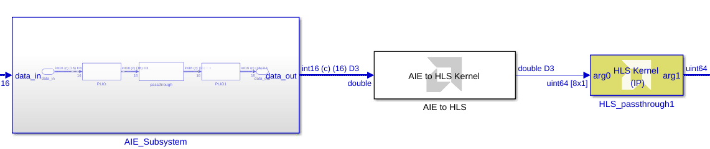

21. Double-click the **AIE to HLS** block to open its parameters.

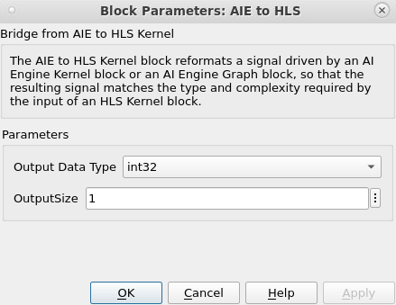

22. Configure the block as follows:

* **Output Data Type:** `uint64` The HLS Kernel expects a `uint64` input. The AIE to HDL block will combine 2 `cint16` inputs into a `uint64` output.
* **Output Size:** `8` Because the input to the AIE to HDL block is a variable-size `cint16` vector with maximum length of 16, the `uint64` output size must be at least 8.


23. Press **Apply** and **OK**.

24. Press `Ctrl+D` to update the model.

The **AIE to HLS** block's sample times and output data types and dimensions are updated:

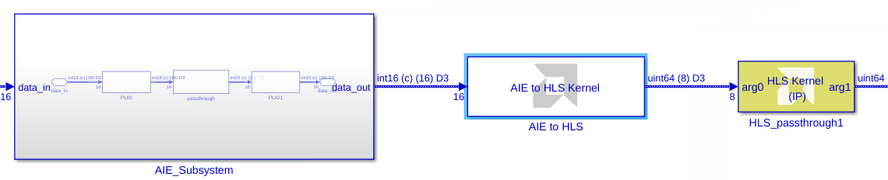

* The output sample rate (blue color) is 62.5 MHz. This is the same sample rate as the AI Engine design; the AIE to HLS block is single-rate.
* The output data type is `uint64`.
* The output signal is a variable-sized signal with a maximum size of `8`.

## Key Takeaways

* AI Engine and HLS Kernel simulations in Vitis Model Composer are not cycle-accurate.
* The Simulink sample rates for AI Engine and HLS Kernel blocks are based on data flow, and do not correlate to hardware clock rates.
* The **PLIO** block defines the bit width and clock rate of the AIE-PL interface. This information is only used in the generated code and cycle-approximate SystemC simulation; it has no bearing on the Simulink simulation.
* The **AIE to HLS** and **HLS to AIE** blocks translate between HLS and AI Engine data types and vector lengths. 

---

&copy; Copyright 2023 Advanced Micro Devices, Inc.

Licensed under the Apache License, Version 2.0 (the "License");
you may not use this file except in compliance with the License.
You may obtain a copy of the License at

```
    http://www.apache.org/licenses/LICENSE-2.0
```

Unless required by applicable law or agreed to in writing, software
distributed under the License is distributed on an "AS IS" BASIS,
WITHOUT WARRANTIES OR CONDITIONS OF ANY KIND, either express or implied.
See the License for the specific language governing permissions and
limitations under the License.
