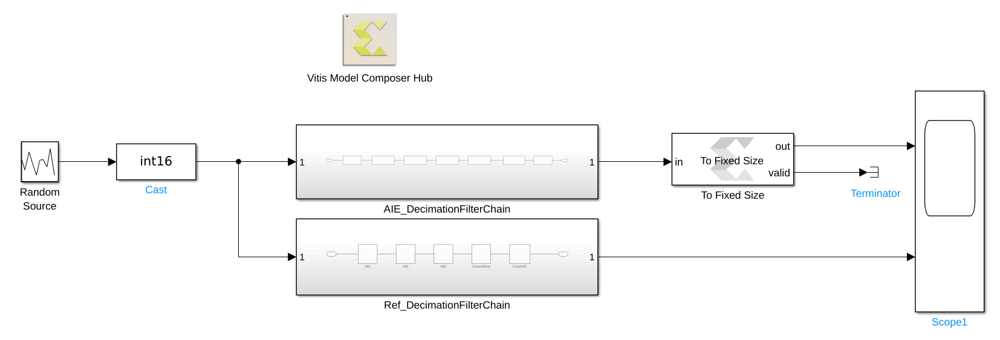

<table class="sphinxhide" width="100%">
 <tr width="100%">
    <td align="center"><h1>AI Engine Development</h1>
    <a href="https://www.xilinx.com/products/design-tools/vitis.html">See Vitis™ Development Environment on xilinx.com</br></a>
    <a href="https://www.xilinx.com/products/design-tools/vitis/vitis-ai.html">See Vitis™ AI Development Environment on xilinx.com</a>
    </td>
 </tr>
</table>

# Lab 1: Introduction to Versal ACAP and AI Engines

This lab gives an overview of Versal ACAP devices and the AI Engine architecture. You will also configure your development environment for AI Engine compilation and run your first AI Engine design in Vitis Model Composer.

:warning: This AI Engine Lab can be done only in a Linux environment.

### Procedure
This lab has the following steps:
 * In Step 1, you will learn about Versal ACAP, AI Engines, and key concepts for designing AI Engine applications.
 * In Step 2, you will install required prerequisites for AI Engine development.
 * In Step 3, you will examine a sample AI Engine signal processing design and simulate it using Vitis Model Composer.
  
## Step 1: Introduction to Versal ACAP and AI Engines

### Versal ACAP

Versal Adaptive Compute Acceleration Platforms (ACAPs) are the latest generation of AMD devices, built on the TSMC 7 nm FinFET process technology. They combine ***Scalar Engines*** (which represents the Processor System (PS)), ***Adaptable Engines*** (which represents the Programmable Logic (PL)), and ***Intelligent Engines*** which are connected together using a high-bandwidth ***Network-on-Chip*** (NoC).


This tutorial will focus on AI Engines, which are a part of the Intelligent Engines.

### AI Engines

The AI Engines are included in some AMD Versal ACAPs. They are organized as a two-dimensional array of ***AI Engine Tiles*** which are connected together with Memory, Stream and Cascade Interfaces. This array can contain up to 400 tiles on the current ACAP devices (for example, the VC1902 device). The array also include an ***AI Engine interface***, located at the last row row of the array, which allows the array to interface with the rest of the device (PS, PL and NoC).


The AI Engine interface includes ***PL and NoC interface tiles*** and a configuration tile. Interface from the PL to the AI Engine Array is done using AXI4-Stream interfaces through both the PL and NoC interface tiles. Interface from the NoC to the AI Engine Array is done using AXI4-Memory Mapped interfaces through the NoC interface tiles. 


It is interesting to see that a direct AXI4-Memory Mapped communication channel is only available from the NoC to the AI Engine tiles (and not from the AI Engine Tiles to the NoC). 

***Note:*** The exact number of PL and NoC interface tiles is device specific. The Versal Architecture and Product Data Sheet: Overview (DS950) lists the size of the AI Engine array.

### AI Engine Tile Architecture

Let's now have a closer look at the array and see what is inside an AI Engine tile.


Each AI Engine tile includes:

* One tile interconnect module which handles AXI4-Stream and Memory Mapped AXI4 input/output
* One memory module which includes a 32 KB data memory divided into eight memory banks, a memory interface, DMA, and locks.
* One AI Engine

The AI Engine can access up to 4 memory modules in all four directions as one contiguous block of memory. This means that in addition to the memory local to its tile, the AI Engine can access the local memory of 3 neighboring tiles (unless the tile is located on the edges of the array):

* The memory module on the north
* The memory module on the south
* The memory module on the east or west depending on the row and the relative placement of the AI Engine and memory module.

### AI Engine Architecture

The AI Engine is a highly-optimized processor which includes the following highlights:

* 32-bit scalar RISC processor (called Scalar Unit)
* A 512b SIMD vector unit featuring a Vector fixed-point/integer unit and a Single-precision floating-point (SPFP) vector unit
* Three address generator units (AGU)
* Very-long instruction word (VLIW) function
* Three data memory ports (Two load ports and one store port)
* Direct stream interface (Two input streams and two output streams)


### Programming the AI Engine Array

AI Engine tiles come in arrays of 10 or 100 units. Creating a single program embedding some directives to specify the parallelism would be a tedious, almost impossible task. That's why the programming model of the AI Engine Array is close to [Kahn Process Networks](https://perso.ensta-paris.fr/~chapoutot/various/kahn_networks.pdf) where autonomous computing processes are connected to each other by communication edges generating a network of processes.

In the AI Engine framework, edges of the graph are ***buffers*** and ***streams*** and the computing processes are called ***kernels***. The kernels are instantiated and connected together and to the rest of the design (NoC or PL) within ***graphs***.

The programming flow is done in 2 stages.

#### Single Kernel Programming

A kernel describes a specific computing process. One kernel will run on a single AI Engine tile. However, note that multiple kernels can run on the same AI Engine tile, sharing the processing time.

Any C/C++ code can be used to program the AI Engine. The scalar processor will handle the majority of the code. If your goal is to design a high performance kernel, then you will target the vector processor using functions from the [***AI Engine API***](https://docs.xilinx.com/r/en-US/ug1079-ai-engine-kernel-coding/AI-Engine-API-Overview). These functions are dedicated to the vector processor of the AI Engine and will allow you to extract a massive processing performance from the AI Engine.

AMD will provide pre-built kernels included in libraries that users will be able to use in their custom graphs.

#### Graph Programming

AMD provides a C++ framework to create ***graphs*** from kernels. This framework includes graph nodes and connections declarations. These nodes are in the AI Engine Array. To have full control over the kernel location, there will be a set of methods that will constrain the placer (kernels, buffers, system memory, ...). A graph will instantiate and connect the kernels together using buffers and streams. It will also describes the data transfer from/to the AI Engine Array to/from the rest of the ACAP device (PL, DDR).

AMD will provide pre-built graphs included in libraries that users will then be able to use in their applications.


During runtime and simulation, the AI Engine application is controlled by the PS.

AMD provides multiple APIs such as the following depending on the application OS:

* Xilinx Run Time (XRT) and OpenCL for Linux applications
* Baremetal drivers

## Step 2: Set Up Development Environment

Before you begin, be sure your system meets the [minimum requirements](https://docs.xilinx.com/r/en-US/ug1393-vitis-application-acceleration/Installation-Requirements). In particular, **at least 32 GB of system memory** is required to complete this tutorial.

To set up your environment to develop AI Engine applications, do the following:

1. If you did not install the Vitis Software Platform when you installed Vitis Model Composer, follow the [installation instructions](https://docs.xilinx.com/r/en-US/ug1393-vitis-application-acceleration/Installing-the-Vitis-Software-Platform) to do so.

2. To run this tutorial, make sure you are using a supported version of MATLAB (R2021a, R2021b, R2022a Update 6) with DSP System Toolbox installed. 

3. Invoke Vitis Model Composer while pointing to the correct versions of MATLAB and Vitis installed. For example: ```./model_composer -vitis /opt/Xilinx/Vitis/2022.2 -matlab /tools/gensys/matlab/R2021a``` 

## Step 3: Run an Example AI Engine Design

In this step, you will simulate a completed AI Engine design in Vitis Model Composer.

The goal of this tutorial is to implement the Decimation Filter Chain depicted below using AI Engine kernels:


The chain consists of 3 half-band decimation filters that bring the sample rate from 1 GSPS to 125 MSPS in a step-wise fashion, followed by a channel filter.

This decimation chain has been modeled for AI Engine using Vitis Model Composer. To simulate this model:

1. Ensure that the MATLAB current folder is the Lab 1 folder, then type ``setupLab1`` in the Command Window.

This prepares your MATLAB session to run the model. It also executes a script called ***CreateFilter*** that populates the MATLAB workspace with variables that describe the decimation chain's filters.


* ``hb1``, ``hb2``, ``hb3``, ``cfi``: Coefficients of the filters which are used in the Simulink model.
* ``hb1_aie``, ``hb2_aie``, ``hb3_aie``, ``cfi_aie``: Coefficients vectors which are used in the AI Engine design.
  * For half-band filters this vector contains only the left-hand side non-null taps including the centre tap.
  * For symmetric filters this vector contains only the left-hand side taps, including the center tap if the filter length is odd.
* ``Shift1``, ``Shift2``, ``Shift3``, ``ShiftCF``: The number of bits bits by which the result has to be shifted before the result is sent to the ouput port.

Study the ***CreateFilter*** script to see how the filters were defined.

2. Double-click the file ***DecimationChain.slx*** to open the model.



This model contains two subsystems, ***AIE_DecimationFilterChain*** and ***Ref_DecimationFilterChain***, which implement the decimation filter chain using AI Engine and basic Simulink blocks, respectively. Double-click on each subsystem to view the underlying blocks.

The model also has a ***Scope*** block allowing us to compare the AI Engine output to the Simulink reference.

3. Run the design by clicking the ***Run*** button on the Simulink toolstrip.

4. After the model runs, double-click on the ***Scope*** block to view the results.

The Scope block shows that the AI Engine and Simulink reference outputs are equivalent.


In future labs, you will learn how to build up this model from scratch using Vitis Model Composer, and how to implement the design on AI Engine hardware. 

---

&copy; Copyright 2023 Advanced Micro Devices, Inc.

Licensed under the Apache License, Version 2.0 (the "License");
you may not use this file except in compliance with the License.
You may obtain a copy of the License at

```
    http://www.apache.org/licenses/LICENSE-2.0
```

Unless required by applicable law or agreed to in writing, software
distributed under the License is distributed on an "AS IS" BASIS,
WITHOUT WARRANTIES OR CONDITIONS OF ANY KIND, either express or implied.
See the License for the specific language governing permissions and
limitations under the License.

<p align="center"><sup>XD058 | &copy; Copyright 2023 Advanced Micro Devices, Inc.</sup></p>
