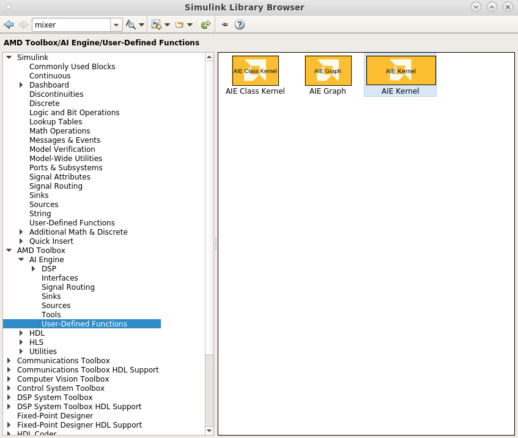
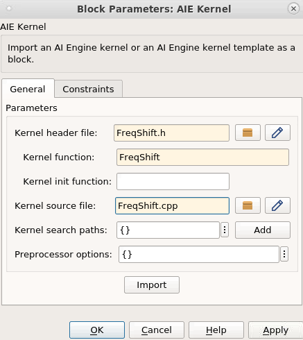
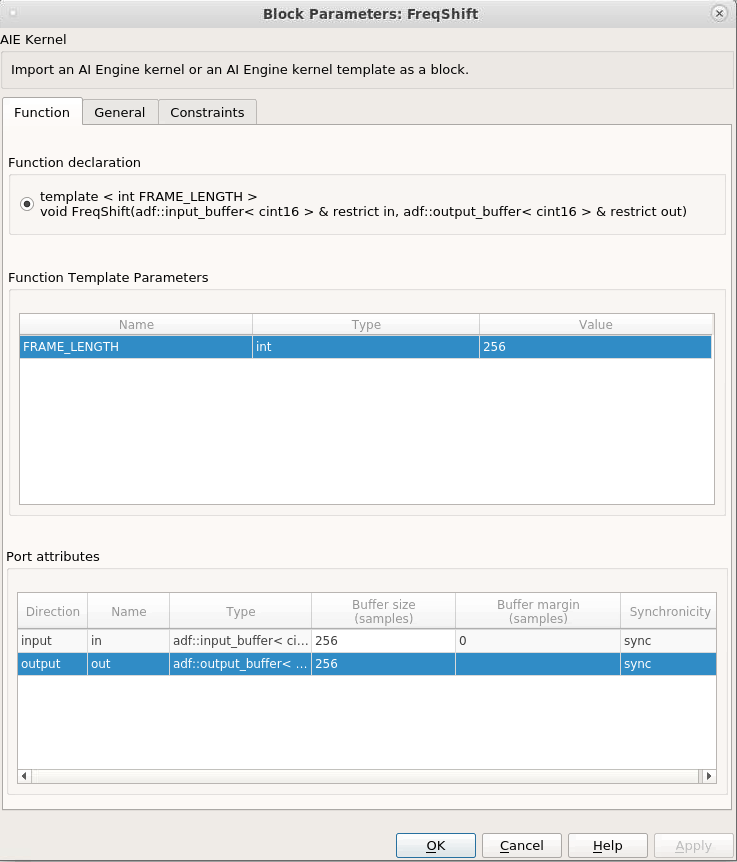
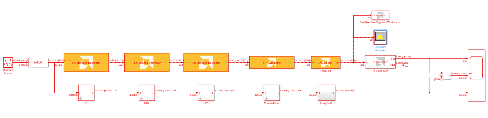
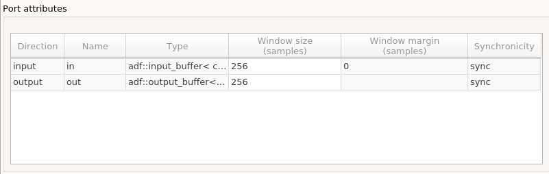

<table class="sphinxhide" width="100%">
 <tr width="100%">
    <td align="center"><h1>AI Engine Development</h1>
    <a href="https://www.xilinx.com/products/design-tools/vitis.html">See Vitis™ Development Environment on xilinx.com</br></a>
    <a href="https://www.xilinx.com/products/design-tools/vitis/vitis-ai.html">See Vitis™ AI Development Environment on xilinx.com</a>
    </td>
 </tr>
</table>

# Lab 3: Import Custom AI Engine Code

This lab briefly describes how AI Engines can be programmed using kernel or graph code. You will see how to import kernel or graph code as blocks into a Vitis Model Composer model and perform simulations.

:warning: This AI Engine Lab can be done only in a Linux environment.

### Procedure
This lab has the following steps:
 * In Step 1, you will learn about AI Engine programming and study an AI Engine kernel function that implements a frequency shift.
 * In Step 2, you will import the AI Engine kernel function into Vitis Model Composer.
 * In Step 3, you will simulate the AI Engine kernel function and understand its execution within Vitis Model Composer.

## Step 1: AI Engine Kernel Functions

We have seen how to implement the decimation filter chain depicted below:


Another common operation in a signal processing system is a frequency shift, or mixing, operation. In this lab, we will see how a frequency shift operation was implemented in AI Engine code. We will also connect that frequency shift to the output of the decimation chain and view the results.

### AI Engine Programming

AI Engine programs consist of two elements:

1. One or more _AI Engine kernels_, which are C/C++ functions that target the AI Engine's scalar and vector processing units. AI Engine kernel code is written using native C/C++ code and a provided AI Engine API. The kernel code is compiled by the AIE Compiler (`aiecompiler`).
2. A _Data Flow Graph Specification_ (graph code), which is C++ code that describes a network with a single AI Engine kernel or multiple AI Engine kernels connected by data streams. The graph can interact with the programmable logic (PL), global memory, and/or the host processor. The graph is also compiled using the `aiecompiler`.

Both kernel programming and graph programming are covered extensively in the [AI Engine Kernel and Graph Programming Guide (UG1079)](https://docs.xilinx.com/r/en-US/ug1079-ai-engine-kernel-coding). There are also many examples on the [Xilinx GitHub](https://github.com/Xilinx/Vitis-Tutorials/tree/HEAD/AI_Engine_Development).

In our decimation chain example, the frequency shift operation is implemented as an AI Engine kernel function. After the frequency shift kernel is integrated with the rest of the decimation chain, Vitis Model Composer will automatically generate graph code for the entire design (see Lab 4).

### AI Engine Kernel Function: Frequency Shift

1. Run the ***setupLab3*** script to initialize a working directory.

2. Open the file ``FreqShift.cpp``.

3. Find the following include statements:

        #include <adf.h>  
        #include <aie_api/aie.hpp>
        #include <aie_api/aie_adf.hpp>

* ``adf.h``: Adaptive Data Flow (ADF) header, which includes all the required constructs for defining and executing AI Engine graphs.
* ``aie_api/aie.hpp`` and ``aie_api/aie_adf.hpp``: AI Engine API headers. The AI Engine API is a portable programming interface for kernel programming. It provides parameterizable data types and common operations for those data types.

4. Kernels are declared as ordinary C/C++ functions that return ``void`` and can use special data types as arguments. The kernel function executes each time the kernel is _invoked_.

Find the kernel function ``FreqShift`` (reprinted below with source code comments removed):

    template <int FRAME_LENGTH>
    void FreqShift(adf::input_buffer<cint16>& __restrict in, 
                   adf::output_buffer<cint16>& __restrict out)
    {
        aie::vector<cint16,8> coeffs = aie::load_v<8>((cint16*)cos_sin);

        aie::vector<cint16,8> data;
        aie::accum<cacc48,8> acc;

        auto pi1 = aie::begin_vector<8>(in);
        auto po1 = aie::begin_vector<8>(out);

        for(unsigned i = 0; i < FRAME_LENGTH/8; i++)
            chess_prepare_for_pipelining
            chess_loop_range(4,)
        {
            data = *pi1++;

            acc = aie::mul(data,coeffs);

            *po1++ = srs(acc,ACC_SHIFT);
        }
    }

The function is recognizable as a templated function in C++, with some elements that are unique to AI Engine programming. 

Let's study the operation of this function line-by-line.

``void FreqShift(adf::input_buffer<cint16>& __restrict in, adf::output_buffer<cint16>& __restrict out)``: This function's interface uses ``input_buffer`` and ``output_buffer`` data types that are defined in the Adaptive Data Flow header. The function accepts and produces buffers of complex 16-bit samples. The ``__restrict`` keyword indicates that the input and output parameters are independent, allowing for more aggressive compiler optimization.

``aie::vector<cint16,8> coeffs = aie::load_v<8>((cint16*)cos_sin);``: Uses a vector data type and function from the AI Engine API to load a hard-coded 8-element vector representing a sinusoid into this invocation of the kernel.

``aie::vector<cint16,8> data; aie::accum<cacc48,8> acc;``: Allocates memory for incoming data and for the product of multiplying this data by the sinusoid.

``auto pi1 = aie::begin_vector<8>(in); auto po1 = aie::begin_vector<8>(out);``: Initialize pointers to the input and output buffers, representing 8-element vectors.

``for(unsigned i = 0; i < FRAME_LENGTH/8; i++)``: Iterate over the input data in chunks of 8 samples.

``chess_prepare_for_pipelining, chess_loop_range(4,)``: These directives instruct the compiler to pipeline this loop and indicate that the loop will execute at least 4 times (implying a minimum ``FRAME_LENGTH`` of 32).

``data = *pi1++``: In each iteration, we get 8 samples from the input buffer...

``acc = aie::mul(data,coeffs);``: ...multiply these 8 samples by the sinusoid...

``*po1++ = srs(acc,ACC_SHIFT);``: ...bit shift the result and send it to the output.

Note that the pointer increments on the input and output mean that the function proceeds along the input data as the for loop executes.

The end result is that this function takes frames of data, multiplies the frame by a sinusoid, and outputs the result. This effectively accomplishes a frequency shift.

5. Each kernel function must be accompanied by a function declaration in a header file. This can be viewed in ``FreqShift.h``.

        template <int FRAME_LENGTH>
        void FreqShift(adf::input_buffer<cint16>& __restrict in, 
                       adf::output_buffer<cint16>& __restrict out);

## Step 2: Import Kernel Function into Vitis Model Composer

1. Open the model ``Lab3_Start.slx``.

1. Select the block _AIE Kernel_ from the **User-defined Functions** section of the AI Engine Library and place it in the canvas:



2. **Double-click** the block to open its parameters. Populate the window with the following data:
* **Kernel header file**: ``FreqShift.h``
* **Kernel function**: ``FreqShift``
* **Kernel source file**: ``FreqShift.cpp``



3. Click **Import**. A new window displays. **FRAME_LENGTH** is the template parameter. Set its value to ``256`` because at this stage (after 3 decimation stages) each data frame has 256 samples. The input and output ports also have the same size: ``256`` samples.  Click **OK**.



4. Place this new block between the **'AIE FIR Channel'** and **'To Fixed Size'** blocks. Grab the **'FreqShift'** block from the ``ReferenceChain.slx`` Simulink design and place it after the **ChannelFilter** Simulink block. Your design should now look as follows:



## Step 3: Simulate Kernel Function in Model Composer

1. Set the model's **Stop Time** to ``inf``.

2. Click **Run**. The new filter will get compiled and a new spectrum will be displayed. Note the shifted spectrum:


3. Switch the **Stop Time** back to ``5000``.

4. Click **Run**. On the Time Scope, verify that the difference is still 0.


We have confirmed that the frequency shift kernel function is behaving as expected. Let's now study in greater detail the operation of the kernel code within Vitis Model Composer.

Simulation of the AI Engine in Vitis Model Composer, is data-driven, not clock driven. That is, the flow and availability of data determines when AI Engine kernels are executed in simulation. The AI Engine kernels are not executed on a fixed clock.

In Lab 2, when we added the filter blocks from the AI Engine DSP library, we had to specify the input buffer size in samples. This tells Simulink to invoke execution of the filter whenever that number of samples is available. Because our model uses frames with the same number of samples, the filter is executed once per each frame period.

When you import an AI Engine kernel as a function, you also need to specify the buffer size (in samples) of the inputs and outputs.



The input buffer size parameter sets the length of the input buffer. When Simulink fills the input buffer with the specified number of samples, the kernel function will be invoked. 

The output buffer size parameter sets the length of the output buffer. At the conclusion of the kernel's execution, the contents of the output buffer will be returned to Simulink. If the kernel's execution does not fill the output buffer with data (i.e. the kernel inserts 256 samples into the buffer, but the buffer length is 512 samples), the remainder of the buffer contains zeros.

Also, note the *Synchronicity* setting. The _sync_ setting means that the synchronization that is required to wait for an input buffer of data, or to provide an empty output buffer, is performed before entering the kernel. There is no synchronization needed within the kernel to read or write the individual elements of data after the kernel has started. This is the default behavior, and this scheme works best when the kernel produces and consumes a buffer's worth of data on every invocation. If you are not consuming a buffer's worth of data on every invocation of a kernel, or if you are not producing a buffer's worth of data on every invocation, then you can control the buffer synchronization by declaring the kernel port to be _async_. You then must use buffer synchronization APIs inside the kernel code before accessing the buffer using read/write APIs.

To avoid buffer overflows or stalling of kernel execution, it is important to set the size of the input and output buffers appropriately. If Simulink produces samples at a greater rate than the AI Engine kernel can consume them, buffer overflows will occur.

For more details, see [How to fix buffer overflow errors with AI Engine and HLS Kernels?](https://github.com/Xilinx/VMC_Help/tree/HEAD/GEN/kernel-buffer-overflow).

## Conclusion

**Congratulations!** This concludes Lab 3. In this lab, you learned about AI Engine kernel programming and how to bring pre-existing AI Engine kernel code into Vitis Model Composer. You also saw how to simulate the kernel function and understand its operation in the context of a larger AI Engine design. 

In the next lab, you will see how to generate graph code and testbenches that can be run in a cycle-approximate simulation of the AI Engine.

---

&copy; Copyright 2023 Advanced Micro Devices, Inc.

Licensed under the Apache License, Version 2.0 (the "License");
you may not use this file except in compliance with the License.
You may obtain a copy of the License at

```
    http://www.apache.org/licenses/LICENSE-2.0
```

Unless required by applicable law or agreed to in writing, software
distributed under the License is distributed on an "AS IS" BASIS,
WITHOUT WARRANTIES OR CONDITIONS OF ANY KIND, either express or implied.
See the License for the specific language governing permissions and
limitations under the License.

<p align="center"><sup>XD058 | &copy; Copyright 2023 Advanced Micro Devices, Inc.</sup></p>
