<table class="sphinxhide" width="100%">
 <tr width="100%">
    <td align="center"><h1>AI Engine Development</h1>
    <a href="https://www.xilinx.com/products/design-tools/vitis.html">See Vitis™ Development Environment on xilinx.com</br></a>
    <a href="https://www.xilinx.com/products/design-tools/vitis/vitis-ai.html">See Vitis™ AI Development Environment on xilinx.com</a>
    </td>
 </tr>
</table>

# Lab 6: Hardware Validation of Versal Adaptive SoC Design

This lab shows how to use Vitis Model Composer to perform validation of an AI Engine design running on Versal Adaptive SoC hardware.

In Lab 5, we used cycle-approximate AI Engine simulation to simulate the behavior of the AIE kernels. This gave us confidence that the algorithm is functionally correct, but did not explore how the AI Engine interacts with the Programmable Logic (PL) and Processing System (PS). 

Hardware validation is an important next step to test the Versal Adaptive SoC design. Vitis Model Composer can be used to create a hardware image for either a physical board or a hardware emulation flow that simulates the full behavior of the Versal Adaptive SoC including AI Engine, PL and PS. 

When creating the hardware image, the input data samples that are fed into the design
during simulation in Simulink are collected. Likewise, the output data samples from the design are
also collected. The input and output data are packaged as part of the hardware image and
downloaded to the hardware. The input data is fed into the design in hardware, the output data is
collected and compared with the output data from simulation. This comparison is done by the
PS in the device. Unless something is wrong, the result should match bit by bit with the
result of the simulation because the simulation in Vitis Model Composer is bit-accurate. The
hardware runs independently of Vitis Model Composer, and during the hardware run no
information is communicated between Vitis Model Composer and the hardware.

:warning: This AI Engine Lab can be done only in a Linux environment.

### Procedure
This lab has the following steps:
 * In Step 1, you will configure the Vitis Model Composer Hub block to generate a hardware image to perform validation.
 * In Step 2, you will run hardware emulation to simulate the behavior of the Versal Adaptive SoC design including AI Engine, PL and PS.
 * In Step 3, you will download the hardware image to a VCK190 board and perform hardware validation.

:warning: Steps 1 and 2 of this lab can be completed without hardware. Step 3 requires a Versal board such as the [VCK190](https://www.xilinx.com/products/boards-and-kits/vck190.html).

## Step 1: Configure Hardware Validation Flow

1. Run the ***setupLab6*** script to initialize a working directory.

2. Open the model ``Lab6_Part1_Start.slx``.

3. At the top level of the model, double-click the Model Composer Hub block.

4. Click the **Hardware Selection** tab.

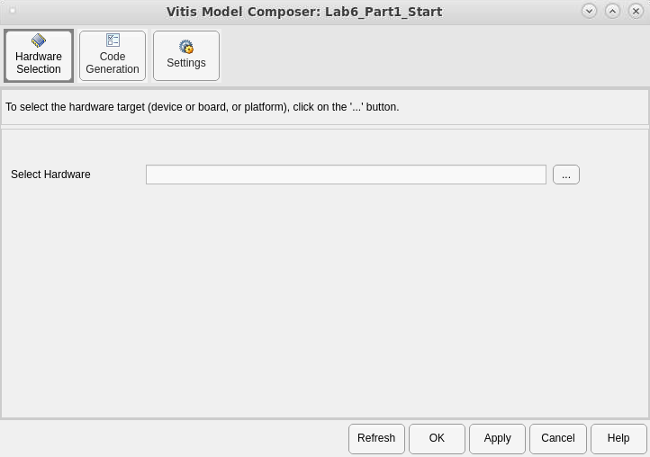

5. Click the '...' button to open the Device Chooser.

6. Select the **Platform** tab.

7. In the Platform drop-down, select **Specify Platform**.


8. Click **Browse**.

This is where you will specify the path to a *.xpfm* file that defines your [platform](https://docs.xilinx.com/r/en-US/ug1273-versal-acap-design/Platform-Based-Design-Flows). In this lab, we will use a [Versal base platform](https://www.xilinx.com/support/download/index.html/content/xilinx/en/downloadNav/embedded-platforms.html) for the [VCK190](https://www.xilinx.com/products/boards-and-kits/vck190.html) that has been provided with the Vitis installation.

9. Navigate to the folder where the Versal base platforms are installed. These are located within the Vitis tools installation, for example: **/opt/Xilinx/Vitis/2023.1/base_platforms**.

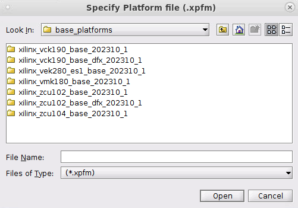

10. Double-click on the **xilinx_vck190_base_...** folder, and then click the **xilinx_vck190_base_....xpfm** file.

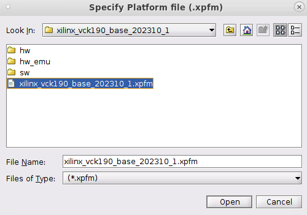

11. Click **Open**, then **OK**.

The Hardware Selection tab populates with information about the selected platform.

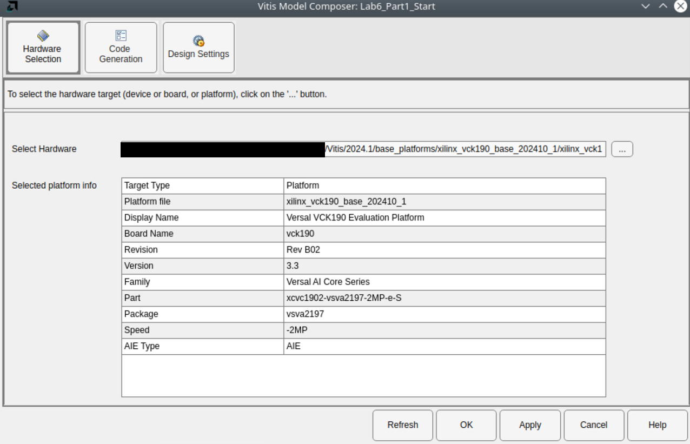

12. Select the **Code Generation** tab, the **FIRchain** subsystem, then **AIE Hardware Flow**.

13. Click the checkbox to **Generate Hardware Validation Code**.

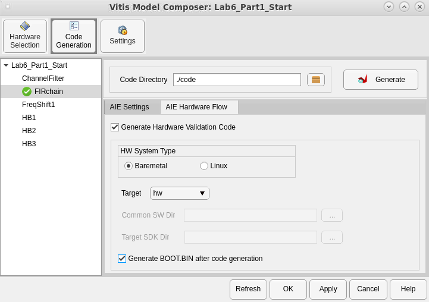

The **HW System Type** provides two options: __Baremetal__ or __Linux__ flow.

* With a _baremetal_ environment, the PS application is compiled to run directly on the processor. The application must integrate and manage the AI Engine graph and PL kernels directly without the support of any operating system. AMD provides a standalone board support package (BSP), drivers, and libraries for applications to use to reduce development effort.
* With _Linux_, the PS application is compiled to run on a Linux operating system. AMD provides an ADF API to control control the AI Engine graph and the Xilinx Runtime (XRT) API to control PL kernels.

For more details, refer to the [AI Engine Tools and Flows User Guide (UG1076)](https://docs.xilinx.com/r/en-US/ug1076-ai-engine-environment/Programming-the-PS-Host-Application). In either scenario, Vitis Model Composer automatically generates all required source code for the host application to execute the testbench and interact with the Adaptive SoC device. **We will use Baremetal flow for this lab.**

**Target** has two options: __hw__ or __hw emu__.

* _hw_ generates a binary image (for baremetal) or an SD card image (for Linux) with which to program the hardware.
* _hw emu_ generates simulation artifacts to perform Vitis hardware emulation. SystemC is used to simulate the AI Engine and PL kernels, and QEMU is used to simulate the PS application. Hardware emulation lets you obtain high-fidelity profiling data about the design as it would run on hardware, without having access to a physical board.

For more information, see [Simulating an AI Engine Graph Application](https://docs.xilinx.com/r/en-US/ug1076-ai-engine-environment/Simulating-an-AI-Engine-Graph-Application).

**If you do not have access to a board and/or would like to perform hardware emulation, select _hw emu_ as the Target and proceed to Step 2.**

**If you have access to a VCK190 evaluation board (or another Versal Adaptive SoC board), select _hw_ as the Target and proceed to Step 3.**

## Step 2: Validation using Hardware Emulation

In this step, you will use Vitis hardware emulation to validate the design. As stated above, this simulates the AI Engine kernels, PL kernels, and PS application side-by-side. This allows you to gain confidence that the design will run on the actual hardware without requiring access to a board. However, running hardware emulation is slower than running the design on the board itself.

1. On the AIE Hardware Flow tab of the Vitis Model Composer Hub block, select **Run hardware emulation after code generation**.

2. Click **Generate**. 

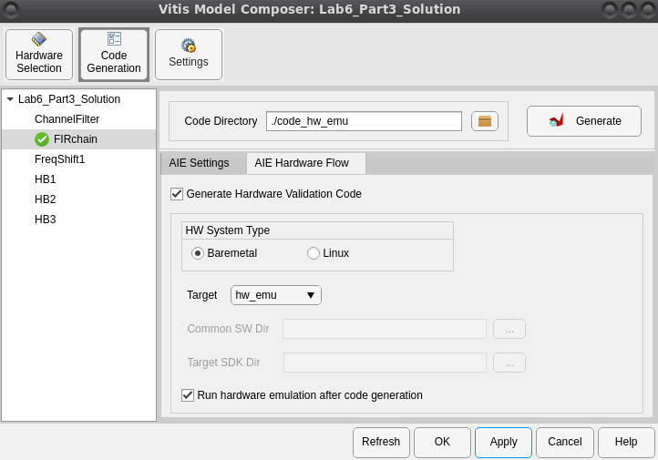

This will take a substantial amount of time as the entire design (AI Engine, PL, and PS) is compiled and synthesized. Alternatively, you can leave the **Run hardware emulation after code generation** option unchecked and Vitis Model Composer will only generate the AIE, PL, and host source code along with a script and makefile to perform hardware emulation outside of Vitis Model Composer.

> Note: To perform hardware emulation outside of Vitis Model Composer after the hardware validation code has been generated, run the script `./code_hw_emu/run_hw/src_ps/launch_hw_emu.sh`.

After hardware validation is complete, the result is displayed in the Progress window. The testbench indicates that all outputs match between the Simulink simulation and the hardware emulation.

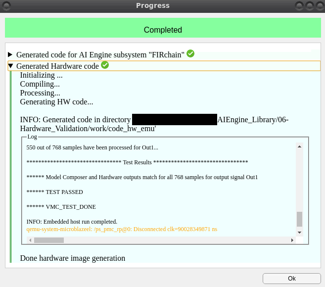

## Step 3: Validation on Hardware

In this step, you will generate a BOOT.BIN binary hardware image, load it on the board, and perform hardware validation.

1. On the AIE Hardware Flow tab of the Vitis Model Composer Hub block, select **Generate BOOT.BIN after code generation**.

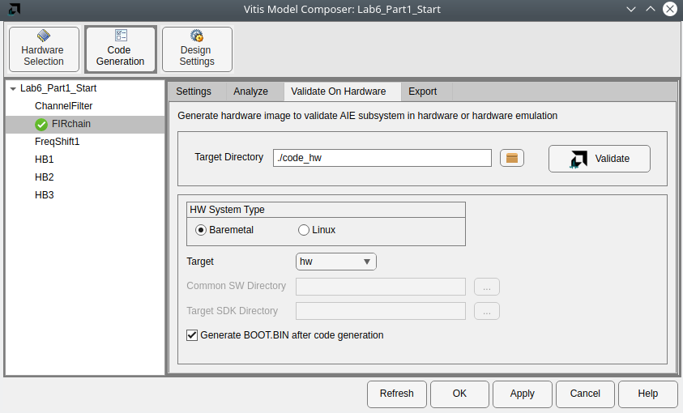

2. Click **Generate**. 

This will take a substantial amount of time as the entire design (AI Engine, PL, and PS) is compiled and synthesized. Alternatively, you can leave the **Generate BOOT.BIN after code generation** option unchecked and Vitis Model Composer will only generate the AIE, PL, and host source code along with a script and makefile to build the boot image outside of Vitis Model Composer.

After the binary image is generated, it is stored in the folder `./code_hw/run_hw/src_ps/BOOT.BIN`.

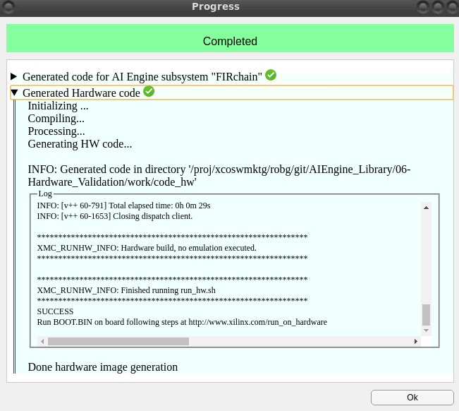

We will now prepare the board and download the hardware image to it. This lab provides instructions specific to the VCK190.

> Note: Here we are assuming the board is physically connected to a Windows machine and the BOOT.BIN is generated using Vitis Model Composer on a Linux machine. The Windows machine and Linux machine are networked together, and the [AMD Hardware Server](https://docs.xilinx.com/r/en-US/ug908-vivado-programming-debugging/Connecting-to-a-Hardware-Target-Using-hw_server) is run on the Windows machine to route data between the board and the Linux machine.

3. Connect the power cable to the board.

4. Connect a USB Micro cable between the Windows host machine and the USB JTAG connector on the target board. This cable is used for USB-to-serial transfer.

5. Ensure that the SW1 switch is set to the JTAG boot mode and power on the VCK190 board using the power switch as shown in the following figure.

   

Once your board is set up, program the device as follows:

6. In Windows, click the search box on the taskbar and type Device Manager, then select Device Manager from the Menu.

7. When the board is powered ON and connected to your machine through the USB interface, determine the COM ports that are between the VCK190 board and your computer from Windows Device Manager.

   

8. Use a Terminal application (e.g. Teraterm or Putty) to open up COM port interfaces on these ports (COM4, COM5 and COM6 in the above case at 115200 baud rate). Note that only one of these terminals will print the output. 

   

   > Note: Ensure the Connection type is set to Serial.

9. Run Hardware Server on Windows.

   > Note : This step assumes that you have Hardware Server installed on your Windows machine as part of Vitis or Vivado Installation. If you do not have Hardware Server installed, please refer to the section [How to Install Hardware Server](#How-to-Install-Hardware-Server). 
   
   Open Windows command prompt and provide complete path to ```hw_server``` application and hit ```Enter```. You can see the hostname and port number as highlighted below.
   
   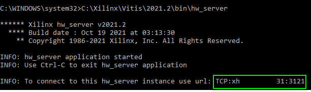
   
10. Launch XSDB and create a target connection to the host running the hw_server.
    
    a. On the Linux machine, open a new terminal and launch XSDB using the ```xsdb``` file from the Vitis installation directory as shown.

      ```
      <AMD Install Directory>/Vitis/<Version>/bin/xsdb
      ```
    b. From the XSDB prompt, run the following commands:
    
      ```
       connect -url <Hostname>:<Port_num>
       ta 1
      ```
      Note : You should use the hostname and port number as highlighted in Step 9. Do not prepend the hostname with 'TCP:'.
       
    c. From within the XSDB prompt, navigate to the directory where hardware device image has been generated. 
    
      ```
       cd <lab work directory>/code_hw/run_hw/src_ps
      ```       
11. Program the device and run:
    
    a. From the XSDB prompt, run the following command:
      ```
      device program BOOT.BIN
      ```
      You will see following message in the XSDB prompt if the device program is successful.
    
      

    b. This will run the design on the board. In the Terminal application, you should see the log similar to the following. Here, the hardware results are compared with the golden results.
    
    ```
       ******************************** Test Results ********************************
       ****** Model Composer and Hardware outputs match for all 40944 samples for output signal Out1 *******
       ****** Test passed ********
    ```
       
    c. To re-run the results, run the following commands:
    
    ```
        rst -system
        device program BOOT.BIN
    ```

## Conclusion

In this lab, you saw how to use Vitis Model Composer to generate a hardware image to perform validation, either via emulation or on a physical board.

## Appendix: How to Install Hardware Server

The AMD Unified installer allows you to install multiple AMD tools using a single installer. Follow the steps below to install AMD Hardware Server on Windows. 

1. Download the AMD Unified installer package and run the ```xsetup.exe``` file.

2. In the Installer window, select 'Hardware Server' from the list of products.

   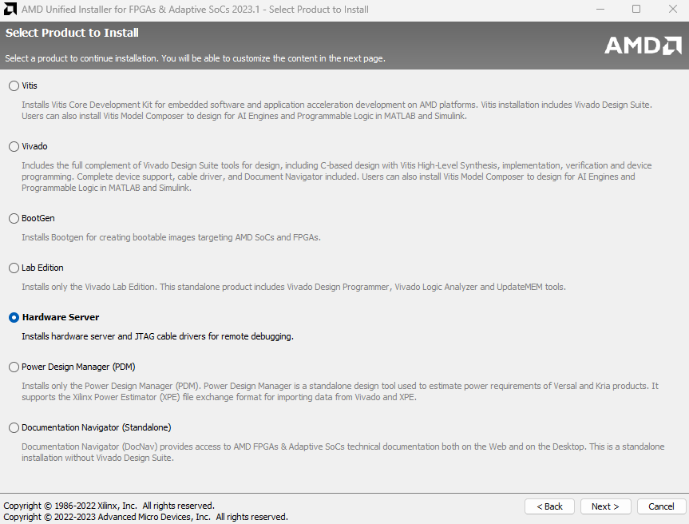
   
3. Click ```Next``` and complete the rest of the installation process. 

---

&copy; Copyright 2023 Advanced Micro Devices, Inc.

Licensed under the Apache License, Version 2.0 (the "License");
you may not use this file except in compliance with the License.
You may obtain a copy of the License at

```
    http://www.apache.org/licenses/LICENSE-2.0
```

Unless required by applicable law or agreed to in writing, software
distributed under the License is distributed on an "AS IS" BASIS,
WITHOUT WARRANTIES OR CONDITIONS OF ANY KIND, either express or implied.
See the License for the specific language governing permissions and
limitations under the License.

<p align="center"><sup>XD058 | &copy; Copyright 2023 Advanced Micro Devices, Inc.</sup></p>
