<table class="sphinxhide" width="100%">
 <tr width="100%">
    <td align="center"><h1>AI Engine Development</h1>
    <a href="https://www.xilinx.com/products/design-tools/vitis.html">See Vitis™ Development Environment on xilinx.com</br></a>
    <a href="https://www.xilinx.com/products/design-tools/vitis/vitis-ai.html">See Vitis™ AI Development Environment on xilinx.com</a>
    </td>
 </tr>
</table>

# Lab 7: Export AI Engine Design from Vitis Model Composer to Vitis

In this lab, we will show how to export an AI Engine design into a 
Vitis AI Engine component after it has been simulated and validated in Vitis 
Model Composer. We will also show how to integrate the generated component into an existing Vitis system project.

In the early stages of the development cycle, it is critical to verify 
the functional behavior of the AI Engine kernels and graph. Vitis Model 
Composer is an ideal choice for testing and debugging at this level 
because of the speed of iteration and the high level of data visibility it 
provides the AI Engine developer.

To run on Versal hardware, the finished AI Engine design must be linked 
to data movers running on the PL and a host application running on the PS. 
This linking step, as well as the subsequent packaging of the finished 
hardware image, can be accomplished via a Vitis system project.

This lab is divided into 2 parts:

1. Generate a Vitis AI Engine Component from the Vitis Model Composer AI Engine design.

2. Integrate the generated component with a Vitis System Project.

## Lab System Design

The design that will be used is shown in the following figure:


The AI Engine part of the design, consisting of the Interpolator, 
Polarclip, and Classifier kernels, is simulated by and generated from 
Vitis Model Composer. The existing Vitis system project consists of the datamovers running on the Programmable Logic (PL) and the Host Application running on the Processing System (PS).

## 1. Generate Vitis AI Engine Component

### Examine the AI Engine Design

Open and run the Vitis Model Composer testbench for the AI Engine part of 
the design.

In MATLAB:

```
open_system('aie_testbench');
sim('aie_testbench');
```


This model implements the AI Engine processing cascade using a FIR Interpolation block from the Vitis DSP Library and AIE Kernel 
blocks pointing to existing kernel source code. The output of simulating the AI Engine processing cascade is 
compared to a reference output. The AI Engine output is also displayed on 
a scope. 

>**NOTE:** To see how the input and reference output data are loaded into Vitis Model Composer, go to the **Simulink toolstrip -> Modeling -> Model Settings -> Model Properties -> Callbacks -> PostLoadFcn**.

After simulating the processing chain and verifying its functionality, the AI Engine design can be exported to Vitis for integration into a larger project.

### Generate AI Engine Code

Vitis Model Composer will generate AI Engine graph code from the design.

1. In the `aie_testbench` model, double-click on the **Vitis Model Composer Hub** block.

2. Ensure that the Hub block is configured as follows for the `ai_engine` subsystem. 


The **Create Testbench** option generates input and reference output data files for the Vitis AIE Simulator, in addition to the graph code.

3. Click **Generate**.

Wait for code generation to complete.


After code generation is complete, explore the contents of the generated `code` folder:


The generated code folder contains a folder called `ip` that contains subfolders for each AI Engine and HLS IP in the design. Each individual IP subfolder contains a `src` folder containing the IP's source code. In this design, the `ip/ai_engine/src` folder contains the AI Engine code we will bring into Vitis as a component. The `ip/ai_engine/data` folder contains input and reference output data files that can be used in AI Engine simulation and hardware validation. Vitis Model Composer also generates Makefiles for compiling and simulating the AI Engine design outside of Model Composer.

### Create AI Engine Component in Vitis

Next, we will create a new Vitis workspace and add an AI Engine component to it.

1. Open a Linux terminal in this lab directory.

2. Configure your shell to run Vitis: `source (path to Xilinx installation)/Vitis/2023.2/settings64.sh`.

3. Start the Vitis IDE: `vitis -w work &`.

This creates a new folder called `work` in the current folder and opens it as a Vitis *workspace*. The Vitis Unified IDE opens to the Welcome page.

4. The Workspace panel on the left side identifies the `work` folder as the current workspace. The workspace is currently empty. Select **Create AI Engine Component**.


5. Leave the component name and location as their defaults. Click **Next**.


6. Select the **Add Folder** button under Import Sources.


7. Add the `src` folder from the AI Engine IP that you generated from Vitis Model Composer.

8. Repeat the previous step to add the `data` folder from the generated AI Engine IP.

9. Make sure the top-level file is `src/ai_engine.cpp`. Click **Next**.


10. Select a part, platform, or hardware design. In the screenshot below, the VCK190 base platform is selected. Click **Next**.


>**NOTE:** For information on custom platform creation, see *Vitis Platform Creation labs*.

11. On the Summary screen, click **Finish**.

The AI Engine Component is created in the Vitis workspace.


>**NOTE:** If you make changes to the AI Engine design in Vitis Model Composer and re-generate code, update the Vitis component by copying the `data` and `src` folders into the component's folder in the Vitis workspace.

### Configure and Build AI Engine Component

Our AI Engine design in Vitis Model Composer was implemented using custom kernel code and blocks from the Model Composer AI Engine DSP Library. Before building the AI Engine component, it is necessary to add the kernel code's location to the component's include path.

1. Double-click the file `aiecompiler.cfg` in the AI Engine Component.

2. Under Include Directory, click **Add Item**.

3. Add this example's folder to the include path.

4. Because our AI Engine design contains blocks from the Vitis Model Composer AI Engine DSP library, we must also add the following locations to the include path:
 * `./xmc_aie_lib`
 * `(Model Composer install location)/tps/xf_dsp/L1/src/aie`
 * `(Model Composer install location)/tps/xf_dsp/L1/include/aie`
 * `(Model Composer install location)/tps/xf_dsp/L2/include/aie`

>**NOTE:** The Model Composer install location can be found by typing `xmcPathInfo` in the MATLAB Command Window.


4. Open the file `ai_engine.cpp`.

5. Modify the call to `mygraph.run` to run the graph for one iteration: `mygraph.run(1);`.

The AI Engine kernel code generated by Vitis Model Composer (`./src/ai_engine.cpp`) runs the AI Engine indefinitely, because this is typically how the AI Engine will operate on hardware. Because of this, when running the `aiesimulator` we need to either modify the AI Engine `main()` function to run the AI Engine for a fixed number of iterations, or set the `simulation-cycle-timeout` setting to stop the simulator after a fixed number of cycles.

6. To build the AI Engine Component, in the Flow Navigator select **AIE Simulator/Hardware -> Build**.


After the build completes, confirm that `Build Finished successfully` appears in the Output console. The build outputs, including the `libadf.a`, are visible in the component workspace.


You can now continue working with this component in Vitis, including simulation, debugging, and integrating with other components to build a system project.

### Simulate AI Engine Component in Vitis

When the AI Engine Component is selected in the Flow Navigator, two simulation/deployment options are displayed:

* **x86 Simulation**: This performs bit-accurate, functional simulation of the AI Engine component without any timing information about latency or throughput. This is equivalent to simulating the AI Engine design in Simulink using Vitis Model Composer.

* **AIE Simulator / Hardware**: This builds the AI Engine component for deployment to hardware or for simulation using `aiesimulator`. `aiesimulator` is bit-accurate and cycle-approximate, and the results can be used to estimate the latency or throughput of the AI Engine design. `aiesimulator` can be invoked from Vitis or Vitis Model Composer (by selecting **Run cycle-approximate simulation** in the Model Composer Hub block).

In the previous step, you built the AI Engine component for AIE simulation or hardware. Now, simulate the AI Engine design in Vitis:

1. Click **AIE Simulator/Hardware -> Run**.

Vitis invokes the `aiesimulator`, and the task status is displayed in the Vitis console.

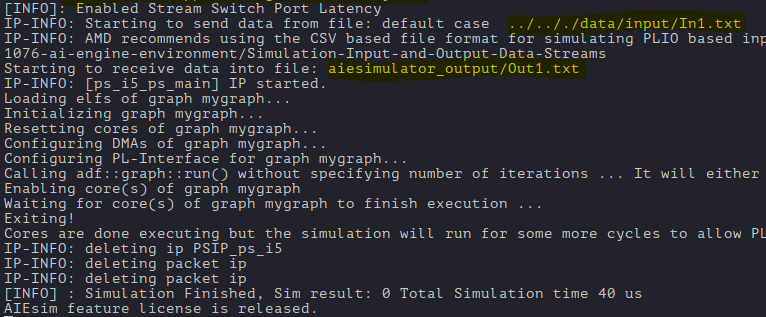

After AIE simulation completes, note the following information displayed:
* The input data comes from the `In1.txt` file that was generated by Vitis Model Composer from our Simulink simulation.
* The simulation output is written to the `aiesimulator_output/Out1.txt` file.

Simulation and build products in Vitis can be viewed in the **Output** section of the workspace.

2. In the Workspace, view **aie_component -> Output**.

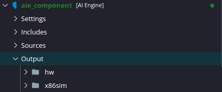

The build products for **x86 Simulation** and **AIE Simulator/Hardware** are contained in separate folders.

3. Open the file `hw/aiesimulator_output/Out1.txt`.

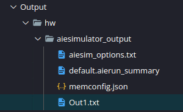

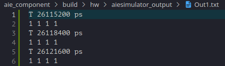

This is the output file produced by `aiesimulator`. Each line that begins with `T` is a timestamp, and the following line shows the output produced by the AI Engine at that timestamp. This AI Engine design has 128-bit PLIOs on the input and output, with `cint16` data types. As a result, 4 output values are recorded on each simulation timestamp.

Vitis Model Composer generates a script that can be used to compare the `aiesimulator` output to the Simulink reference output.

4. Open a new Terminal within Vitis: **Terminal menu -> New Terminal**.

5. Run the following command: `./aie_component/data/check_output ./aie_component/build/hw/aiesimulator_output ./aie_component/data/reference_output`.

This runs the simulation results comparison script. The first argument to the script is the path to the `aiesimulator` output. The second argument is the path to the reference output generated by Vitis Model Composer.

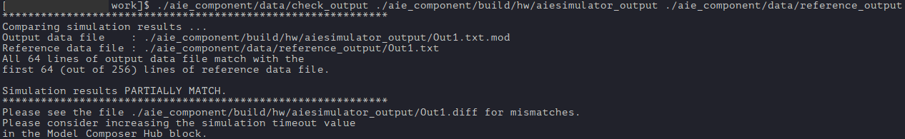

The script compares the simulation output to the reference output and reports that they *partially match*. This means that the `aiesimulator` produced fewer cycles of output than the Simulink simulation, but that the partial results matched. In this case, the `aiesimulator` produced 64 cycles of output compared to 256 cycles produced by Simulink. To get the results to completely *match*, we could increase the `aiesimulator` cycle timeout by a factor of 4 or increase the number of iterations to execute the AI Engine. If the script reports that the outputs *do not match*, then there was an actual value mismatch between the `aiesimulator` and Simulink. Differences between the outputs are logged in the `Out1.diff` file.

Now, if you make changes to the AI Engine code within Vitis, you can rerun AIE simulation and compare the results with the original Simulink testbench.

## 2. Integrate Component with Vitis System Project

Now that the component has been created, we will integrate it with an existing Vitis system project. Depending on the design, this may require changes to the *linker connectivity graph* and/or the *host application*.

### Create Vitis System Project

First, create an example Vitis system project to use with the rest of this lab.

1. Go to the **File menu -> New Component -> From Examples**.

2. Navigate to **Acceleration Examples -> Installed Examples Repository -> AI Engine System Design Examples** and select the **AI Engine, PL and PS System Design** example.

3. Select **Create Application from Template**.

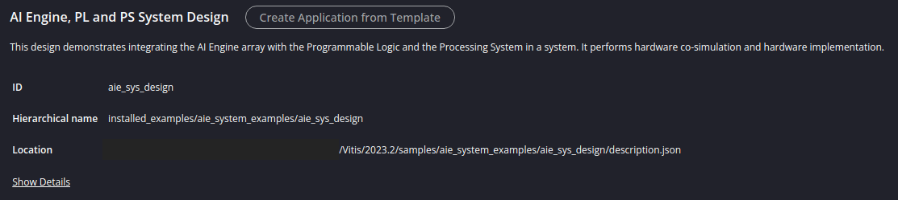

4. Use the default name and location for your system project. Click **Next**.

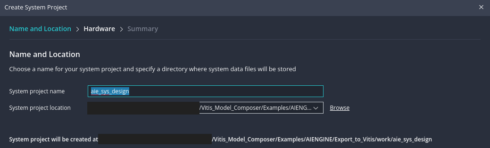

5. To create a system project, you now must select a platform. Select one of the base platforms installed on your system and click **Next**.

>**NOTE:** For information on custom platform creation, see *Vitis Platform Creation labs*.

6. Provide the embedded component paths. If you haven't already, install the Linux kernel image and root filesystem for your platform by following these instructions. Then, specify the path to the **Kernel Image**, **Root FS**, and **Sysroot**. Select **Update Workspace Preference** to remember these settings for other components in this workspace. Click **Next**.

 

7. On the Summary screen, click **Finish**.

The example Vitis system project is created in the workspace, along with its constituent components.

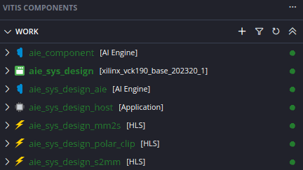 

8. In the workspace, click on **aie_sys_design -> Settings -> vitis-sys.json**.

This file controls the settings for this Vitis system project. The components of this system project are listed under **Components**.

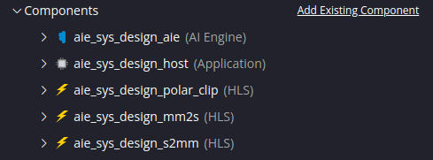 

This system project consists of the following components:

- A **host** application component to run on the PS.
- Data mover HLS components (**mm2s** and **s2mm**) to run on the PL.
- An AI Engine component (**aie**).
- An HLS processing component (**polar_clip**) to run on the PL.

These components align with the *lab System Design* pictured above, except the **polar_clip** algorithm is implemented in the PL instead of AI Engine.

We are going to replace the **aie** and **polar_clip** components from this system project with the AI Engine component we generated from Vitis Model Composer.

### Add AI Engine Component

1. In the **Components** list, mouse over the **aie_sys_design_aie** and **aie_sys_design_polar_clip** components and click **Delete** followed by **OK**.

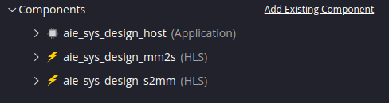 

2. Click on **Add Existing Component** and select **AI Engine**.

3. Select the **aie_component** component from the workspace. Click **OK**.

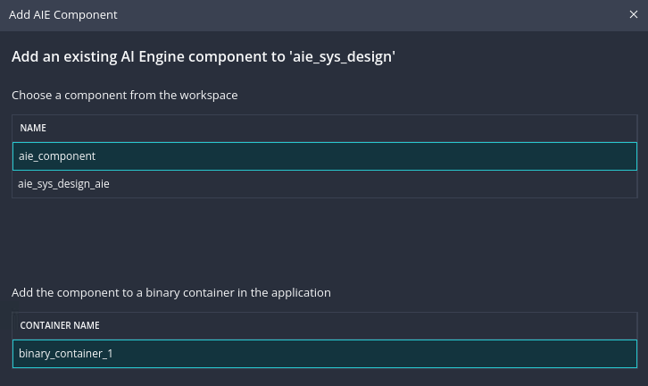 

The system project should now consist of the AI Engine component, the host application, and the **mm2s** and **s2mm** HLS datamovers.

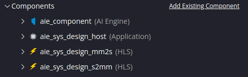 

### Modify Linker Connectivity Settings

As mentioned above, we are replacing the AI Engine component and an HLS kernel from the existing system project with a new AI Engine component from Vitis Model Composer. Because we are changing the kernels in the design and how they connect to each other, we need to change the linker connectivity settings.

1. Under **Hardware Linker Settings**, expand the Binary Container **binary_container_1**. The container consists of the 2 PL HLS datamover kernels and the AI Engine graph.

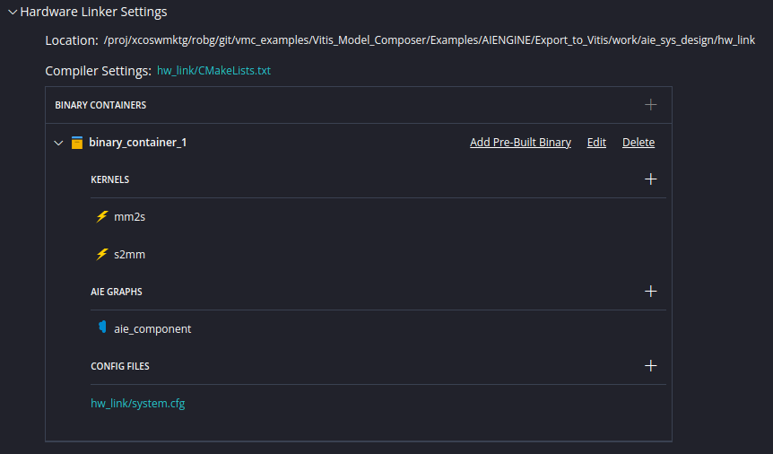

2. Click on the Config File **hw_link/system.cfg**.

3. Click on the **Source Editor** 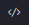 button.

The hardware linker connectivity file appears.


4. Remove the following lines from the `[connectivity]` section of the file:
```
stream_connect=ai_engine_0.Data_clip_in0:polar_clip_1.input
stream_connect=polar_clip_1.output:ai_engine_0.Data_clip_out0
```
The AI Engine input and output are now connected directly to the datamovers.

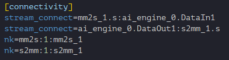

### Modify Host Application

1. In the workspace, open **aie_sys_design_host -> Sources -> src -> host.cpp**.

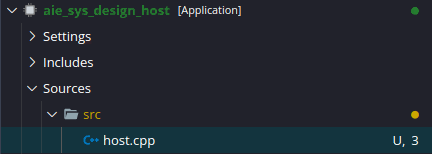

This application does the following:
- Load the bitstream (.xclbin) for the PL and AI Engine design
- Loads input and reference output data vectors into memory
- Initializes the PL kernels for the datamovers and polar clip operation
- Initializes the AI Engine graph
- Runs the design and captures the output
- Compares the design output to the golden reference and reports any mismatch

We need to modify the application to:
- Remove the polar clip PL kernel from the design. This operation is now occuring in the AI Engine. 
- Initialize the AI Engine graph we brought over from Vitis Model Composer.

2. Comment out the sections labeled `polar clip ip` and `wait for polar clip done`.

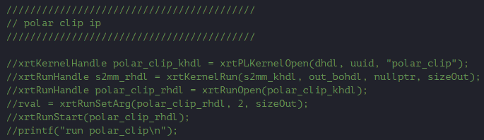
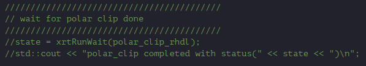

3. Change the `xrtGraphOpen` call to initialize `mygraph` instead of `clipgraph`. 

>**NOTE:** The AI Engine graph's handle (name) can be found in its main (`.cpp`) function.

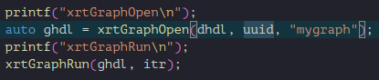

### Build the Modified Vitis System Project

1. In the Flow Navigator, select the **aie_sys_design** component.

2. Select **Hardware Emulation -> Build All**.

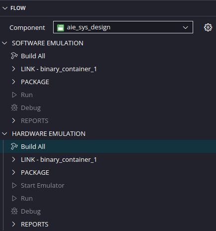

You are prompted for which components to build with the system project. Because we previously built the **aie_component**, it is not selected by default. The **host**, **mm2s**, and **s2mm** components must be built because they are required by the system project and have not been built previously. 

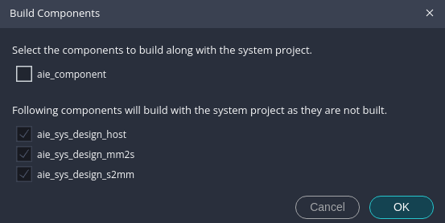

3. Click **OK**.

The build process takes a few minutes. It compiles the AI Engine graph and PL kernels, links them based on the connectivity graph, compiles the host application, and packages a bootimage containing Linux, a bitstream, and the host application.

### Run the System Project in Hardware Emulation

Hardware emulation is intended to closely match the behavior and results of the design running on hardware.

- The host application is emulated using QEMU.
- The Programmable Logic (PL) is emulated by Vivado Simulator (`xsim`).
- The AI Engine is emulated by the cycle-approximate AIE Simulator (`aiesimulator`).

1. In the Flow Navigator, select the **aie_sys_design** component.

2. Select **Hardware Emulation -> Start Emulator**.

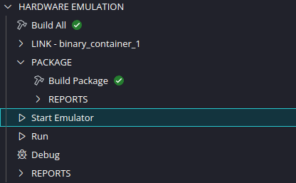

3. Click **Start**.

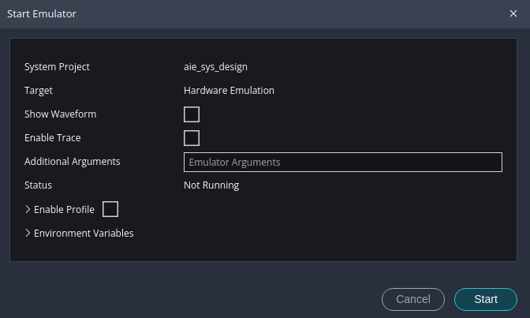

>**NOTE:** The *Show Waveform* option will open the Vivado Simulator window while emulation is running, so you can monitor PL signals. The *Enable Trace* option will open the Vitis Analyzer trace view while emulation is running, so you can monitor AI Engine data traffic.

The bootimage generated in the previous section is loaded into the emulator, and after a few minutes Linux is booted.

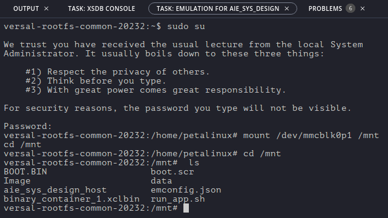

The compiled host application `aie_sys_design_host` and the PL/AIE binary container `binary_container_1.xclbin` are present in the mounted filesystem.

4. Select **Hardware Emulation -> Run** in the Flow Navigator.

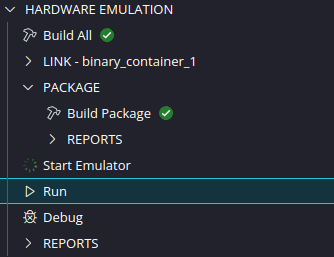

This runs the `aie_sys_design_host` application in the emulator, which begins by downloading the bitstream to the PL and configuring the AI Engine.

After the bitstream is loaded, the host application prints diagnostic and status messages to the Debug Console.

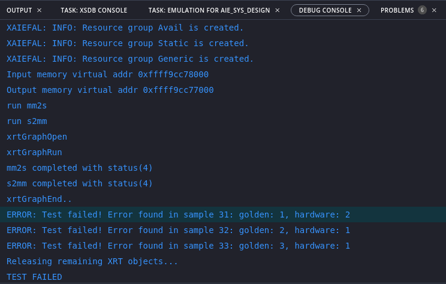

The console messages above indicate when the `mm2s` and `s2mm` datamovers and AI Engine graph start and stop running. After the AI Engine finishes processing data and the `s2mm` datamover finishes transferring the result from the AI Engine to the DDR memory through the PL and the NoC, the host application compares the received data to a golden reference output. Mismatches in the data are reported on a sample-by-sample basis. 

>**NOTE:** The input and reference output vectors used in hardware emulation are different from those used in AI Engine simulation. These vectors must be loaded into memory by the host application. In this case, the vectors are contained in the header files `input.h` and `golden.h` included in the `host.cpp`. On the Linux file system, the vectors are contained in the `data` directory.

In this case, 3 output samples (out of 1024 total) show a mismatch between the emulated AI Engine output and the golden reference data. This could be caused by a difference between the PL and AI Engine implementation of the polar clip operation.

Vitis can also run hardware emulation in Debug mode, along with *Show Waveform* and *Enable Trace* options, to investigate the operation of the AI Engine, PL, and host application in detail, in order to identify and resolve issues. 

5. Mouse over **Hardware Emulation -> Start Emulator** and click the **X** to stop the emulator.

## Conclusion

**Congratulations!** This concludes Lab 7 and the AI Engine tutorial series. 

In this lab, we integrated an AI Engine design with PL and PS components, using Vitis Model Composer and Vitis.

First, we exported an AI Engine design from Vitis Model Composer into a Vitis AI Engine component. We configured Vitis to build our AI Engine component by pointing to the generated code and required libraries. We also reused data from the Simulink testbench to perform simulation in Vitis.

Then, we integrated the generated component into a Vitis system project. We updated the project's linker settings and host application to account for the new AI Engine design. We also ran the entire system project (PS, PL, and AI Engine) in hardware emulation mode.

---

&copy; Copyright 2023 Advanced Micro Devices, Inc.

Licensed under the Apache License, Version 2.0 (the "License");
you may not use this file except in compliance with the License.
You may obtain a copy of the License at

```
    http://www.apache.org/licenses/LICENSE-2.0
```

Unless required by applicable law or agreed to in writing, software
distributed under the License is distributed on an "AS IS" BASIS,
WITHOUT WARRANTIES OR CONDITIONS OF ANY KIND, either express or implied.
See the License for the specific language governing permissions and
limitations under the License.

<p align="center"><sup>XD058 | &copy; Copyright 2023 Advanced Micro Devices, Inc.</sup></p>

