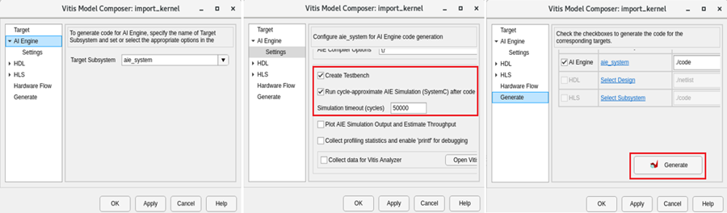

# Lab 1: Importing AI Engine Kernels

This section of tutorial shows how to import AI Engine kernels into Vitis Model Composer, generate the code, and simulate using AIE Simulation.

### Procedure
This lab has the following steps:
 * In Step 1, you build your design with three AI Engine kernels in Vitis Model Composer.
 * In Step 2, you simulate the design.
 * In Step 3, you generate a graph code and simulate using AIE simulation.
  
## Step 1: Build the AI Engine Design in Vitis Model Composer
 
In this step, you will import three kernel functions using the AIE Kernel block available in the Vitis Model Composer AI Engine library and build a design.

1. In the MATLAB Current Folder, navigate to <samp> AIEngine_Library/Lab1/. </samp> 
 
2. Use the subsequent steps to import the kernel function <samp>fir_27t_sym_hb_2i</samp> into the design. This is an interpolating-by-two filter fir symmetric filter. Because it is interpolating, the output of the filter is twice the size of the input. Open the source code <samp>hb_27_2i.cpp</samp> from <samp> kernels/src/hb_27_2i.cpp</samp>, and notice this kernel has a Window input and a Window output.
```
void fir_27t_sym_hb_2i
(
	input_window_cint16 * cb_input,
	output_window_cint16 * cb_output)
{
```

3. Double-click <samp> import_kernel.slx </samp> to open the model. This is a model with only sources and sinks. You will fill the design in-between.

4. From the Library Browser, select the **AIE Kernel** block from under the User-Defined functions of the AI Engine library. Drag the block into the <samp> import_kernel.slx </samp> file.
<br><br>

5. Double-click the block. The following Block Parameters dialog box displays.
<br><br>

6. Update the block parameters as follows:
<br><br>**Kernel header file**: Either browse to locate the <samp> hb_27_2i.h </samp> file or enter `kernels/inc/hb_27_2i.h` as the parameter.
<br><br>**Kernel function**: `fir_27t_sym_hb_2i`
<br><br>**Kernel init function**: Leave empty
<br><br>**Kernel source file**: Either browse to locate <samp> hb_27_2i.cpp </samp> file or enter `kernels/src/hb_27_2i.cpp` as the parameter.
<br><br>**Kernel search path**: Leave empty
<br><br>**Preprocessor options**: Leave empty

7. Click **Import**. The tool parses the function signature in the header file and updates the AIE Kernel block GUI interface. The Function tab is displayed as shown in the following figure.
<br><br>

8. Update the parameter values as indicated in the following figure.
<br><br>

> ❗❗ **Important**: All parameters are in samples (not bytes).

>  ❗❗ **Important**: The tool does not parse the kernel function and it does not have any knowledge about the input or output window sizes, nor the input window margin size.

9. After applying, click **OK** to close the window and connect the block to the input as shown in the following figure.
<br><br>

10. Next we will import the <samp> polar_clip </samp> function. Unlike the previous kernel, the polar clip has a stream in port and a stream out port. The function signature is as follows.
<br><br>

11. Drag the new AIE Kernel block from AI Engine library and update the parameters as follows:
<br><br> **Kernel header file**: <samp> kernels/inc/polar_clip.h </samp>
<br><br> **Kernel function**: <samp> polar_clip </samp>
<br><br> **Kernel init function**: Leave empty
<br><br> **Kernel source file**: <samp> kernels/src/polar_clip.cpp </samp> 
<br><br> **Kernel search paths**: Leave empty
<br><br> **Preprocessor options**: Leave empty

12. Click **Import**. The tool parses the header file and creates the block. Update the parameter value as shown in the following figure.
<br><br>

>  ❗❗ **Important**: Here, the Window size and Window margin fields are only applicable for window type signals.

>  ❗❗ **Important**: The Signal size parameter is the maximum size of the output signal.

13. Connect this block to the existing design and update the diagram by pressing Ctrl+D. The design should now look as follows.
<br><br>
<br><br>You have connected a block with a window output to a block with a stream input.

14. Use the subsequent steps to import the final kernel function `fir_27t_symm_hb_dec2` into the design. This is a decimation by two filter and the signature to this function is as follows.
```
void fir_27taps_symm_hb_dec2
(
	input_window_cint16 * inputw,
	output_window_cint16 * outputw
){
```

15. Drag the new AIE Kernel block from the AI Engine library and update the parameters as follows:
<br><br> **Kernel header file**: <samp> kernels/inc/hb_27_2d.h </samp>
<br><br> **Kernel function**: `fir_27taps_symm_hb_dec2`
<br><br> **Kernel init function**: Leave empty
<br><br> **Kernel source file**: <samp> kernels/src/hb_27_2d.cpp </samp>
<br><br> **Kernel search paths**: Leave empty
<br><br> **Preprocessor options**: Leave empty

16. After applying, click **OK** to close the window. A new Function tab opens. Set the parameters for this kernel as follows.
<br><br>

17. Connect the block to the existing design as follows.
<br><br>

## Step 2: Simulate the Design

1. As with any other Simulink design, simulate the design using the Simulink **Run** button. Notice that the first time you simulate, it takes some time (less than a minute) before the simulation starts. During this time, the code for each kernel is getting compiled and executable files are getting created.

2. After compilation, you should get the real and imaginary outputs in scope as shown in the following figure.
<br><br>

## Step 3: Code Generation and Running AI Engine SystemC Simulation

Vitis Model Composer can generate graph code from your design. It also generates a make file and collects data from the input and output port of your system. In this step you will see how this is done.

1. Create a subsystem from all three blocks in your design. You can do this by selecting the blocks and clicking the **Create Subsystem** button as shown in the following figure.
<br><br>

2. Assign a name to the subsystem, for example `aie_system`.

3. Drag the Model Composer Hub from the library browser or simply click on the canvas and start typing `Model Composer Hub`.

4. Double-click the Model Composer Hub and make changes as follows.
<br><br>
<br><br>When you check **Create testbench**, the tool generates a testbench, including input and output test vectors from Vitis Model Composer. You can use AI Engine SystemC Simulator to verify the correctness of the design by comparing the results with the test vectors from Vitis Model Composer.

> 📝 **Note**: The AIE simulation may take some time to complete.

5. Click **Apply** and then **Generate**. Within a few seconds the code directory gets created. Because you also checked **Create testbench**, the aiecompiler will get invoked under the hood and compile the code using the generated graph code and the kernel source codes. It subsequently runs the AIE Simulation.
<br><br>This operation takes some time. Observe the simulation completion message along with the comparison of the output to the Simulink output (<samp>data/reference_output/Out1.txt</samp>). It prints any diff, in the wait dialog.
<br><br>

6. Click **OK** to exit the Progress window.

7. Navigate to <samp> code/src_aie </samp> to inspect the generated graph code and Makefile. The tool automates the generation of all these files.
<br><br>

8. Navigate to the data folder and observe the <samp> reference_output/ </samp> directory where the data logged from Simulink gets stored. The <samp> aiesimulator_output/ </samp> folder logs the data from AI Engine SystemC simulator and Vitis Model Composer compares the results at the end of simulation.
<br><br>

### Conclusion

In this lab, you learned:
 * How to import AI Engine kernels into Vitis Model Composer and build a design.
 * How to generate the graph code using the Model Composer Hub block.
 * How to perform AI Engine SystemC simulation.

The following solution directory contains the final Vitis Model Composer files for this lab.
 * <samp> AIEngine_Library/Lab1/Solution </samp>

--------------
Copyright 2022 Xilinx

Licensed under the Apache License, Version 2.0 (the "License");
you may not use this file except in compliance with the License.
You may obtain a copy of the License at

    http://www.apache.org/licenses/LICENSE-2.0

Unless required by applicable law or agreed to in writing, software
distributed under the License is distributed on an "AS IS" BASIS,
WITHOUT WARRANTIES OR CONDITIONS OF ANY KIND, either express or implied.
See the License for the specific language governing permissions and
limitations under the License.
