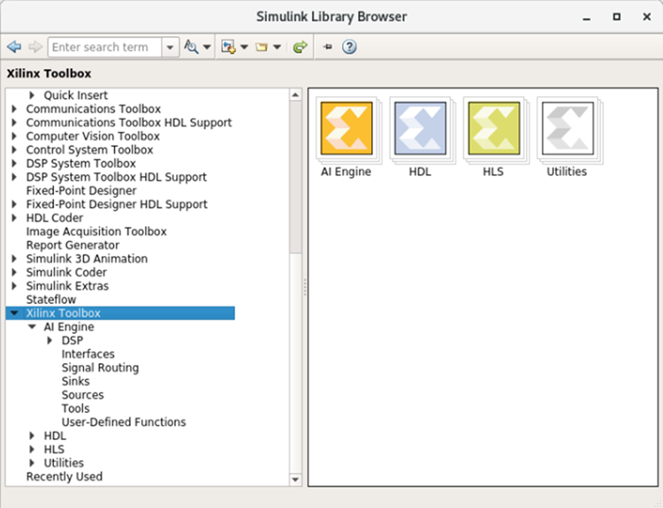

# Vitis Model Composer for AI Engine Lab Overview

Vitis Model Composer enables the rapid simulation, exploration, and code generation of algorithms targeted for AI Engines from within the Simulink® environment. You can achieve this by importing AI Engine kernels and data-flow graphs into Vitis Model Composer as blocks and controlling the behavior of the kernels and graphs by configuring the block GUI parameters. Simulation results can be visualized by seamlessly connecting Simulink source and sink blocks with Vitis Model Composer AI Engine blocks.

Vitis Model Composer provides a set of AI Engine library blocks for use within the Simulink environment. These include:
 * Blocks to import kernels and graphs which can be targeted to the AI Engine portion of Versal® devices.
 * Block to import HLS kernels which can be targeted to the PL portion of Versal devices.
 * Blocks that support connection between the AI Engine and the Xilinx HDL blockset.
 * Configurable AI Engine functions such as FIR, FFT, IFFT etc.

> ❗❗ **Important**: The AI Engine Lab can be done only in a Linux environment.

 **Figure: Simulink Library Browser: AI Engine**
  

This tutorial includes the following labs which introduce AI Engine support in Vitis Model Composer.

### Lab 1

Import AI Engine Kernels
 * Import AI Engine kernels using the AIE Kernel block from AI Engine library
 * Generate graph code
 * Simulate the design using the AI Engine SystemC Simulator.

### Lab 2

Import an AI Engine Graph
 * Import an AI Engine sub-graph using the AIE Graph block
 * Generate a top-level graph
 * Simulate the design using the AI Engine SystemC Simulator.
