# Lab 1: Introduction to Vitis Model Composer HDL Library

In this lab, you will learn how to use the Vitis Model Composer HDL library to specify a design in Simulink® and synthesize the design into an FPGA. This tutorial uses a standard FIR filter and demonstrates how Vitis Model Composer provides you the design options that allow you to control the fidelity of the final FPGA hardware.

#### Objectives
After completing this lab, you will be able to:

* Capture your design using the Vitis Model Composer HDL Blockset 
* Capture your designs in either complex or discrete Blocksets.
* Synthesize your designs in an FPGA using the Vivado® Design Environment.

#### Procedures

This lab has four primary parts:

**Step 1**
<br><ul>Review an existing Simulink design using the Xilinx® FIR Compiler block, and review the final gate level results in Vivado.</ul>

**Step 2**
<br><ul>Use over-sampling to create a more efficient design.</ul>

**Step 3**
<br><ul>Design the same filter using discrete blockset parts.</ul>

**Step 4**
<br><ul>Understand how to work with Data Types such as Floating-point and Fixed-point.</ul>

## Step 1: Creating a Design in an FPGA

In this step, you learn the basic operation of Vitis Model Composer and how to synthesize a Simulink design into an FPGA.

1. Invoke Vitis Model Composer. 
   - On Windows systems, select **Windows > Xilinx Design Tools > Vitis Model Composer 2021.2.**
   - On Linux systems, type `model_composer` at the command prompt.

2. Navigate to the Lab1 folder: <samp> \HDL_Library\Lab1. </samp> 
<br>You can view the directory contents in the MATLAB® Current Folder browser, or type `ls` at the command line prompt.

3. Open the Lab1_1 design as follows:
   - At the MATLAB command prompt, type `open Lab1_1.slx` *OR*
   - Double-click <samp>Lab1_1.slx</samp> in the Current Folder browser.

<ul>The Lab1_1 design opens, showing two sine wave sources being added together and passed separately through two low-pass filters. This design highlights that a low-pass filter can be implemented using the Simulink FDATool or Lowpass Filter blocks. </ul>

<p align="center">
  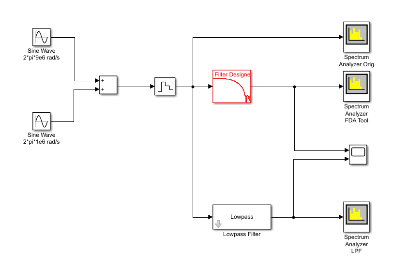
</p>
	
4.  Click the **Run** simulation button.

<ul>
   <br><br>
  When simulation completes you can see the spectrum for the initial summed waveforms, showing a 1 MHz and 9 MHz component, and the results of both filters showing the       attenuation of the 9 MHz signals. <br><br>
  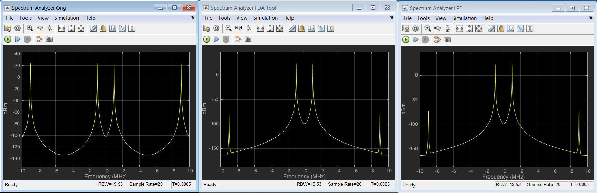 <br><br>
  You will now create a version of this same filter using HDL blocks for implementation in an FPGA.
</ul>

5. Click the **Library Browser** button in the Simulink toolbar to open the Simulink Library Browser. 

<ul>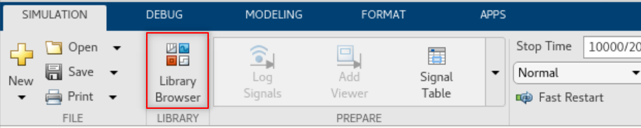</ul>

6. Expand the **Xilinx Toolbox > HDL** menu, select **DSP**, **Non AXI-S** then select **Digital FIR Filter.**

7. Right-click the **Digital FIR Filter** block and select **Add block to model Lab1_1**

<ul> 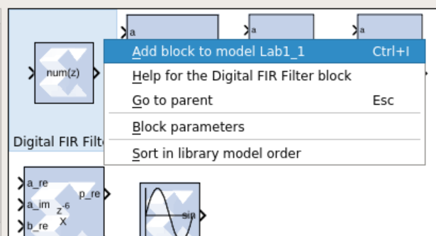 <br><br>
	
  You can define the filter coefficients for the Digital FIR Filter block by accessing the block attributes–double-click the <b>Digital FIR Filter</b> block to view these–or, as in this case, they can be defined using the FDATool.
</ul>

8. From Xilinx Toolbox > HDL > Tools, select FDATool and add it to the Lab1_1 design.
<br>An FPGA design requires three important aspects to be defined:
   - The input ports
   - The output ports
   - The FPGA technology

<ul>The next three steps show how each of these attributes is added to your Simulink design.</ul>

>**Important: If you fail to correctly add these components to your design, it cannot be implemented in an FPGA. Subsequent labs will review in detail how these blocks are configured; however, they must be present in all Vitis Model Composer HDL designs.**

9. In the Interfaces menu, select **Gateway In**, and add it to the design.

<ul>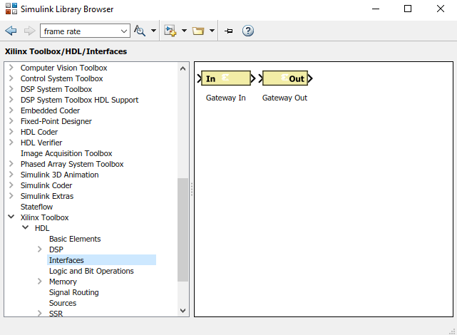</ul>

10. Similarly, from the same menu, add a Gateway Out block to the design.

11. From the Utilites menu, under the Code Generation menu, add the Vitis Model Composer Hub token used to define the FPGA technology.

12. Finally, make a copy of one of the existing Spectrum Analyzer blocks, and rename the instance to Spectrum Analyzer HDL by clicking the instance name label and editing the text.

13. Connect the blocks as shown in the following figure. Use the left-mouse key to make connections between ports and nets.

<ul>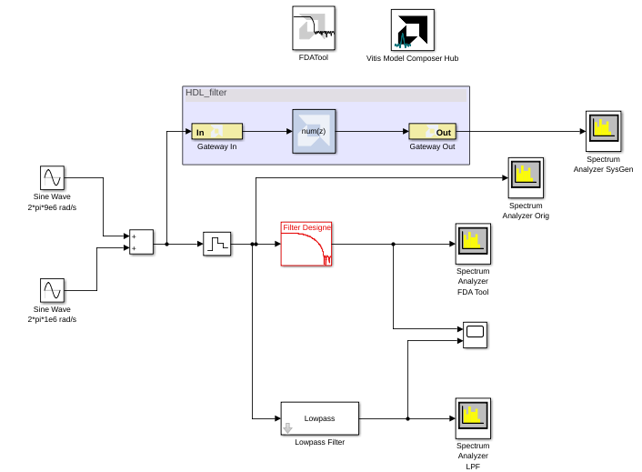</ul>

The next part of the design process is to configure the HDL blocks.

### Configure the HDL Blocks

The first task is to define the coefficients of the new filter. For this task you will use the Xilinx block version of FDATool that you just added in step 8 above. 


1. Double click on the FDATool block and review the existing Frequency and Magnitude specifications.
<ul>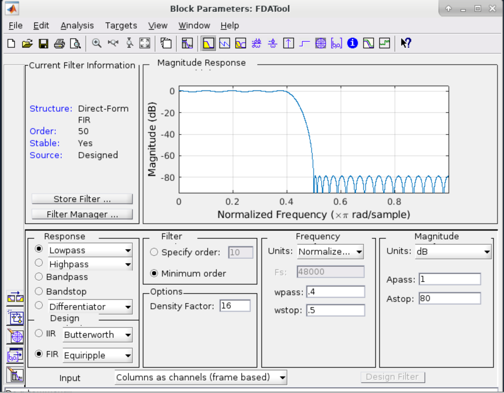</ul>

2. Change the filter specifications to match the following values:
   - Frequency Specifications
      - Units = MHz
      - Fs = 20
      - Fpass = 1.5
      - Fstop = 8.5
   - Magnitude Specifications
      - Units = dB
      - Apass = 0.01
      - Astop = 100

3. Click the **Design Filter** button at the bottom. Your filter should look like below. Close the Properties Editor.

<ul>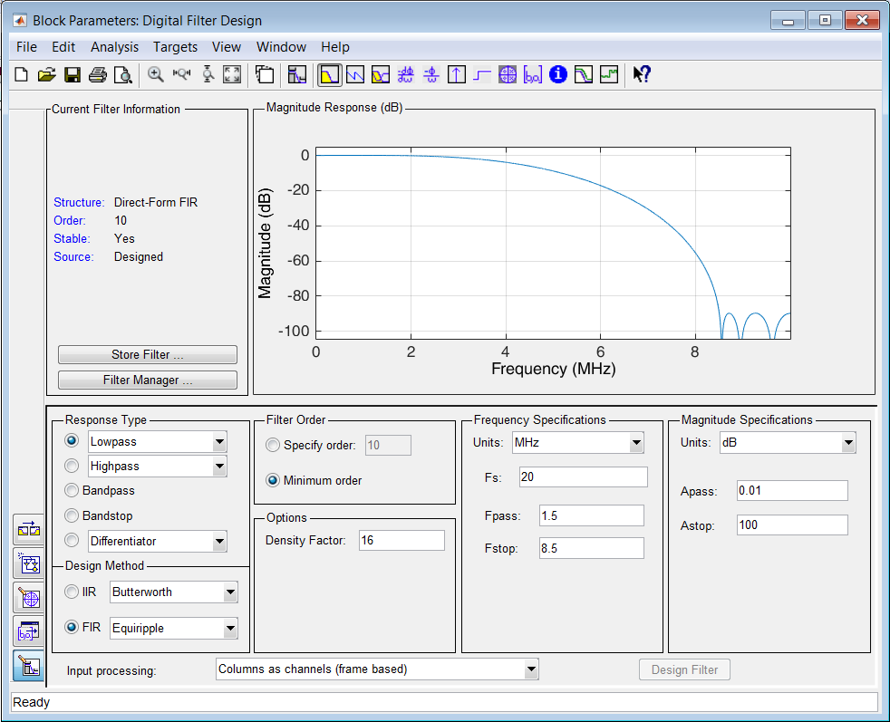</ul>

4. Double-click the **Digital FIR Filter** instance to open the Properties Editor.

5. In the Filter Parameters section, replace the existing coefficients (Coefficient Vector) with ```xlfda_numerator( [bdroot, '/FDATool']))``` to use the coefficients defined by the FDATool instance that is at the top level in the model (and hence the reason to use the MATLAB 'bdroot' command).

<ul>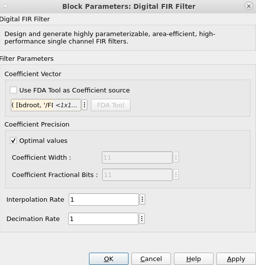</ul>

6. Click **OK** to exit the Digital FIR Filter Properties Editor.

<br><br>In an FPGA, the design operates at a specific clock rate and using a specific number of bits to represent the data values.
<br><br>The transition between the continuous time used in the standard Simulink environment and the discrete time of the FPGA hardware environment is determined by defining the sample rate of the Gateway In blocks. This determines how often the continuous input waveform is sampled. This sample rate is automatically propagated to other blocks in the design by Vitis Model Composer. In a similar manner, the number of bits used to represent the data is defined in the Gateway In block and also propagated through the system.
<br><br>Although not used in this tutorial, some HDL blocks enable rate changes and bit-width changes, up or down, as part of this automatic propagation. More details on these blocks are found in the *Vitis Model Composer User Guide* ([UG1483](https://docs.xilinx.com/r/2021.2-English/ug1483-model-composer-sys-gen-user-guide/Revision-History)).
<br><br>Both of these attributes (rate and bit width) determine the degree of accuracy with which the continuous time signal is represented. Both of these attributes also have an impact on the size, performance, and hence cost of the final hardware.
<br><br>Vitis Model Composer allows you to use the Simulink environment to define, simulate, and review the impact of these attributes.

7. Double-click the **Gateway In** block to open the Properties Editor.
<br>Because the highest frequency sine wave in the design is 9 MHz, sampling theory dictates the sampling frequency of the input port must be at least 18 MHz. For this design, you will use 20 MHz.

8. At the bottom of the Properties Editor, set the Sample Period to 1/20e6.

9. For now, leave the bit width as the default fixed-point 2’s complement 16-bits with 14-bits representing the data below the binary point. This allows us to express a range of -2.0 to 1.999, which fits the range required for the summation of the sine waves (both of amplitude 1).

<ul>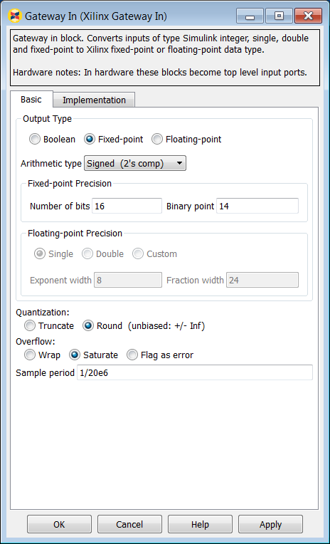</ul>

10. Click **OK** to close the Gateway In Properties Editor.
<br>This now allows us to use accurate sample rate and bit-widths to accurately verify the hardware.

13. Create a subsystem that inlcudes the Gateway blocks and the Digital FIR Filter. Call the subsystem, HDL_filter. 
<ul>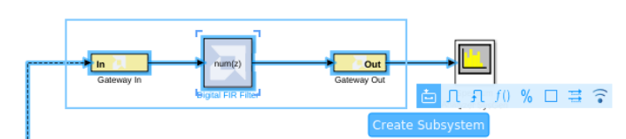</ul>
<ul>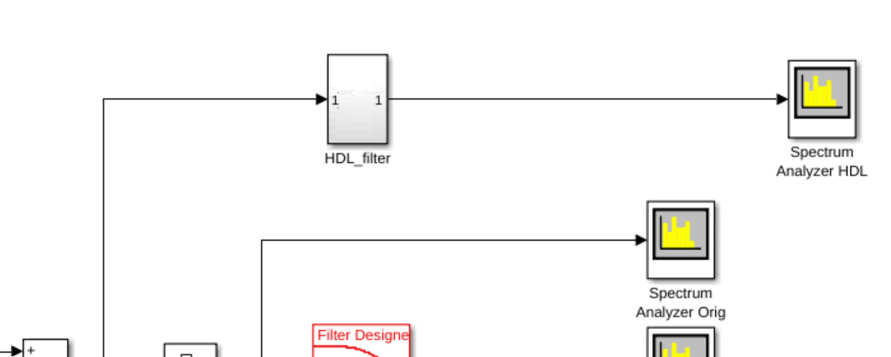</ul>

14. Double-click the **Vitis Model Composer Hub** token to open the Properties Editor. Click on the "Code Generation" icon on the top, and then click the HDL_filter subsystem on the left. 
<ul>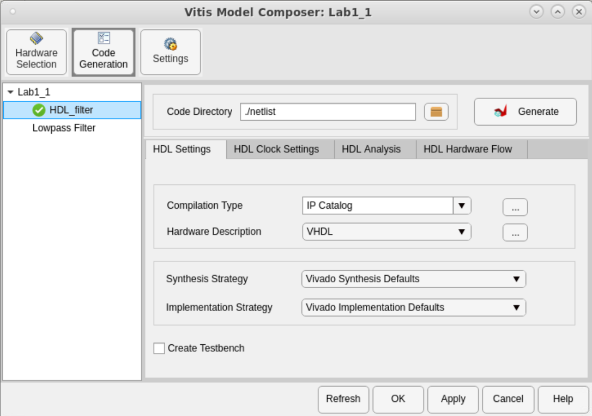</ul>

<br>Because the input port is sampled at 20 MHz to adequately represent the data, you must define the clock rate of the FPGA and the Simulink sample period to be at least 20 MHz.

15. Select the HDL Clock Settings tab:
	 - Specify an FPGA clock period of 50 ns (1/20 MHz).
	 - Specify a Simulink system period of 1/20e6 seconds.
<ul>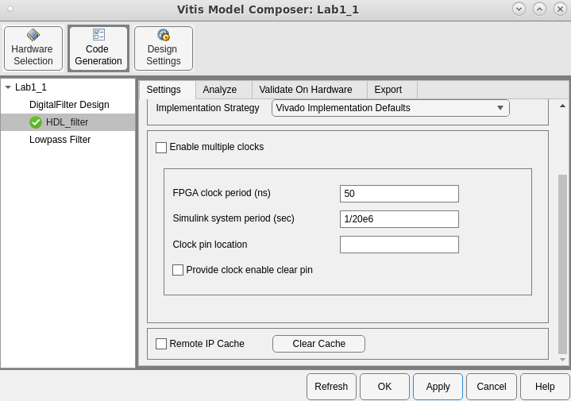</ul>

16. Select the HDL Analysis tab:
	- For the Perform Analysis selection select **Post Synthesis** .
	- For the Analyzer Type selection select **Resource**. This option gives the resource utilization details after completion.

<ul>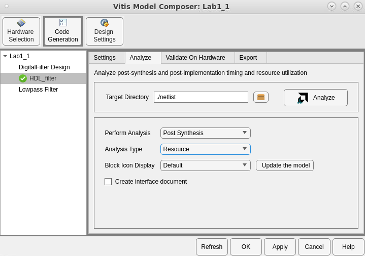</ul>

17. Click **OK** to exit the Hub Block.

16. <p> Click the Run simulation button  to simulate the design and view the results, as shown in the following figure. Because the new design is cycle and bit accurate, simulation might take longer to complete than before.</p>
<ul>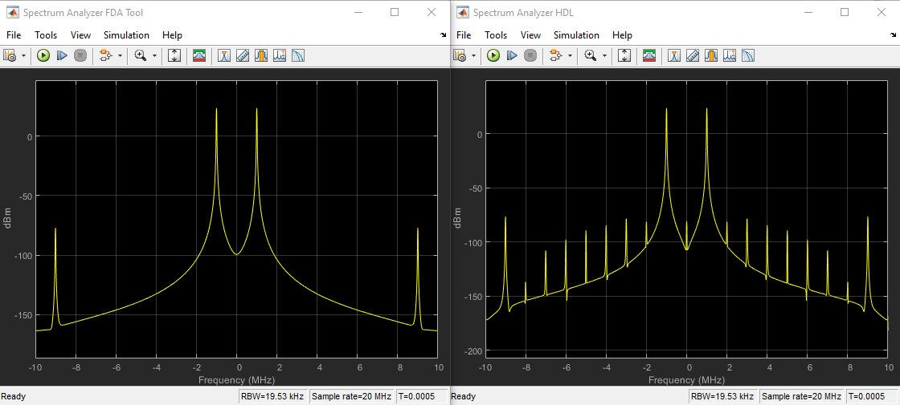
<br> The results are shown above, on the right hand side (in the Spectrum Analyzer HDL window), and differ slightly from the original design (shown on the left in the Spectrum Analyzer FDA Tool window). This is due to the quantization and sampling effect inherent when a continuous time system is described in discrete time hardware.
<br>The final step is to implement this design in hardware. This process will synthesize everything contained between the Gateway In and Gateway Out blocks into a hardware description. This description of the design is output in the Verilog or VHDL Hardware Description Language (HDL). This process is controlled by the System Generator token.
</ul>

17. Double-click the **Vitis Model Composer Hub** block to open the Properties Editor.

18. You can click on **Hardware Selection** and choose a device. For now, use the default device.

19. Click on **Code Generation**, then clik on **HDL_filter** on the left. Make sure the **Compilation Type** is set to **IP Catalog**. This ensures the output is in IP Catalog format. Also, use the default Hardware description language, VHDL.

<ul>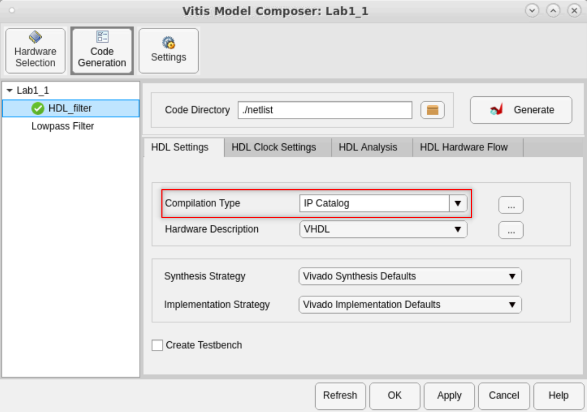</ul>

20. Click **Generate** to compile the design into hardware.
<br>The compilation process transforms the design captured in Simulink blocks into an industry standard Register Transfer Level (RTL) design description. The RTL design can be synthesized into a hardware design. A Resource Analyzer window appears when the hardware design description has been generated.

<ul>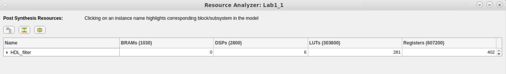<br>
<br> The Compilation status dialog box also appears. <br>
<br>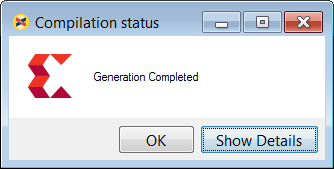
</ul>

21. Click **OK** to dismiss the Compilation status dialog box.

22. Click **OK** to dismiss the Resource Analyzer window.

The final step in the design process is to create the hardware and review the results.

### Review the Results

The output from design compilation process is written to the netlist directory. This directory contains three subdirectories:

<samp>sysgen</samp>
<br><ul> This contains the RTL design description written in the industry standard VHDL format. This is provided for users experienced in hardware design who wish to view the detailed results. </ul>

<samp>ip</samp>
<br><ul> This directory contains the design IP, captured in Xilinx IP catalog format, which is used to transfer the design into the Xilinx Vivado. <em>Lab 5: Using AXI Interfaces and IP Integrator</em>, presented later in this tutorial, explains in detail how to transfer your design IP into the Vivado for implementation in an FPGA
 </ul>

<samp>ip_catalog</samp>
<br><ul> This directory contains an example Vivado project with the design IP already included. This project is provided only as a means of quick analysis. </ul>

The previous Resource Analyzer: Lab1_1 figure shows the summary of resources used after the design is synthesized. You can also review the results in hardware by using the example Vivado project in the ip_catalog directory.

>**Important: The Vivado project provided in the ip_catalog directory does not contain top-level I/O buffers. The results of synthesis provide a very good estimate of the final design results; however, the results from this project cannot be used to create the final FPGA.**

When you have reviewed the results, exit the ```Lab1_1.slx``` Simulink design.


## Step 2: Creating an Optimized Design in an FPGA

In this step you will see how an FPGA can be used to create a more optimized version of the design in Step 1, by oversampling. You will also learn about using workspace variables.

1. At the command prompt, type ```open Lab1_2.slx.```

2. From your Simulink project worksheet, select Simulation > Run or click the Run simulation button .

3. Double-click the Vitis Model Composer Hub to open the Properties Editor.

<ul> As noted in Step 1, the design requires a minimum sample frequency of 18 MHz and it is currently set to 20 MHz (a 50 ns FPGA clock period). <br>
  <br><ul></ul> <br>
  <br>The frequency at which an FPGA device can be clocked easily exceeds 20 MHz. Running the FPGA at a much higher clock frequency will allow Vitis Model Composer to use the same hardware resources to compute multiple intermediate results.
</ul>

4. Double-click the **FDATool** instance to open the Properties Editor.

5. Click the **Filter Coefficients** button  to view the filter coefficients
<ul>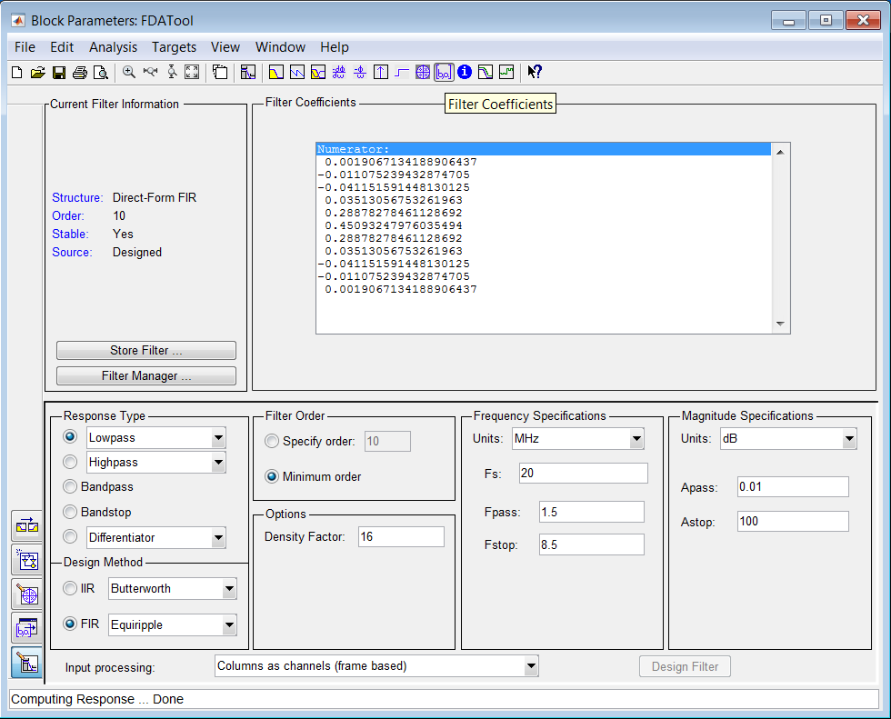<br>
<br>This shows the filter uses 11 symmetrical coefficients. This requires a minimum of six multiplications. This is indeed what is shown at the end of the previous section where the final hardware is using six DSP48 components. DSP48 is the FPGA resource used to perform a multiplication.
<br>The current design samples the input at a rate of 20 MHz. If the input is sampled at 6 times the current frequency, it is possible to perform all calculations using a single multiplier.
</ul>

6. Close the FDATool Properties Editor.

7. You will now replace some of the attributes of this design with workspace variables. First, you need to define some workspace variables.

8. In the MATLAB Command Window:
   - Enter ```num_bits = 16```
   - Enter ```bin_pt = 14```

<ul>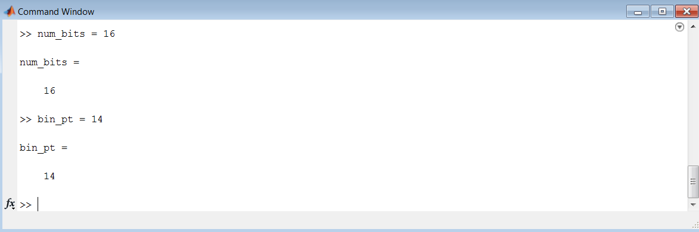</ul>

9. In design Lab1_2, double-click the HDL_filter subssytem, and then double click the **Gateway In** block to open the Properties Editor.

10. In the Fixed-Point Precision section, replace 16 with ```num_bits``` and replace 14 with ```bin_pt```, as shown in the following figure.

<ul>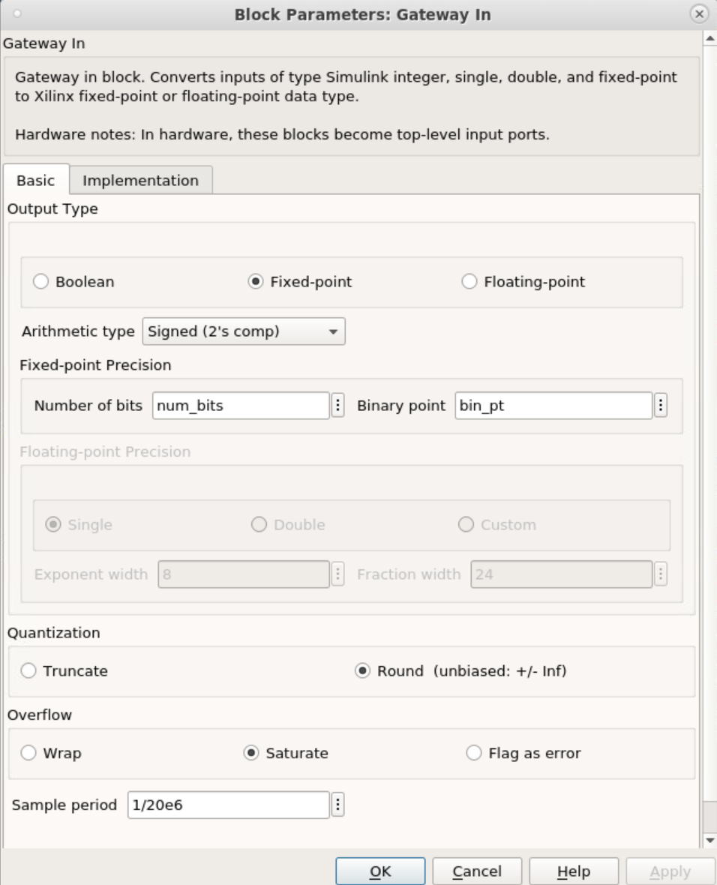</ul>

11. Click **OK** to save and exit the Properties Editor. 
<br> In the Vitis Model Composer Hub update the sampling frequency to 120 MHz (6 * 20 MHz) in this way:
	 - Click on Code Generation, on the right side of the window click on HDL_filter.
	 - Select the HDL Clock Settings tab. 
	 - Specify an FPGA clock period of 8.33 ns (1/120 MHz).
  	 - Specify a Simulink system period of 1/120e6 seconds.
	 - Select the HDL Analysis Settings tab.
	 - From the Perform analysis menu, select <b>Post Synthesis</b> and from Analyzer type menu, select <b>Resource</b> as shown in the following figure. This option gives the resource utilization details after completion. 
   
> 📝 Note:  In order to see accurate results from the Resource Analyzer Window, it is recommended to specify a new target directory rather than use the current working directory.

<ul>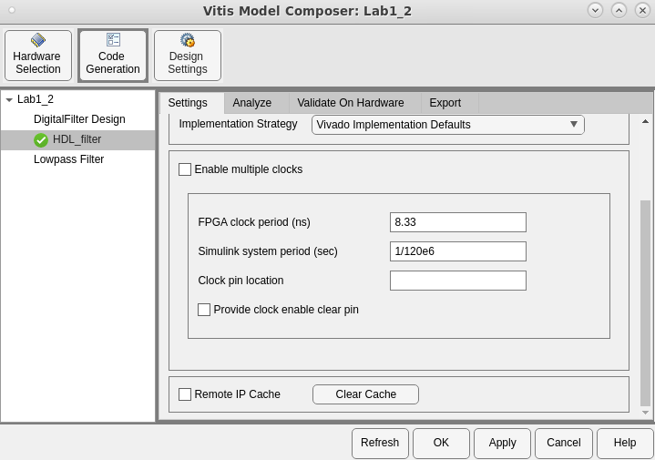</ul>

12. Click **Generate** to compile the design into a hardware description.

<ul>In this case, the message appearing in the Diagnostic Viewer can be dismissed as you are purposely clocking the design above the sample rate to allow resource sharing and reduce resources. Close the Diagnostic Viewer window.</ul>

13. When generation completes, click **OK** to dismiss the Compilation status dialog box.

<ul> The Resource Analyzer window opens when the generation completes, giving a good estimate of the final design results after synthesis as shown in the following figure.<br> <br> The hardware design now uses only a single DSP48 resource (a single multiplier) and compared to the results at the end of the Configure the HDL Blocks section, the resources used are significantly lower. <br>
<br>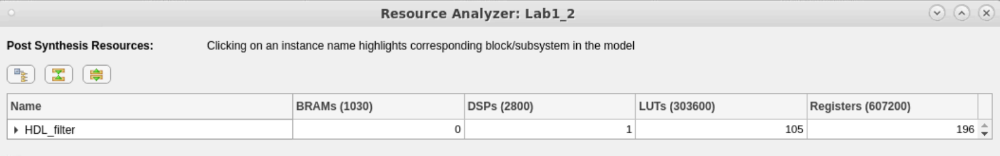</ul>

14. Click **OK** to dismiss the Resource Analyzer window.
15. Click **OK** to dismiss the System Generator token.

Exit the <samp>Lab1_2.slx</samp> Simulink worksheet.

## Step 3: Creating a Design using Discrete Components

In this step you will see how Vitis Model Composer can be used to build a design using discrete components to realize a very efficient hardware design.

1. At the command prompt, type open `Lab1_3.slx.`
<br><br>This opens the Simulink design shown in the following figure. This design is similar to the one in the previous two steps. However, this time the filter is designed with discrete components and is only partially complete. As part of this step, you will complete this design and learn how to add and configure discrete parts. <br>
<br><br>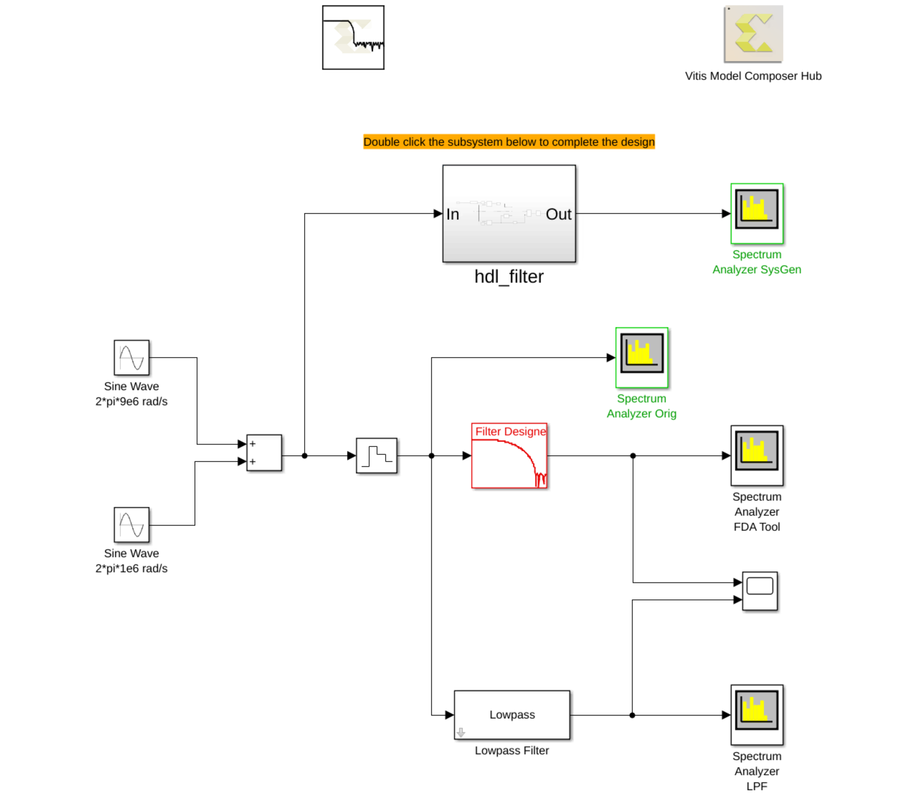<br>
This discrete filter operates in this way:<br>
   - Samples arrive through port In and after a delay stored in a shift register (instance ASR)
   - A ROM is required for the filter coefficients.
   - A counter is required to select both the data and coefficient samples for calculation.
   - A multiply accumulate unit is required to perform the calculations.
   - The final down-sample unit selects an output every nth cycle.
<ul>Start by adding the discrete components to the design.</ul>

2. Click the Library Browser button  in the Simulink toolbar to open the Simulink Library Browser.
   - Expand the Xilinx Blockset menu.
   - As shown in the following figure, select the **Sources** section in the HDL library, then right-click **Counter** to add this component to the design.
<br><br>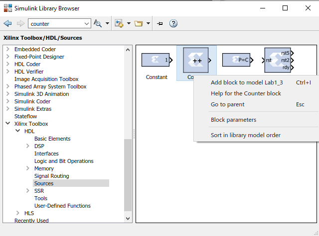<br><br>
   - Select the **Memory** section and then **Non AXI-S** (shown at the bottom left in the figure above) and add a ROM to the design.
   - Finally, select the **DSP** section and then **Non AXI-S** and add a DSP Macro 1.0 to the design.

3. Connect the three new instances to the rest of the design as shown in the following figure:
<br><br>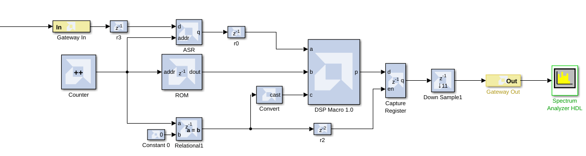<br><br>
You will now configure the instances to correctly filter the data.

4. Double-click the FDATool instance and select Filter Coefficients  from the toolbar to review the filter specifications.
<br><br>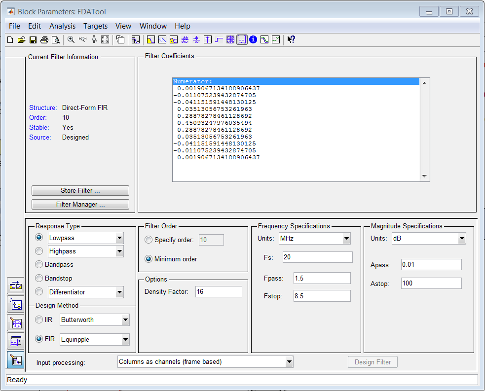<br><br>
This shows the same specifications as the previous steps in Lab 1 and confirms there are 11 coefficients. You can also confirm, by double-clicking on the input Gateway In that the input sample rate is once again 20 MHz (Sample period = 1/20e6). With this information, you can now configure the discrete components.

5. Close the FDATool Properties Editor.

6. Double-click the **Counter** instance to open the Properties Editor.
   - For the Counter type, select **Count limited** and enter this value for **Count to value:** `length(xlfda_numerator([bdroot '/FDATool']))-1` <br>This will ensure the counter counts from 0 to 10 (11 coefficient and data addresses).
   - For Output type, leave default value at Unsigned and in Number of Bits enter the value 4. Only 4 binary address bits are required to count to 11.
   - For the Explicit period, enter the value `1/(11*20e6)` to ensure the sample period is 11 times the input data rate. The filter must perform 11 calculations for each input sample.
<br><br>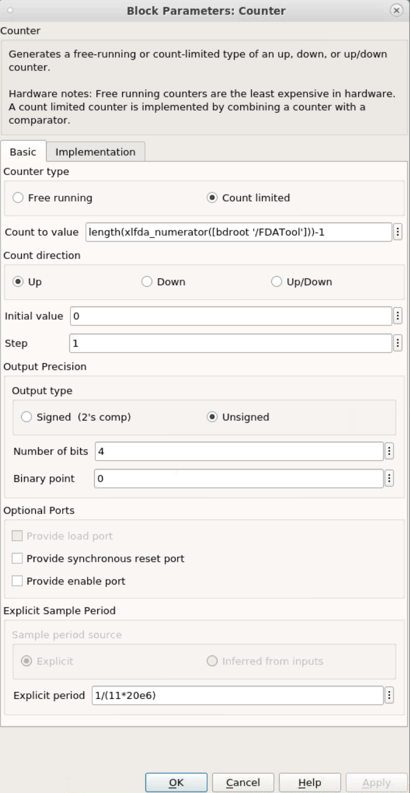<br><br>
   - Click **OK** to exit the Properties Editor.
 
7. Double-click the **ROM** instance to open the Properties Editor.
   - For the Depth, enter the value `length(xlfda_numerator([bdroot '/FDATool']))`. This will ensure the ROM has 11 elements.
   - For the Initial value vector, enter `xlfda_numerator([bdroot '/FDATool'])`. The coefficient values will be provided by the FDATool instance. 
<br><br><br><br> 
   - Click **OK** to exit the Properties Editor.

8. Double-click the **DSP Macro 1.0** instance to open the Properties Editor.
   - In the Instructions tab, replace the existing Instructions with `A*B+P` and then add `A*B`. When the `sel` input is false the DSP will multiply and accumulate. When the `sel` input is true the DSP will simply multiply. 
<br><br>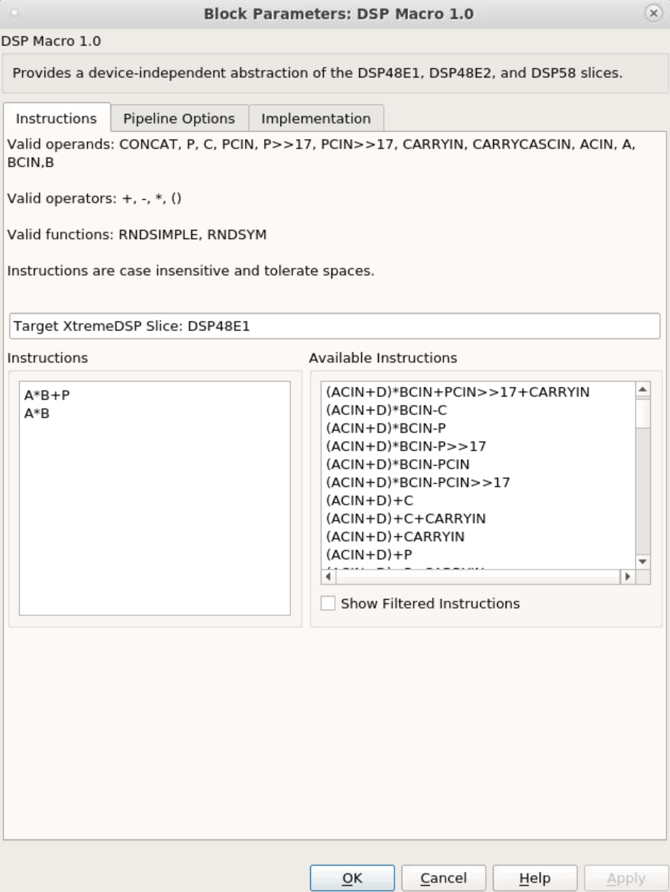<br><br>
   - In the Pipeline Options tab, use the Pipeline Options drop-down menu to select **By_Tier.**
   - Select **Tier 3** and **Tier 5**. This will ensure registers are used at the inputs to A and B and between the multiply and accumulate operations. 
<br><br><br><br> 
   - Click **OK** to exit the Properties Editor.

9. Click **Save** to save the design.

10. Click the Run simulation button to simulate the design and view the results, as shown in the following figure.
<br><br>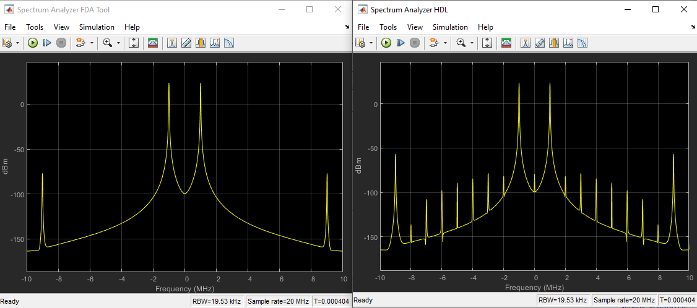<br><br>
The final step is to compile the design into a hardware description and synthesize it.

11. Double-click the **System Generator** token to open the Properties Editor.

12. From the Compilation tab, make sure the Compilation target is IP catalog.

13. From the Clocking tab, under Perform analysis select **Post Synthesis** and for Analyzer type select **Resource**. This option gives the resource utilization details after completion.


> 🖊️ Note: In order to see accurate results from Resource Analyzer Window it is recommended to specify a new target directory rather than use the current working directory.

14. Click Generate to compile the design into a hardware description. After generation finishes, it displays the resource utilization in the Resource Analyzer window.
<br><br>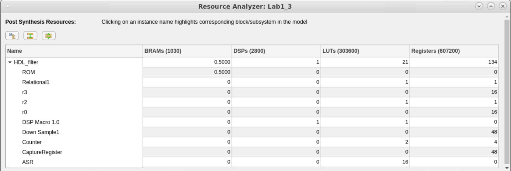<br><br>
The design now uses fewer FPGA hardware resources than either of the versions designed with the Digital FIR Filter macro.

15. Click OK to dismiss the Resource Analyzer window.

16. Click OK to dismiss the Compilation status dialog box.

17. Click OK to dismiss the System Generator token.

18. Exit the `Lab1_3.slx` worksheet.


## Step 4: Creating a Design using Discrete Components

In this step, you will learn how hardware-efficient fixed-point types can be used to create a design which meets the required specification but is more efficient in resources, and understand how to use Xilinx HDL Blocksets to analyze these systems.

This step has two primary parts:
   - In Part 1, you will review and synthesize a design using floating-point data types.
   - In Part 2, you will work with the same design, captured as a fixed-point implementation, and refine the data types to create a hardware-efficient design which meets the same requirements.

### Part 1: Designing with Floating-Point Data Types

In this part you will review a design implemented with floating-point data types.

1. At the command prompt, type `open Lab1_4_1.slx.`
<br><br>This opens the Simulink design shown in the following figure. This design is similar to the design used in Lab 1_1, however this time the design is using float data types and the filter is implemented in sub-system FIR.<br><br>
First, you will review the attributes of the design, then simulate the design to review the performance, and finally synthesize the design.
<br><br>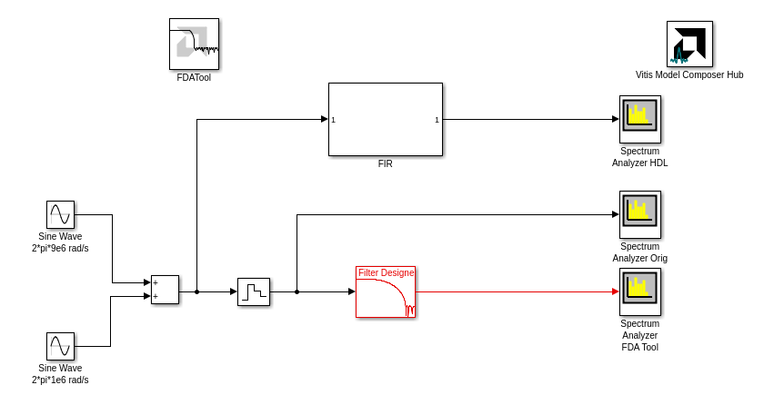<br><br>
In the previous figure, both the input and output of instance FIR are of type double.

2. In the MATLAB Command Window enter:
```
MyCoeffs = xlfda_numerator('FDATool')
```

3. Double-click the instance **FIR** to open the sub-system.

4. Double-click the instance **Constant1** to open the Properties Editor.
<br><br>This shows the Constant value is defined by `MyCoeffs(1).`
<br><br>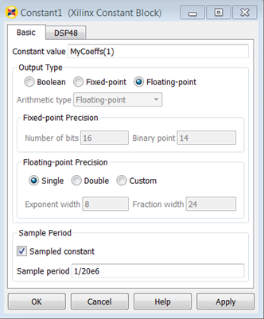<br><br>

5. Close the Constant1 Properties editor.

6. Return to the top-level design using the toolbar button Up To Parent , or click the tab labeled Lab1_4_1.<br>
<br>The design is summing two sine waves, both of which are 9 MHz. The input gateway to the Vitis Model Composer must therefore sample at a rate of at least 18 MHz.

7. Double-click the **Gateway In1** instance to open the Properties Editor and confirm the input is sampling the data at a rate of 20 MHz (a Sample period of 1/20e6).

8. Close the Gateway In Properties editor.

9. Click the Run simulation button to simulate the design.<br>
<br>The results shown in the following figure show the Vitis Model Composer HDL blockset produces results which are very close to the ideal case, shown in the center. The results are not identical because the Vitis Model Composer design must sample the continuous input waveform into discrete time values.
<br><br>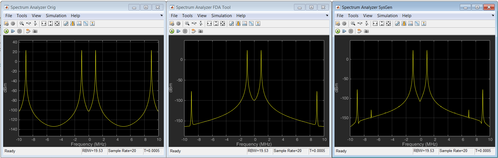<br><br>
The final step is to synthesize this design into hardware.

10. Double-click the **System Generator** token to open the Properties Editor.

11. On the Compilation tab, make sure the Compilation target is IP Catalog.

12. On the Clocking tab, under Perform analysis select **Post Synthesis** and from the Analyzer type menu select **Resource**. This option gives the resource utilization details after completion.

13. Click **Generate** to compile the design into a hardware description. After completion, it generates the resource utilization in Resource Analyzer window as shown in the following figure.
<br><br>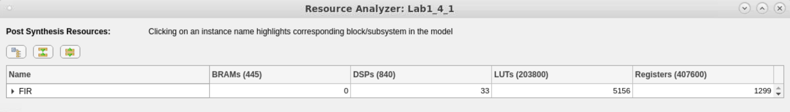<br><br>

14. Click **OK** to dismiss the Compilation status dialog box.
15. Click **OK** to dismiss the System Generator token.<br>
<br>You implemented this same filter in Step 1 using fixed-point data types. When compared to the synthesis results from that implementation – the initial results from this step are shown in the following figure and you can see this current version of the design is using a large amount of registers (FF), BRAMs, LUTs, and DSP resources (Xilinx dedicated multiplier/add units).
<br><br>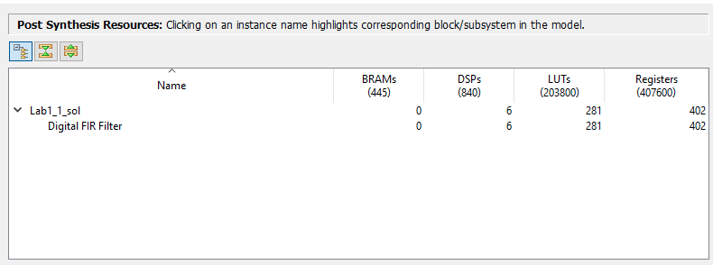<br><br>
Maintaining the full accuracy of floating-point types is an ideal implementation but implementing full floating-point accuracy requires a significant amount of hardware.
<br><br>For this particular design, the entire range of the floating-point types is not required. The design is using considerably more resources than what is required. In the next part, you will learn how to compare designs with different data types inside the Simulink environment.

16. Exit the <samp>Lab1_4_1.slx</samp> Simulink worksheet.

### Part 2: Designing with Fixed-Point Data Types

In this part you will re-implement the design from Part 1: Designing with Floating-Point Data Types using fixed-point data types, and compare this new design with the original design. This exercise will demonstrate the advantages and disadvantages of using fixed-point types and how Vitis Model Composer allows you to easily compare the designs, allowing you to make trade-offs between accuracy and resources within the Simulink environment before committing to an FPGA implementation.

1. At the command prompt, type open `Lab1_4_2.slx` to open the design shown in the following figure.
<br><br>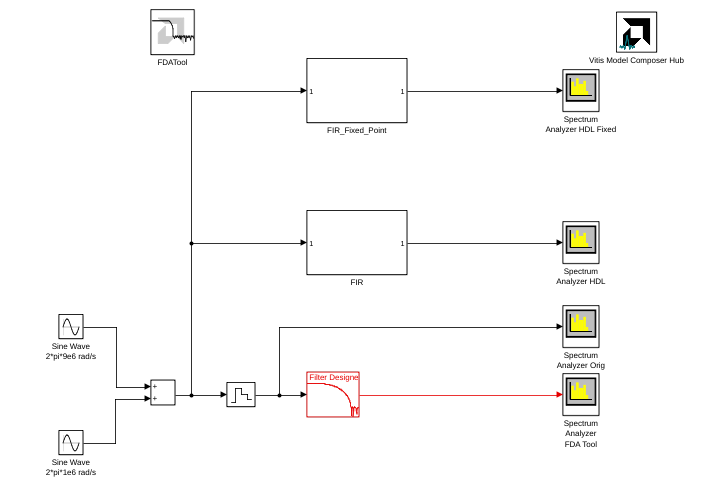<br><br>

2. In the MATLAB Command Window enter:
```
MyCoeffs = xlfda_numerator('FDATool')
```

3. Double-click the instance Gateway In2 to confirm the data is being sampled as 16-bit fixed-point value.

4. Click Cancel to exit the Properties Editor.

5. Click the Run simulation button to simulate the design and confirm instance Spectrum Analyzer HDL Fixed shows the filtered output.
<br><br>As you will see if you examine the output of instance FIR-Fixed-Point (shown in the previous figure) Vitis Model Composer has automatically propagated the input data type through the filter and determined the output must be 43-bit (with 28 binary bits) to maintain the resolution of the signal.
<br><br>This is based on the bit-growth through the filter and the fact that the filter coefficients (constants in instance FIR-Fixed-Point) are 16-bit.

6. In the MATLAB Command Window, enter `sum(abs(MyCoeffs))` to determine the absolute maximum gain using the current coefficients.
<br><br><br><br>
Taking into account the positive and negative values of the coefficients the maximum gain possible is 1.2070 and the output signal should only ever be slightly smaller in magnitude than the input signal, which is a 16-bit signal. There is no need to have 15 bits (43-28) of data above the binary point.
<br><br>You will now use the Reinterpret and Convert blocks to manipulate the fixed-point data to be no greater than the width required for an accurate result and produce the most hardware efficient design.

7. Right-click with the mouse anywhere in the canvas and select **Xilinx BlockAdd**.

8. In the Add Block entry box, type `Reinterpret`.

9. Double-click the **Reinterpret** component to add it to the design.

10. Repeat the previous three steps for these components: 
    - Convert
    - Scope

11. In the design, select the Gateway Out2 instance
    - Right-click and use Copy and Paste to create a new instance of the Gateway Out block.
    - Paste twice again to create two more instances of the Gateway Out (for a total of three new instances).

12. Double-click the **Scope** component.
    - In the Scope properties dialog box, select **File > Number of Inputs > 3**.
    - Select **View > Configuration Properties** and confirm that the Number of input ports is 3.
<br><br>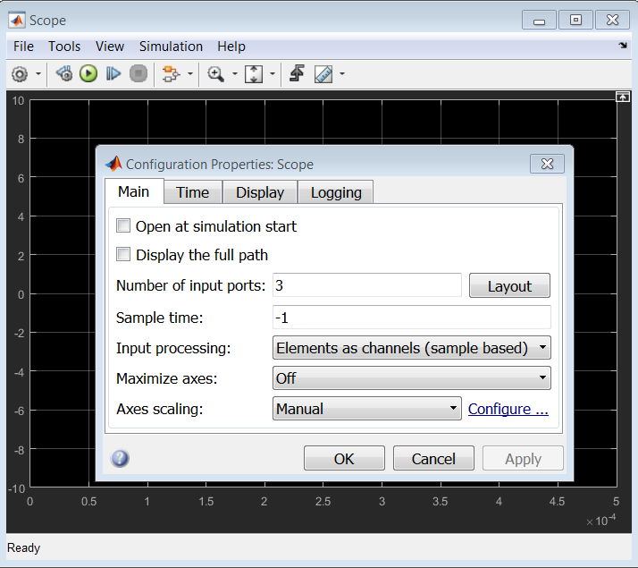<br><br>
    - Click **OK** to close the Configuration Properties dialog box.
    - Select **File > Close** to close the Scope properties dialog box.

13. Connect the blocks as shown in the next figure.

14. Rename the signal names into the scope as shown in the following figure: Convert, Reinterpret and Growth.
<br><br>To rename a signal, click the existing name label and edit the text, or if there is no text double-click the wire and type the name.
<br><br>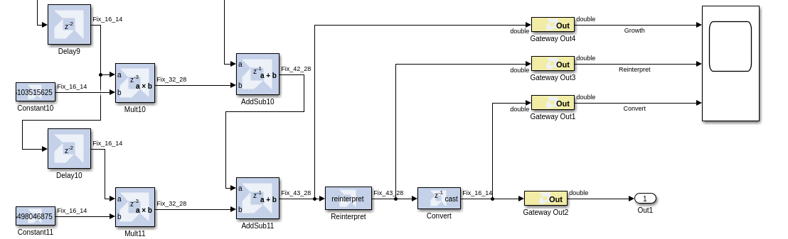<br><br>

15. Click the Run simulation button to simulate the design.

16. Double-click the Scope to examine the signals.
> ⭐ **Tip**: You might need to zoom in and adjust the scale in View > Configuration Properties to view the signals in detail.

<ul>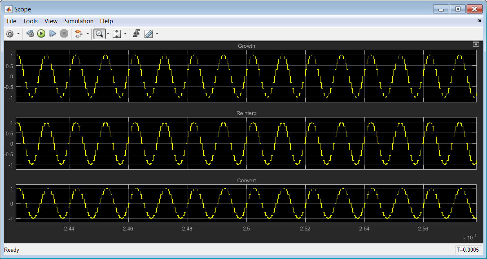<br><br>
The Reinterpret and Convert blocks have not been configured at this point and so all three signals are identical.
<br><br>The HDL Reinterpret block forces its output to a new type without any regard for retaining the numerical value represented by the input. The block allows for unsigned data to be reinterpreted as signed data, or, conversely, for signed data to be reinterpreted as unsigned. It also allows for the reinterpretation of the data's scaling, through the repositioning of the binary point within the data.
<br><br>In this exercise you will scale the data by a factor of 2 to model the presence of additional design processing which might occur in a larger system. The Reinterpret block can also be used to scale down.</ul>

17.  Double-click the **Reinterpret** block to open the Properties Editor.

18. Select **Force Binary** Point.

19. Enter the value `27` in the input field Output Binary Point and click **OK**.
<br><br>The HDL Convert block converts each input sample to a number of a desired arithmetic type. For example, a number can be converted to a signed (two's complement) or unsigned value. It also allows the signal quantization to be truncated or rounded and the signal overflow to be wrapped, saturated, or to be flagged as an error.
<br><br>In this exercise, you will use the Convert block to reduce the size of the 43-bit word back to a 16-bit value. In this exercise the Reinterpret block has been used to model a more complex design and scaled the data by a factor of 2. You must therefore ensure the output has enough bits above the binary point to represent this increase.

20. Double-click the Convert block to open the Properties Editor.

21. In the Fixed-Point Precision section, enter 13 for the Binary Point and click OK.

22. Save the design.

23. Click the Run simulation button to simulate the design.

24. Double-click the Scope to examine the signals.
> ⭐ **Tip**:  You might need to zoom in and adjust the scale in View > Configuration Properties to view the signals in detail..

<ul>In the following figure you can see the output from the filter (Growth) has values between plus and minus 1. The output from the Reinterpret block moves the data values to between plus and minus 2.
<br><br>In this detailed view of the waveform, the final output (Convert) shows no difference in fidelity, when compared to the reinterpret results, but uses only 16 bits.
<br><br><br><br>
The final step is to synthesize this design into hardware.</ul>

25. Double-click the System Generator token to open the Properties Editor.

26. On the Compilation tab, ensure the Compilation target is IP catalog.

27. On the Clocking tab, under Perform analysis select **Post Synthesis** and from Analyzer type menu select Resource. This option gives the resource utilization details after completion.

> 🖊️ Note: In order to see accurate results from Resource Analyzer Window it is recommended to specify a new target directory rather than use the current working directory.

28. Click **Generate** to compile the design into a hardware description. After completion, it generates the resource utilization in Resource Analyzer window as shown in the following figure.
<br><br><br><br>

29. Click **OK** to dismiss the Compilation status dialog box.

30. Click **OK** to dismiss the System Generator token.<br>
Notice, as compared to the results in Step 1, these results show approximately:
    - 45% more Flip-Flops 
    - 20% more LUTs
    - 30% more DSP48s
However, this design contains both the original floating-point filter and the new fixed-point version: the fixed-point version therefore uses approximately 75-50% fewer resources with the acceptable signal fidelity and design performance.

31. Exit Vivado.
32. Exit the <samp>Lab1_4_2.slx</samp> worksheet.

### Summary

In this lab, you learned how to use the Vitis Model Composer HDL blockset to create a design in the Simulink environment and synthesize the design in hardware which can be implemented on a Xilinx FPGA. You learned the benefits of quickly creating your design using a Xilinx Digital FIR Filter block and how the design could be improved with the use of over-sampling.

You also learned how floating-point types provide a high degree of accuracy but cost many more resources to implement in an FPGA and how the Vitis Model Composer HDL blockset can be used to both implement a design using more efficient fixed-point data types and compensate for any loss of accuracy caused by using fixed-point types.

The Reinterpret and Convert blocks are powerful tools which allow you to optimize your design without needing to perform detailed bit-level optimizations. You can simply use these blocks to convert between different data types and quickly analyze the results.

Finally, you learned how you can take total control of the hardware implementation by using discrete primitives.

> 🖊️ Note: In this tutorial you learned how to add Vitis Model Composer HDL blocks to the design and then configure them. A useful productivity technique is to add and configure the System Generator token first. If the target device is set at the start, some complex IP blocks will be automatically configured for the device when they are added to the design.

The following solution directory contains the final Vitis Model Composer (`*.slx`) files for this lab.
```
/HDL_Library/Lab1/solution
```
