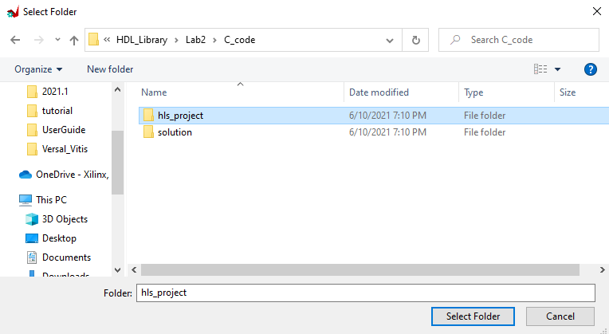
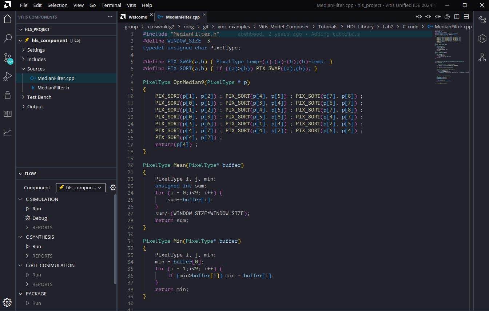
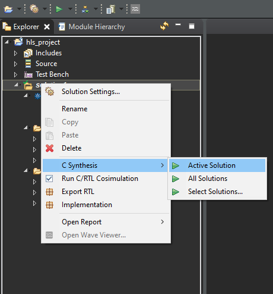
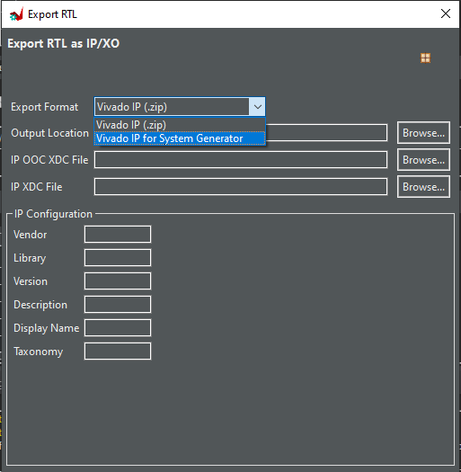
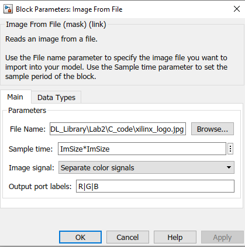

# Lab 2: Importing Code into a Vitis Model Composer HDL Design

## Objectives

After completing this lab, you will be able to:
   - Create a Finite State Machine using the MCode block in Vitis Model Composer.
   - Import an RTL HDL description into Vitis Model Composer.
   - Configure the black box to ensure the design can be successfully simulated.
   - Incorporate a design, synthesized from C, C++ or SystemC using Vitis HLS, as a block into your MATLAB design.

## Step 1: Modeling Control with M-Code

In this step you will be creating a simple Finite State Machine (FSM) using the MCode block to detect a sequence of binary values 1011. The FSM needs to be able to detect multiple transmissions as well, such as 10111011.

### Procedure

In this step you will create the control logic for a Finite State Machine using M-code. You will then simulate the final design to confirm the correct operation.

1. Launch Vitis Model Composer and change the working directory to: **\HDL_Library\Lab2\M_code**

2. Open the file <samp>Lab2_1.slx</samp>
<br><br>You see the following incomplete diagram. <br>


3. Add an MCode block from the Xilinx Toolbox/HDL/User-Defined Functions library. Before wiring up the block, you need to edit the MATLAB® function to create the correct ports and function name.

4. Double-click the **MCode** block and click the **Edit** button, as shown in the following figure.
<br><br>
<br><br> The following figure shows the defualt M-code in the MATLAB text editor
<br><br>

5. Edit the default MATLAB function to include the function name `state_machine` and the input `din` and output `matched`.

6. You can now delete the sample M-code.
<br><br>

7. After you make the edits, use Save As to save the MATLAB file as state_machine.m to the Lab2/M_code folder.
    - In the MCode Properties Editor, use the Browse button to ensure that the MCode block is referencing the local M-code file (<samp>state_machine.m</samp>).

8. In the MCode Properties Editor, click OK.
<br><br>You will see the MCode block assume the new ports and function name.

9. Now connect the MCode block to the diagram as shown in the following figure:
<br><br>
<br><br>You are now ready to start coding the state machine. The bubble diagram for this state machine is shown in the following figure. This FSM has five states and is capable of detecting two sequences in succession.
<br><br>

10. Edit the M-code file, state_machine.m, and define the state variable using the Xilinx `xl_state` data type as shown in the following. This requires that you declare a variable as a persistent variable. The `xl_state` function requires two arguments: the initial condition and a fixed-point declaration.
<br><br>Because you need to count up to 4, you need 3 bits.
``` 
persistent state, state = xl_state(0,{xlUnsigned, 3, 0}); 
```

11. Use a switch-case statement to define the FSM states shown. A small sample is provided, shown as follows, to get you started.
```
switch state
   case 0
      if din == 1
          state = 1;
      else
          state = 0;
      end
      matched = 0;
```
> 📝 Note: You need an otherwise statement as your last case

12. Save the M-code file and run the simulation. The waveform should look like the following figure.
<br><br>You should notice two detections of the sequence.
<br><br>


## Step 2: Modeling Blocks with HDL

In this step, you will import an RTL design into Vitis Model Composer as a black box.

A black box allows the design to be imported into Vitis Model Composer even though the description is in Hardware Description Language (HDL) format.


1. Invoke Vitis Model Composer and from the MATLAB console, change the directory to: \HDL_Library\Lab2\HDL.
<br><br>The following files are located in this directory:
    - Lab2_2.slx - A Simulink model containing a black box example.
    - transpose_fir.vhd - Top-level VHDL for a transpose form FIR filter. This file is the VHDL that is associated with the black box.
    - mac.vhd – Multiply and adder component used to build the transpose FIR filter.

2. Type open `Lab2_2.slx on the MATLAB` command line.

3. Open the subsystem named Down Converter.

4. Open the subsystem named Transpose FIR Filter Black Box.
<br><br> At this point, the subsystem contains two input ports and one output port. You will add a black box to this subsystem:
<br><br>

5. Left-click the design canvas and begin typing **Black Box** to a Black Box block to this subsystem.
<br><br>A browser window opens, listing the VHDL source files that can be associated with the black box.

6. From this window, select the top-level VHDL file <samp>transpose_fir.vhd</samp>. This is illustrated in the following figure
<br><br>
<br><br>The associated configuration M-code <samp>transpose_fir_config.m</samp> opens in an Editor for modifications.

7. Close the Editor.

8. Wire the ports of the black box to the corresponding subsystem ports and save the design
<br><br>

9. Double-click the Black Box block to open this dialog box:
<br><br>A browser window opens, listing the VHDL source files that can be associated with the black box.
<br><br>
<br><br> The following are the fields in the dialog box:
<br><br>   **Block configuration m-function**
<br> &emsp; This specifies the name of the configuration M-function for the black box. In this example, the field contains the name of the function that was generated by the Configuration Wizard. By default, the black box uses the function the wizard produces. You can however substitute one you create yourself.
<br><br>**Simulation mode**
<br><br>There are three simulation modes: 
<br><br> <b>Inactive</b>
<br> &emsp; In this mode the black box participates in the simulation by ignoring its inputs and producing zeros. This setting is typically used when a separate simulation model is available for the black box, and the model is wired in parallel with the black box using a simulation multiplexer.
<br><br> <b>Vivado Simulator</b>
<br> &emsp; In this mode simulation results for the black box are produced using co-simulation on the HDL associated with the black box.
<br><br>  **External co-simulator**
<br> &emsp; In this mode it is necessary to add a Questa HDL co-simulation block to the design, and to specify the name of the Questa block in the HDL co-simulator to use field. In this mode, the black box is simulated using HDL co-simulation.

10. Set the Simulation mode to Inactive and click OK to close the dialog box.

11. Move to the design top-level and run the simulation by clicking the **Run simulation** button , then double-click the **Scope** block.

12. Notice the black box output shown in the Output Signal scope is zero. This is expected because the black box is configured to be Inactive during simulation.
<br><br>

13. From the Simulink Toolstrip, select *Debug > Information Overlays > Alias Data Types** to display the port types for the black box.

14. Compile the model (Ctrl-D) to ensure the port data types are up to date.
<br><br>Notice that the black box port output type is `UFix_26_0`. This means it is unsigned, 26-bits wide, and has a binary point 0 positions to the left of the least significant bit.

15. Open the configuration M-function <samp>transpose_fir_config.m</samp> and change the output type from `UFix_26_0` to `Fix_26_12`. The modified line (line 26) should read:
```
dout_port.setType('Fix_26_12');
```
Continue the following steps to edit the configuration M-function to associate an additional HDL file with the black box.

16. Locate line 65:
```
this_block.addFile('transpose_fir.vhd');
```

17. Immediately above this line, add the following:
```
this_block.addFile('mac.vhd');
```

18. Save the changes to the configuration M-function and close the file.

19. Click the design canvas and recompile the model (Ctrl-D).
<br><br>Your Transpose FIR Filter Black Box subsystem should display as follows
<br><br>

20. From the Black Box block parameter dialog box, change the Simulation mode field from **Inactive** to **Vivado Simulator** and then click **OK**.

21. Move to the top-level of the design and run the simulation.

22. Examine the scope output after the simulation has completed.
<br><br> Notice the waveform is no longer zero. When the Simulation Mode was Inactive, the Output Signal scope displayed constant zero. Now, the Output Signal shows a sine wave as the results from the Vivado Simulation.

23. Right-click the Output Signal display and select **Configuration Properties**. In the Main tab, set **Axis Scaling** to the **Auto** setting.
You should see a display similar to that shown below.
<br><br>

## Step 3: Modeling Blocks with C/C++ Code

The Vitis HLS tool has the ability to transform C/C++ design sources into RTL. The Vitis Model Composer HDL library contains a Vitis HLS block in the HDL/User-Defined Functions library which enables you to bring in C/C++ source files into a Vitis Model Composer model.

### Procedure

In part 1 you will first synthesize a C file using Vitis HLS. In Part 2, you incorporate the output from Vitis HLS into MATLAB and use the rich simulation features of MATLAB to verify that the C algorithm correctly filters an image.

### Part 1

1. Invoke Vitis HLS: Click **Windows > Xilinx Design Tools > Vitis HLS 2022.1.**

2. Select **Open Project** in the welcome screen and navigate to the Vitis HLS project directory <samp>\HDL_Library\Lab2\C_code\hls_project</samp> as shown in the following figure.
<br><br>

3. Click **Select Folder** to open the project.

4. Expand the Source folder in the Explorer pane (left-hand side) and double-click the file MedianFilter.cpp to view the contents of the C++ file as shown in the following figure.
<br><br>
<br><br>This file implements a 2-Dimensional median filter on 3x3 window size.

5. Synthesize the source file by right-clicking on solution1 and selecting **C Synthesis > Active Solution** as shown in the following figure.
<br><br>
<br><br>When the synthesis completes, Vitis HLS displays the following message on the console:
```
Finished C synthesis
```

6. Click **OK** on the C Synthesis Active Solution window.

7. Right-click **solution1** and select **Export RTL**.

8. Set Format Selection to **Vivado IP for System Generator** as shown in the following figure and click **OK**
<br><br>
<br><br>When the Export RTL process completes, Vitis HLS displays this message:
```
Finished export RTL
```

9. Exit Vitis HLS

### Part 2: Including a Vitis HLS Package in a Vitis Model Composer Design

1. Launch Vitis Model Composer and open the `Lab2_3.slx` file in the <samp>Lab2/C_code</samp> folder. This should open the model as shown in the following figure.
<br><br>

2. Add a Vitis HLS block:
    - Left-click anywhere on the canvas workspace.
    - Type `Vitis HLS` in the Add block dialog box.
    - Select **Vitis HLS** as shown in the following figure.
<br><br>

3. Double-click the Vitis HLS block to open the Properties Editor.

4. Use the Browse button to select the solution created by Vitis HLS in Step 1, at <samp>\HDL_Library\Lab2\C_code\hls_project\solution1</samp>, as shown in the following figure.

5. Click **OK** to import the Vitis HLS IP.
<br><br>

6. Connect the input and output ports of the block as shown in the following figure.
<br><br>

7. Navigate into the Noisy Image sub-system and double-click the **Image From File** block to open the Block Parameters dialog box.

8. Use the **Browse** button to ensure the file name correctly points to the file <samp>xilinx_logo.jpg</samp> as shown in the following figure.
<br><br>

9. Click **OK** to exit the Block Parameters dialog box.

10. Use the Up to Parent  toolbar button to return to the top level.

11. Save the design.

12. Simulate the design and verify the image is filtered, as shown in the following figures.
<br><br>

### Summary

In this lab you learned:
 * How to create control logic using M-Code. The final design can be used to create an HDL netlist, in the same manner as designs created using the HDL Blocksets.
 * How to model blocks in Vitis Model Composer using HDL by incorporating an existing VHDL RTL design and the importance of matching the data types of the Vitis Model Composer model with those of the RTL design and how the RTL design is simulated within Vitis Model Composer.
 * How to take a filter written in C++, synthesize it with Vitis HLS and incorporate the design into MATLAB. This process allows you to use any C, C++ or SystemC design and create a custom block for use in your designs. This exercise showed you how to import the RTL design generated by Vitis HLS and use the design inside MATLAB.

Solutions to this lab can be found corresponding locations:
 * <samp>\HDL_Library\Lab2\C_code\solution</samp>
 * <samp>\HDL_Library\Lab2\HDL\solution</samp>
 * <samp>\HDL_Library\Lab2\M_code\solution</samp>

--------------
Copyright 2022 Xilinx

Licensed under the Apache License, Version 2.0 (the "License");
you may not use this file except in compliance with the License.
You may obtain a copy of the License at

    http://www.apache.org/licenses/LICENSE-2.0

Unless required by applicable law or agreed to in writing, software
distributed under the License is distributed on an "AS IS" BASIS,
WITHOUT WARRANTIES OR CONDITIONS OF ANY KIND, either express or implied.
See the License for the specific language governing permissions and
limitations under the License.
