# Lab 6: Using a Vitis Model Composer HDL Design with a Zynq-7000 SoC

In this lab, you will learn how to export your Vivado® design with Vitis Model Composer HDL IP to a software environment and use driver files created by Vitis Model Composer to quickly implement your project on a Xilinx® evaluation board, running hardware with software in the same design.

### Objectives

After completing this lab, you will have learned:
* How to export your Vivado design with Vitis Model Composer HDL IP to a software environment ( Vitis™ software platform).
* How Vitis Model Composer automatically creates software driver files for AXI4-Lite interfaces.
* How to integrate the Vitis Model Composer driver files into your software application.

### Procedure

This lab has two primary parts:
* In Step 1, you will review the AXI4-Lite interface and associated C drivers.
* In Step 2, you will export your Vivado design to a Vitis software environment and run it on a board.

## Step 1: Review the AXI4-Lite Interface Drivers

In this step you review how AXI4-Lite interface drivers are provided when a design with an AXI4-Lite interface is saved.
This exercise uses the same design as Lab 5: Using AXI Interfaces and IP Integrator.

1. Invoke Vitis Model Composer and use the **Current Folder** browser to change the directory to: <samp> \HDL_Library\Lab6. </samp>

2. At the command prompt, type open Lab6_1.slx. This opens the design as shown in the following figure.
  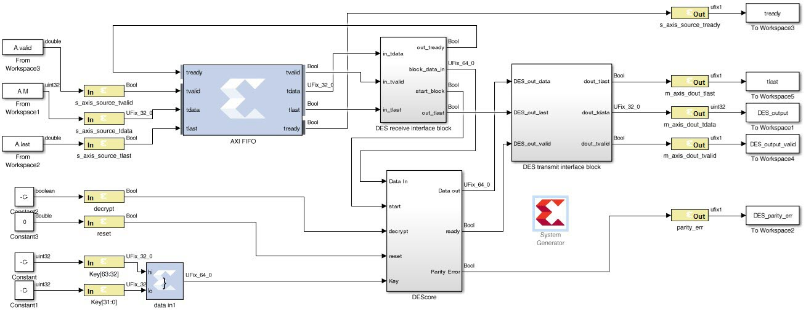
  This design uses a number of AXI interfaces. These interfaces were reviewed in Lab 5: Using AXI Interfaces and IP Integrator and the review is repeated here with additional details on the AXI4-Lite register addressing.
    - Using AXI interfaces allows a design exported to the Vivado IP Catalog to be efficiently integrated into a larger system using IP integrator.
    - It is not a requirement for designs exported to the IP Catalog to use AXI interfaces. The design uses the following AXI interfaces:
        - An AXI4-Stream interface is used for ports `s_axis_source_*`. All Gateway In and Out signals are prefixed with same name (`s_axis_source_`) ensuring they are grouped into the same interface. The suffix for all ports are valid AXI4-Stream interface signal names (`tvalid`, `tlast`, and `tdata`).

3. Double-click **Gateway In** decrypt (or any of **reset**, **Keys[63:32]**, **Keys[31:0]**, **parity_err**).

4. In the Properties Editor select the **Implementation** tab.

5. Confirm the Interface is specified as AXI4-Lite in the Interface options.
   Also note how the address of this port may be automatically assigned (as the current setting of **Auto assign address offset** indicates), or the address may be manually specified.

6. Click **OK** to exit the Properties Editor.
  Details on simulating the design are provided in the canvas notes. For this exercise, you will concentrate on exporting the design to the Vivado IP catalog and use the IP in an existing design.

7. In the System Generator token, select **Generate** to generate a design in IP Catalog format.

8. Click **OK** to dismiss the Compilation status dialog box.

9. Click **OK** to dismiss the System Generator token.

10. In the file system, navigate to the directory <samp> \HDL_Library\Lab6\sys_gen_ip\ip\drivers\lab6_1_v1_2\src </samp> and view the driver files.
  The driver files for the AXI4-Lite interface are automatically created by Vitis Model Composer when it saves a design in IP Catalog format.
  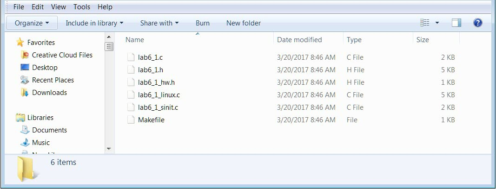

11. Open file <samp> lab6_1_hw.h </samp> to review which addresses the ports in the AXI4-Lite interface were automatically assigned.
  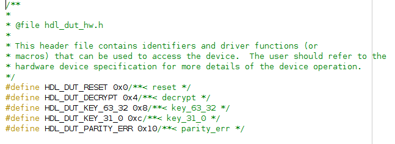

12. Open file <samp> lab6_1.c </samp> to review the C code for the driver functions. These are used to read and write to the AXI4-Lite registers and can be incorporated into your C program running on the Zynq®-7000 CPU. The function to write to the decrypt register is shown in the following figure.
  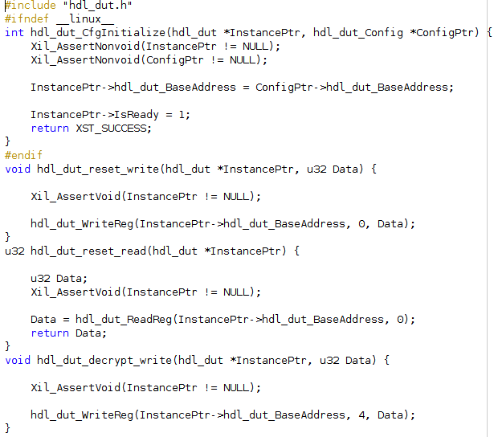
  The driver files are automatically included when the Vitis Model Composer design is added to the IP Catalog. The procedure for adding a Vitis Model Composer design to the IP Catalog is detailed in Lab 5: Using AXI Interfaces and IP Integrator. In the next step, you will implement the design.

## Step 2: Developing Software and Running it on the Zynq-7000 System

1. Open the Vivado IDE:
    - Click **Windows > Xilinx Design Tools > Vitis 2021.2.**
  In this lab you will use the same design as Lab 5: Using AXI Interfaces and IP Integrator, but this time you will create the design using a Tcl file, rather than the interactive process.

2. Using the Tcl console as shown in the following figure:
   - Type `cd C:\ug1498-model-composer-sys-gen-tutorial\HDL_Library\Lab6\IPI_Project` to change to the project directory.
   - Type source lab6_design.tcl to create the RTL design.

> 📝 Note: If you have copied the tutorials to a different directory or changed the file names, you should update the Tcl file accordingly.

<ul>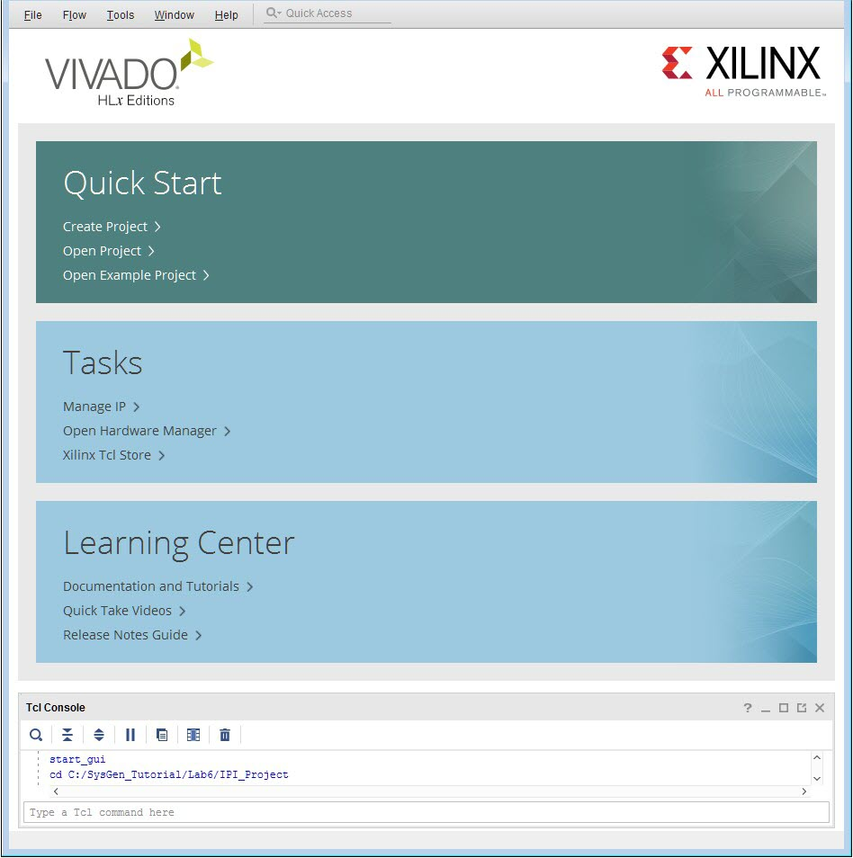</ul>

3. Click **Open Implemented Design** in the Flow Navigator pane.

4. From the Vivado IDE main menu select **File > Export > Export Hardware**.

5. Click **Next** in the Export Hardware Platform page.
  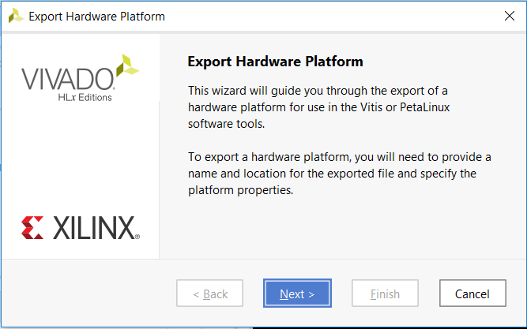

6. Select the **Include Bitstream** option in the Output page and click Next.
  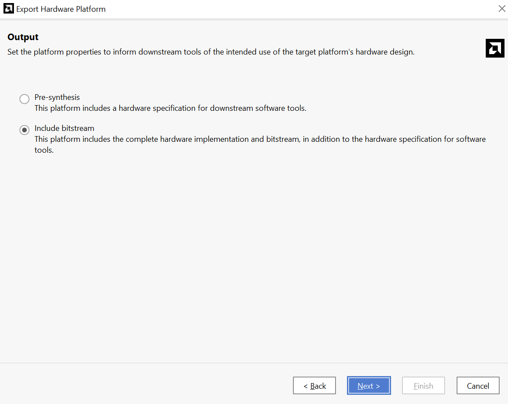

7. Leave the **XSA file name** and the **Export to** fields at the default setting and click **Next**.

8. Click **Finish** to export the hardware.

9. Open the Vitis IDE:
    - Click **Windows > Xilinx Design Tools > Vitis 2021.2.**

10. Select the workspace space directory to store preferences and click Launch.

11. From the Vitis IDE, select **Create Application Project**.

12. Click **Next** in the Welcome page.

13. Switch to the **Create a new platform from hardware(XSA)** tab and click **Browse** to create a custom platform from the XSA.

14. Navigate to **Lab6 > IPI_Project > project_1**, select **design_1_wrapper.xsa** and click **Open**

15. Click **Next**.
  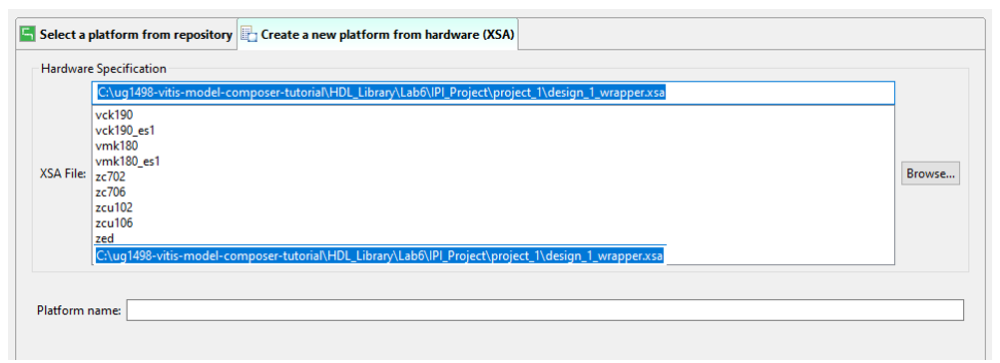

16. Enter the application project name `Des_Test` in the Application project name field.

17. In the Target processor section, select the processor **ps7_cortexa9_0** and click **Next**.
  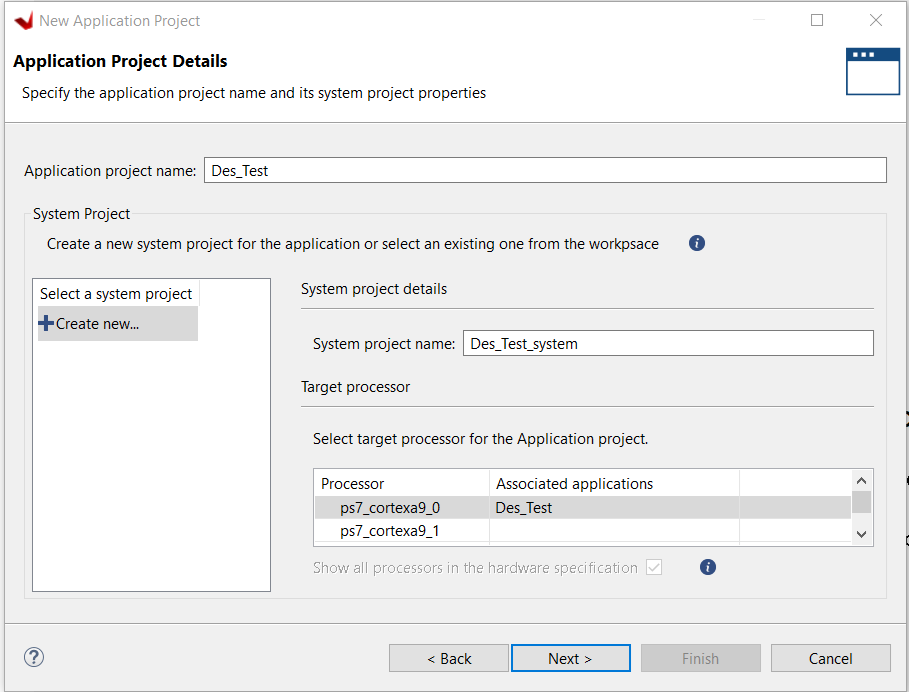

18. Click **Next**.

19. In the Domain page ensure the CPU selected is **ps7_cortexa9_0** and click **Next**.

20. Select the **Hello World** template and click **Finish**.

21. Expand the **design_1_wrapper** container as shown to confirm the AXI4-Lite driver code is included in the project.
  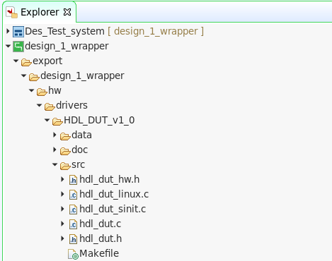

22. Power up the ZC702 board to program the FPGA.

23. Click **Xilinx > Program Device** and from the resulting window, click **Program**.
   The Done LED (DS3) goes ON, on the FPGA board.

24. Click **Window > Show View** and in the Show view window, type `Vitis`, select Vitis Serial Terminal and click **Open**.
  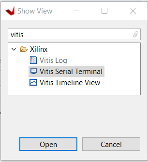

25. To set up the terminal in the Vitis Serial Terminal view, click the + icon and perform the following:
  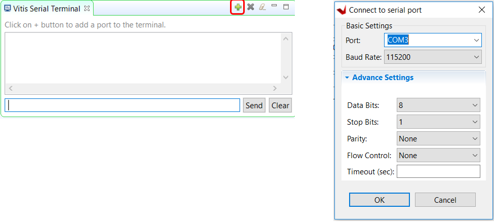
    - Select the COM port to which the USB UART cable is connected. On Windows, if you are unsure, open the **Device Manager** and identify the port with the "Silicon Labs" driver under Ports (COM & LPT).
    - Change the Baud Rate to 115200.
    - Click **OK** to exit the Terminal Settings dialog box.
    - Check that the terminal is connected by the message in tab title bar.

26. Right-click the application project **Des_Test** in the Explorer view, select **Build Project**.
   When this completes, you will see the message “Build Finished” in the console.

27. Right-click on application project **Des_Test**, select **Run As > Launch on Hardware.**

28. Switch to the **Vitis Serial Terminal** tab and confirm that `Hello World` was received.

29. Expand the container `Des_Test` and then expand the container `src`.

30. Double-click the **helloworld.c** file.

31. Replace the contents of this file with the contents of the file `hello_world_final.c` from the `lab6` directory.

32. Save the `helloworld.c` source code.

33. Right-click application project `Des_Test` in the Explorer view, and select **Build Project**.
   When this completes, you will see the message “Build Finished” in the console.

34. Right-click again and select **Run As > Launch on Hardware.**

> 📝 Note: If a window opens displaying the text “Run Session is already active”, click OK in that window.

35. Review the results in the Vitis Serial Terminal tab (shown in the following figure).
  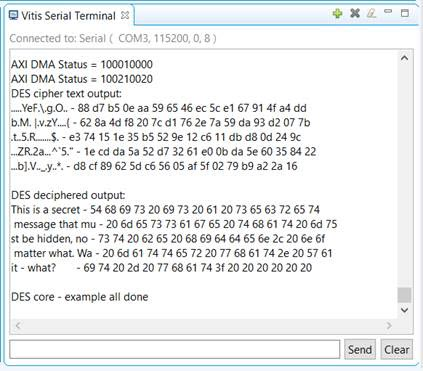

### Summary 

In this lab, you learned how to export your Vivado IDE design containing Vitis Model Composer HDL IP to the Vitis software environment and to integrate the driver files automatically created by Vitis Model Composer to run the application on the ZC702 board. You then viewed the results of the acceleration.

The following solutions directory contains the final Vitis Model Composer (`*.slx`) files for this lab. The solutions directory does not contain the IP output from Vitis Model Composer, the files and directories generated when the Vivado IDE is executed, or the Vitis workspace.

<samp> \HDL_Library\Lab6\solution </samp>
