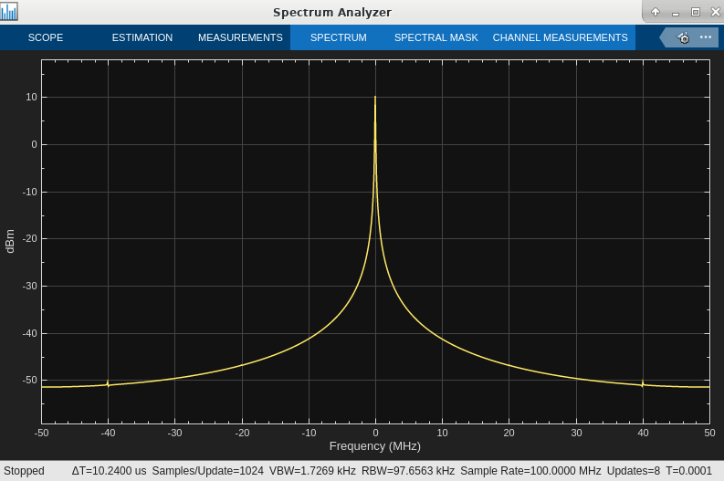

# Lab 7: FIR Compiler 7.2

In this lab, you will learn how to verify the functionality of HDL FIR Compiler block in Vitis Model Composer.

### Objectives

After completing this lab, you will be able to:

* Configure **FIR Compiler** as a **singe rate filter**.

* Configure **FIR Compiler** as an **Interpolator** and a **Decimator** with Integer or Fixed-Fractional rate change.

* Choose correct **hardware oversampling specification** settings in order to get the required output sample rate.

### Procedure 

This lab has five primary parts:

* In Step 1 you will learn how to configure **FIR Compiler** as a **single rate filter**.

* In Step 2 Configure **FIR Compiler** as an **interpolator**.

* In Step 3 Configure **FIR Compiler** as a **decimator**.

* In Step 4 **FIR Compiler** with Hardware Oversampling Specification format: **Hardware Oversampling Rate**.

* In Step 5 Configure **FIR Compiler** with **fixed-fractional rate change**.

## Step 1: Configure FIR Compiler as a Single rate filter

1. Invoke Vitis Model Composer.
    - On Windows systems select **Windows > AMD Design Tools > Vitis Model Composer 2024.2.**
    - On Linux systems, type `model_composer` at the command prompt.

2. Navigate to the Lab7 folder: `\HDL_Library\Lab7.`

You can view the directory contents in the MATLAB® Current Folder browser, or type ls at the command line prompt.

3. Open the Lab7 design using one of the following:
    - At the MATLAB command prompt, type `open Lab7_1.slx`
    - Double-click **Lab7_1.slx** in the Current Folder browser.

Lab7_1 opens as shown in figure below:

Input to the design: 

Input has two sine waves with frequencies **1 MHz** and **5 MHz** respectively and sampled at **100 MHz**.

A random noise is added to create a real-time scenario.

**FDA Tool settings**:

FDA tool is added to the design to generate filter coefficients.

Fitler coefficients with **passband**: Fpass = 2 MHz and **stopband**:  Fstop = 4 MHz are generated.

Double click on **FDA tool** to observe the settings.

4. From the Simulink Toolstrip, click on simulink library browser and then AMD Toolbox---> HDL---> DSP---> AXI-S.

5. Right click on FIR Compiler 7.2 to add this block to the model as shown below:

6. Double click on FIR Compiler and add `double(xlfda_numerator(strcat(bdroot,'/FDATool')))` to cofficient vector field under Filter Coefficients.

> [!NOTE] 
> You could also define the coefficients as a variable in the MATLAB workspace and specify the variable name in this field.

7. Select filter type as `Single_Rate` under filter specification field as shown below:

8. Go to Channel Specification tab and make sure `Maximum_Possible` format is selected under Hardware Oversampling Specification.

9. Go to the **Implementation** tab and select **Coefficient Options** as shown in figure below:

10. Connect Gateway In block to **data_tdata_real** port of FIR Compiler.

11. Connect Gateway Out blocks to **tready**, **tvalid** and **tdata** as shown in figure below:

12. Left click on canvas and drag mouse to select FIR Compiler, Gateway In and Gateway Out blocks.

13. Right click and choose Create Subsystem from Selection.

14. Subsystem will be created as shown below:

15. Rename the Substem as **HDL_DUT** and connect the input and output ports as shown in figure below:

16. Double click on **Vitis Model Composer Hub block**, swich to the code generation tab and select **HDL_DUT**.

17. Go to settings tab set **FPGA Clock Period(ns)** to 10 and **Simulink System Period** to 1/100e6, click **Apply**.

18. Run the design and observe the FIR Compiler output signals displayed in the **scope** and **spectrum analyzer** as shown below:

19. Input to FIR Compiler has two signals (**1 MHz** and **5 MHz**) but the output has only one signal (**1 MHz**).

20. The signal with **5 MHz** is attenuated because it is falling in the stopband of the filter.

21. Double click on **FDA tool**, change the passband (**Fpass**) from 2 to 5 and the stopband (**Fstop**) from 4 to 10 and then click on **Design Filter**. 
    Now the **filter coefficients** are generated with Fpass = 5MHz and Fstop = 10 MHz.

22. Run the design again to observe the FIR Compiler output signals.

23. Now you can see two signals (with **1MHz** and **5MHz**) at the FIR Compiler output:

 

You can observe the output sample rate displayed at the bottom toolstrip of spectrum analyzer.
 
24. Input sample rate to filter is **100 MHz** and output sample rate is also **100 MHz**. There is no rate change applied for the filter because we configured FIR Compiler as a **single rate filter**.

### Updating the design with sampling rate 50 MHz:

25. Double click on each input signal (including random source) and change the Sample time from **1/100e6** to **1/50e6** as shown below:

 

26. Double click on **HDL_DUT** subsystem, select **Gateway In block** and double click to change sample period to **1/50e6** and then click **Apply**. 

27. Go one level up and double click on **Vitis Model Composer Hub** block, swich to **code generation** tab and select **HDL_DUT**.

28. Change **FPGA Clock Period(ns)** from 10 to 20, and **Simulink System Period** from 1/100e6 to 1/50e6, click **Apply**.

29. Double click on **FDA Tool**, change **Fs** from 100 to 50, click on **design filter** and close FDA Tool.

30. Run the design, now you observe the FIR Compiler output sample rate is updated to **50MHz** as shown below:

 

## Step 2: Configure FIR Compiler as an Interpolator

1. Double-click **Lab7_2.slx** in the Current Folder browser.

2. Lab7_2 opens as shown in figure below:

 

3. Double click on input signal and make sure the sample time is 1/20e6.

4. Double click on **HDL_DUT** subsystem, add FIR Compiler 7.2 block here (copy paste from Lab7_1.slx).

 

 

5. Double click on FIR Compiler block, change the filter specification settings as shown below:

**Filter Type**: Interpolation

**Rate Change Type**: Integer

**Interpolation Rate Value**: 5

6. Switch to channel specification tab, change the hardware oversampling specification settings as shown below:

**Select Format**: Input_Sample_Period

**Sample Period**: 5

7. Click **Apply** and **OK**.

8. Formula for computing Sample Period value if **Input_Sampling_Period** format is selected:

 Sample Period = {(Input Sampling Period /Simulink System Period)/number of input channels}
 
 Sample Period = (50ns/10ns)/(1) = 5.

When you select **Input_Sampling_Period** format, here sample period indicates number of clock cycles between two input samples.

9. Add constant block to the design, double click on this block and select output type as Boolean. 

10. Check Sampled constant and enter sample period value 1/20e6 as shown below:

11. Click **Apply** and **OK**.

12. Connect input and output ports of FIR Compiler as shown below:

13. Go one level up and double click on Vitis Model Composer Hub block, swich to code generation tab and select HDL_DUT.

14. Make sure FPGA Clock Period(ns) is set to 10, and Simulink System Period is set to 1/100e6 or 10e-9.

15. The formula to compute **Simulink System Period** is explained below:

**Input Sample Rate**: 20MHz (Input Sample Period: 1/20MHz = 50ns)

**Expected Output Sample Rate**: (Input Sample Rate) * (Rate change value) = 20MHz * 5 = 100 MHz  

**Output Sample Period**: 1/100MHz = 10ns

Simulink System Period value in the hub block should be the greatest common divisor(gcd) of all the sample periods that appear in the model.

gcd(Input Sample Period, Output Sample Period) = gcd(50,10) = 10.

**Simulink System Period** in the Hub block: (10e-9) : 10ns 

16. Click **Apply** and **OK**.

17. Run the design again to observe the FIR Compiler output signals.

18. Input sample rate to the filter is 20 MHz and expected output sample rate is 100MHz (Interpolation with rate change value: 5).

19. Observe the output sample rate in the spectrum analyzer, it should be 100MHz.

> [!NOTE] 
> We can also select any existing hardware oversampling specification format for this design, if we select **Output_Sampling_Period** format, then sample period indicates number of clock cycles between two output samples.

20. Double click on FIR Compiler block, Switch to the channel specification tab, change the hardware oversampling specification settings as shown below:

**Select Format**: Output_Sample_Period

**Sample Period**: 1

21. Click **Apply** and **OK**.

22. Formula for Sample Period if **Output_Sampling_Period** format is selected:

 **Sample Period** = {(Expected Output Sampling Period / Simulink System Period)/number of input channels}

 **Sample Period** = (10ns/10ns)/(1) = 1.

23. Run the design, we should have the same FIR Compiler output response with this format also.

## Step 3: Configure FIR Compiler as a Decimator

## Summary

In this lab you learned how to configure FIR Compiler as a Decimator and an interpolator with integer and fixed fractional rate changes. 

--------------
Copyright 2024 Advanced Micro Devices, Inc.

Licensed under the Apache License, Version 2.0 (the "License");
you may not use this file except in compliance with the License.
You may obtain a copy of the License at

    http://www.apache.org/licenses/LICENSE-2.0

Unless required by applicable law or agreed to in writing, software
distributed under the License is distributed on an "AS IS" BASIS,
WITHOUT WARRANTIES OR CONDITIONS OF ANY KIND, either express or implied.
See the License for the specific language governing permissions and
limitations under the License.
