# Lab 7: Implement Filters using FIR Compiler Block

In this lab, you will learn how to configure the FIR Compiler block in Vitis Model Composer. In particular, achieving the expected filter result requires you to set both the **FIR block** parameters and the Vitis Model Composer Simulink System Period settings in the **Hub block** correctly. This tutorial will show you how to do this.

### Objectives

After completing this lab, you will be able to configure the **FIR Compiler** block as a:

* **Single Rate Filter**.
* **Interpolator** with Integer or Fixed-Fractional rate change.
* **Decimator** with Integer or Fixed-Fractional rate change.

## Step 1: Configure FIR Compiler as a Single rate filter

1. Invoke Vitis Model Composer.
    - On Windows systems select **Windows > AMD Design Tools > Vitis Model Composer 2024.2.**
    - On Linux systems, type `model_composer` at the command prompt.

2. Navigate to the Lab7 folder: `\HDL_Library\Lab7.`

You can view the directory contents in the MATLAB® Current Folder browser, or type `ls` at the command line prompt.

3. Open the Lab7 design using one of the following:
    - At the MATLAB command prompt, type `open Lab7_1.slx`
    - Double-click **Lab6_1.slx** in the Current Folder browser.

`Lab7_1` opens as shown in figure below:

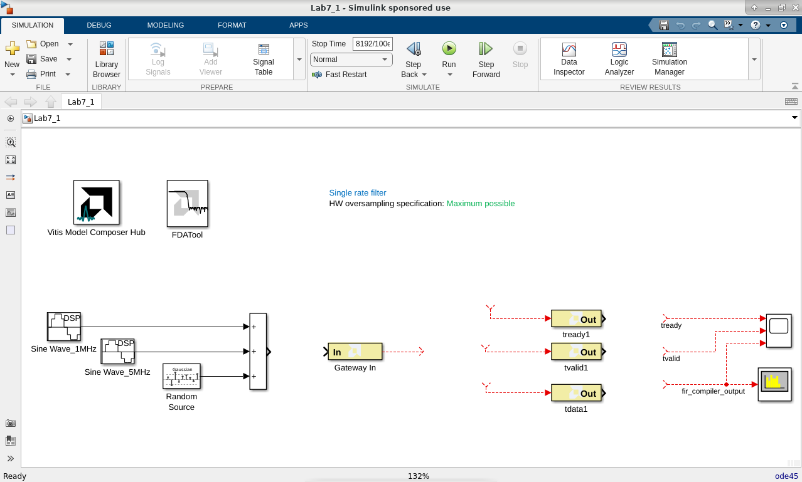

The design input consists of two sine waves with frequencies **1 MHz** and **5 MHz** respectively and sampled at **100 MHz**. A random noise is added to create a realistic scenario.

The **FDATool** block is added to the design to generate coefficients for a lowpass filter. Double-click on the **FDATool** block to observe the settings and then close the window.

4. From the Simulink Toolstrip, click on **Library Browser** and then go to **AMD Toolbox->HDL->DSP->AXI-S** and scroll down to find the FIR Compiler 7.2 block.

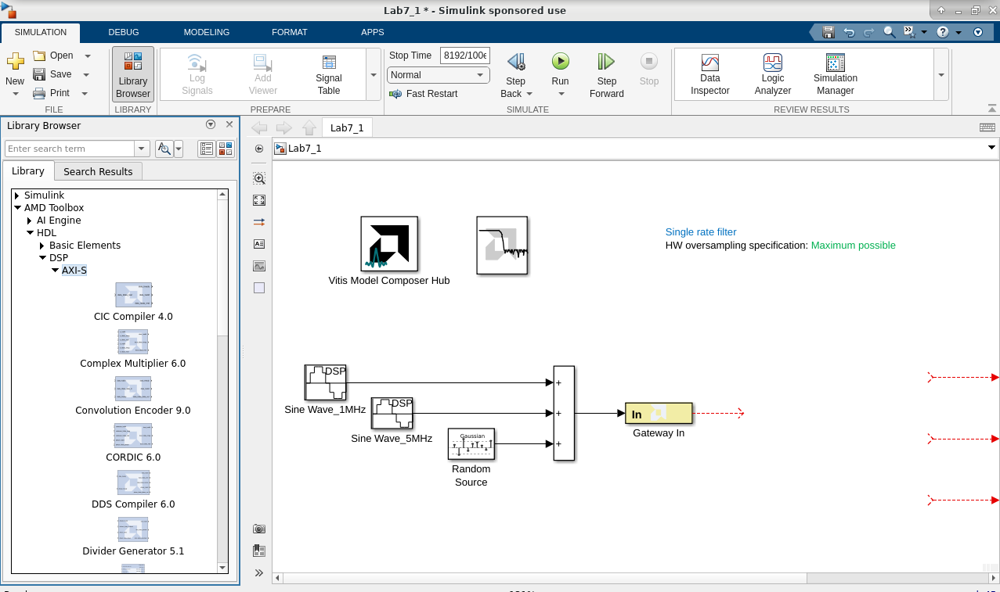

5. Right click on **FIR Compiler 7.2** and click on **Add block to model Lab7_1** to add this block to the model as shown below:

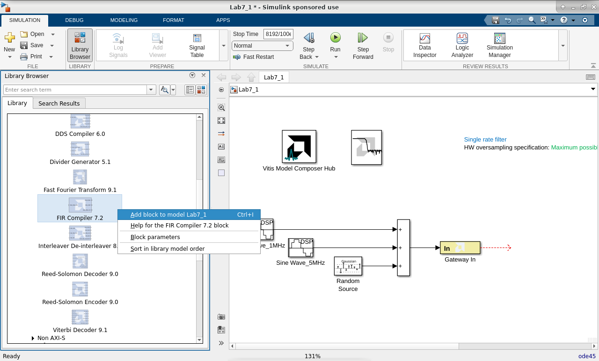

6. Double click on FIR Compiler and add the following command to the cofficient vector field to use filter coefficients generated from the FDATool. 

`double(xlfda_numerator(strcat(bdroot,'/FDATool')))` 

> **NOTE:** You could also define the coefficients as a variable in the MATLAB workspace and specify the variable name in this field.

7. Select filter type as `Single_Rate` under filter specification field as shown below:

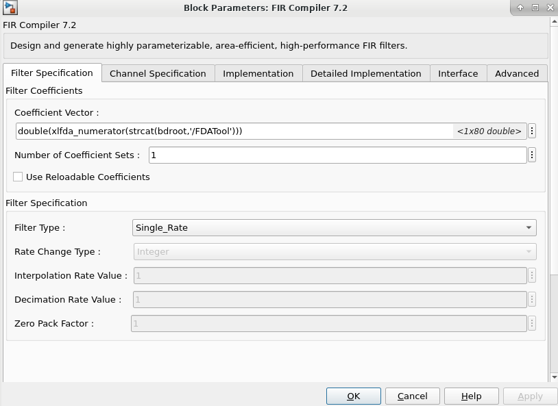

8. Switch to the **Channel Specification** tab and select `Maximum_Possible` format under hardware oversampling specification as shown below:

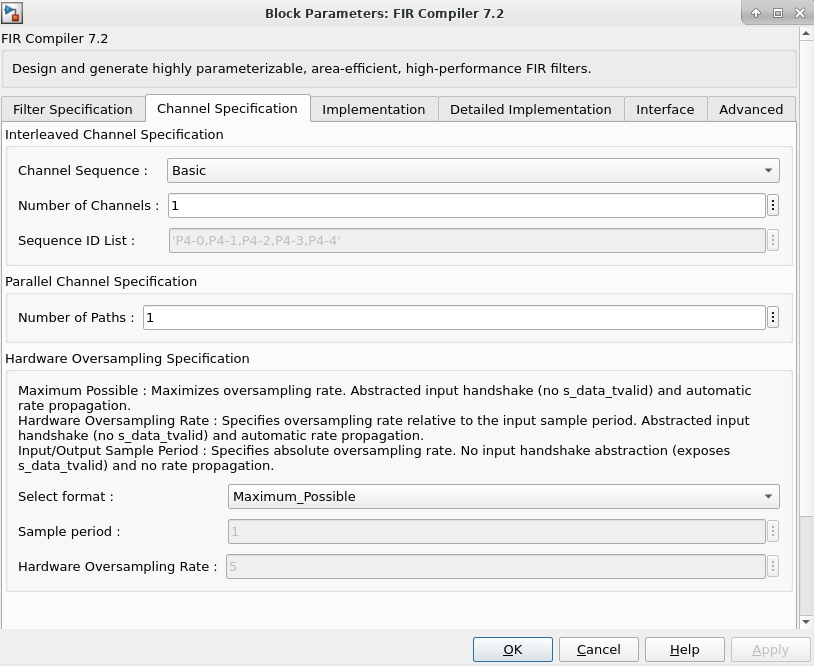

> **NOTE:** When **Maximum_Possible** format is selected, there is an automatic input handshaking, so s_data_tvalid port is not exposed here.

9. Go to the **Implementation** tab and configure the **Coefficient Options** as shown below:

* **Quantization:** Quantize_Only
* **Coefficient Width:** 16
* **Coefficient Fractional Bits:** 14

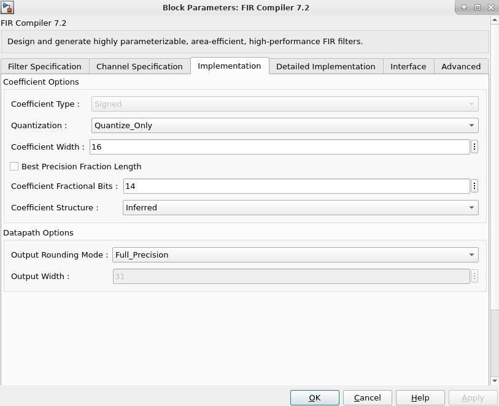

10. Click **Apply** and **OK**, connect Gateway In block to **data_tdata_real** port of FIR Compiler.

11. Connect Gateway Out blocks to **tready**, **tvalid** and **tdata** as shown in figure below:

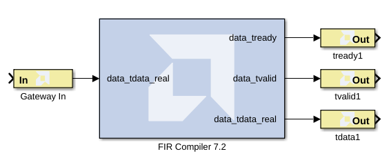

12. Left click on the canvas and drag the mouse to select **FIR Compiler**, **Gateway In** and **Gateway Out** blocks.

13. Right click and choose **Create Subsystem from Selection**.

14. The subsystem will be created as shown below:

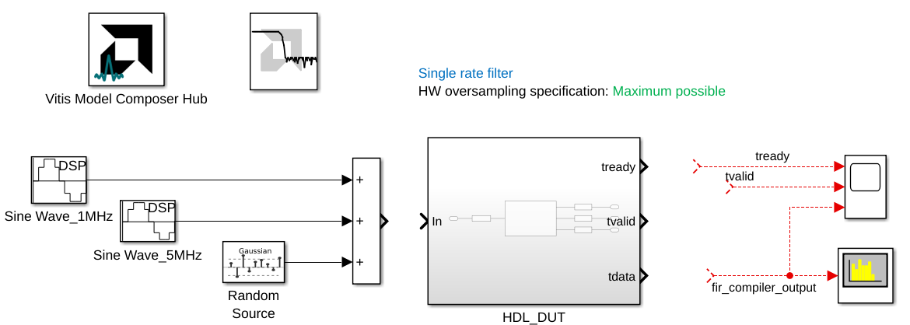

15. Rename the Subsystem as **HDL_DUT**. 

16. Connect the input and output ports as shown in figure below:

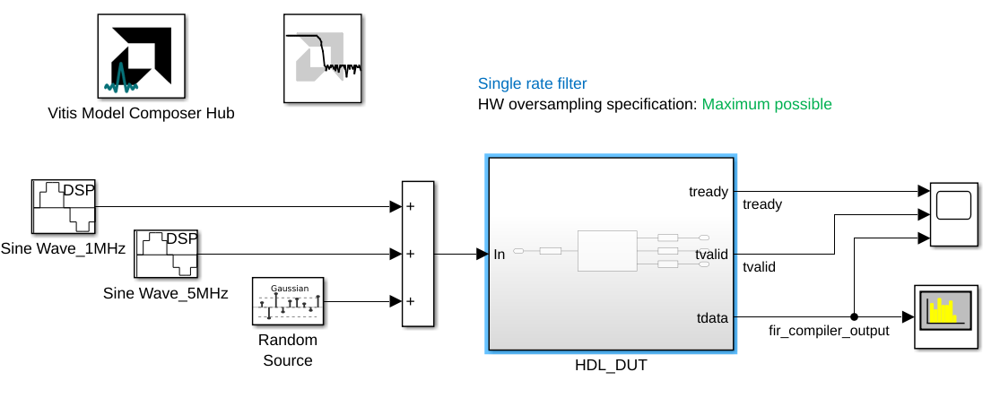

17. Double click on the **Vitis Model Composer Hub** block, switch to the **Code Generation** tab and select **HDL_DUT**.

18. On the **Settings** tab of Hub block, set **FPGA Clock Period(ns)** to `10` and **Simulink System Period(sec)** to `1/100e6` or `10e-9`, the formula to compute **Simulink System Period** is explained below:

* **Input Sample Rate**: 100MHz (Input Sample Period: 1/100MHz = 10ns)
* **Expected Output Sample Rate**: 100MHz (There is no rate change applied for the filter because we configured FIR Compiler as a **single rate filter**)
* **Output Sample Period**: 1/100MHz = 10ns

The **Simulink System Period** value should be the greatest common divisor(gcd) of all the sample periods that appear in the model.

`gcd(Input Sample Period, Output Sample Period) = gcd(10,10) = 10`

**Simulink System Period** in the Hub block: (10e-9) : 10ns 

19. Click **Apply** and **OK**.

20. Run the design and observe the FIR Compiler output signals displayed in the **Scope** and **Spectrum Analyzer** as shown below:

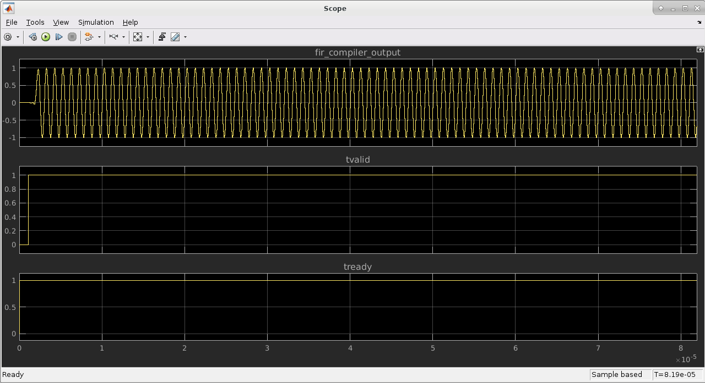

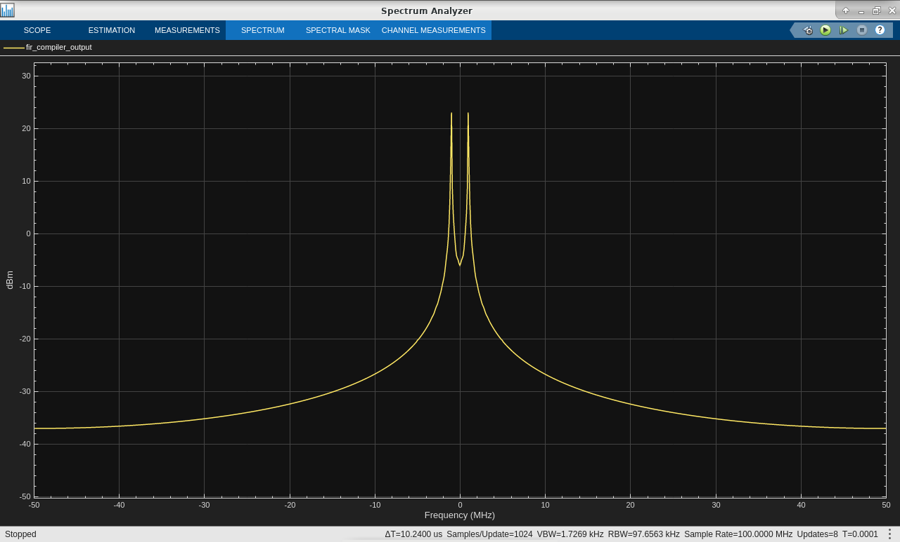

The input to the FIR has two signals (**1 MHz** and **5 MHz**), but the output has only one signal (**1 MHz**). The signal with **5 MHz** is attenuated because it is falling in the stopband of the filter.

21. Double click on **FDATool**, change the passband (**Fpass**) from 2 to 5 and the stopband (**Fstop**) from 4 to 10 and then click on **Design Filter**. 
    
Now the filter coefficients are generated with Fpass = 5MHz and Fstop = 10 MHz.

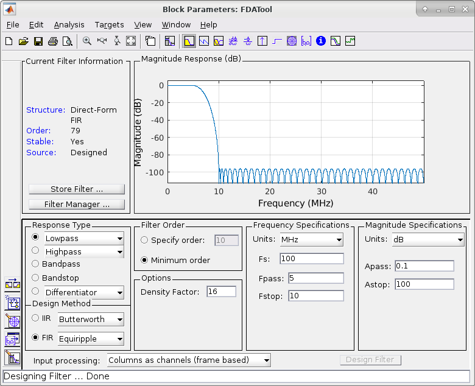

22. Close the **FDATool** and run the design again to observe the FIR Compiler output signals.

Now you can see two signals (with **1MHz** and **5MHz**) at the FIR Compiler output:

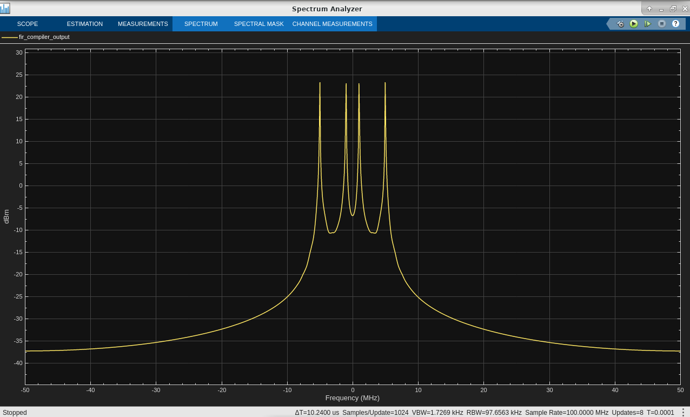 

You can observe the output sample rate displayed at the bottom toolstrip of spectrum analyzer. The input sample rate is **100 MHz** and the output sample rate is also **100 MHz**. 


### Updating the design with a sampling rate of 50 MHz:

23. Double click on each input signal (including random source) and change the Sample time from **1/100e6** to **1/50e6** as shown below:

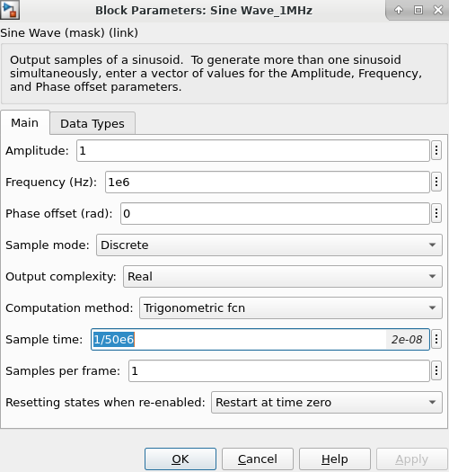 

24. Click **Apply** and **OK**.

25. Double click on the **HDL_DUT** subsystem, then double click the **Gateway In** block. Change sample period to **1/50e6** and then click **Apply**. 

26. Go one level up and double click on **Vitis Model Composer Hub** block. Select the **HDL_DUT** subsystem.

27. Change the **Simulink System Period** from 1/100e6 to 1/50e6 or 20e-9, Simulink System Period computation is explained below:

* **Input Sample Rate**: 50MHz (Input Sample Period: 1/50MHz = 20ns)
* **Expected Output Sample Rate**: 50MHz 
* **Output Sample Period**: 1/50MHz = 20ns

`gcd(Input Sample Period, Output Sample Period) = gcd(20,20) = 20`

**Simulink System Period** in the Hub block: (20e-9) : 20ns 

28. Click **Apply** and **OK**.

29. Double click on **FDATool**, change **Fs** from 100 to 50, click on **Design Filter** and close FDA Tool.

30. Run the design. Now you can observe the FIR Compiler output sample rate is updated to **50MHz** as shown below:

 

## Step 2: Configure FIR Compiler as an Interpolator with Integer rate change

1. Double-click **Lab7_2.slx** in the Current Folder browser.

Lab7_2 opens as shown in the figure below:

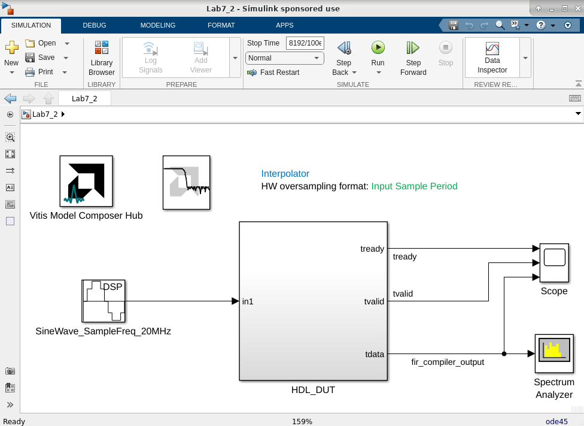 

2. Double click on the **Sine Wave** block and make sure the sample time is 1/20e6.

3. Double click on **HDL_DUT** subsystem. Add the FIR Compiler 7.2 block here (copy-paste the block from `Lab7_1.slx`).

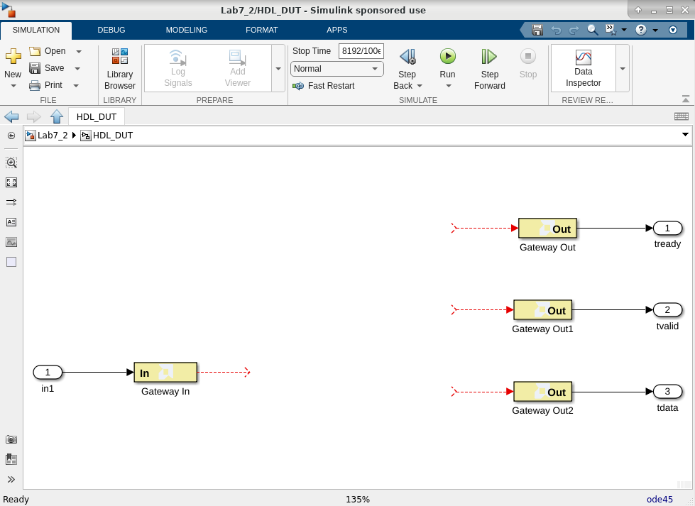 

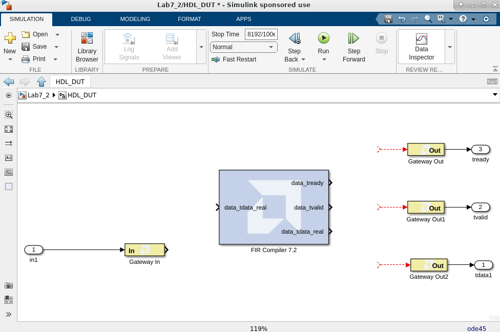 

4. Double click on the FIR Compiler block and change the filter specification settings as shown below:

* **Filter Type**: Interpolation
* **Rate Change Type**: Integer
* **Interpolation Rate Value**: 5

5. Switch to the **Channel Specification** tab and change the hardware oversampling specification settings as shown below:

* **Select Format**: Input_Sample_Period
* **Sample Period**: 5

6. Click **Apply** and **OK**.

When you select **Input_Sampling_Period** format, the **Sample Period** parameter indicates the number of Simulink System Periods between two input samples.

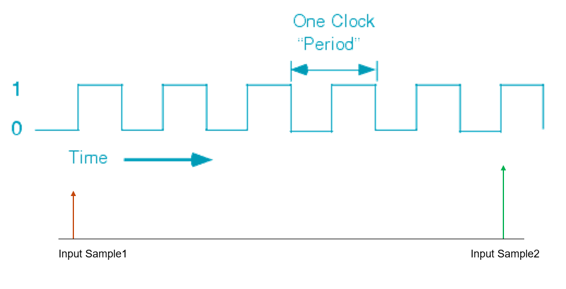

The formula for computing the Sample Period for a given input rate and Simulink system rate is: 

```
Sample Period = {(Input Sampling Period /Simulink System Period)/number of input channels}
 
Sample Period = (50ns/10ns)/(1) = 5.
```

**Simulink System Period** Computation is explained below:

* **Input Sample Rate**: 20MHz (Input Sample Period: 1/20MHz = 50ns)
* **Expected Output Sample Rate**: (Input Sample Rate) * (Rate change value) = 20MHz * 5 = 100 MHz  
* **Output Sample Period**: 1/100MHz = 10ns

`gcd(Input Sample Period, Output Sample Period) = gcd(50,10) = 10`

**Simulink System Period** in the Hub block: (10e-9) : 10ns 

7. Add a **Constant** block to the design. Double click on this block and select output type as Boolean. 

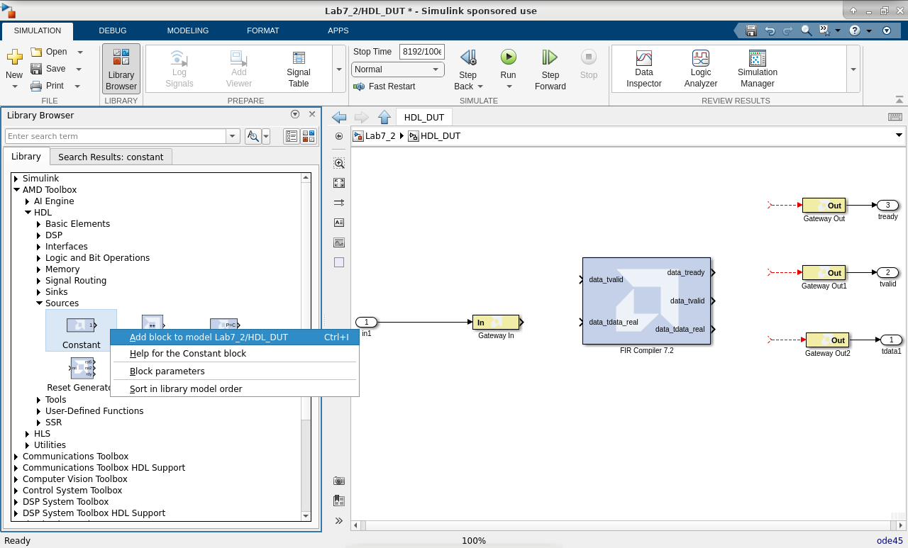

8. Check **Sampled constant** and enter a sample period value of `1/20e6`:

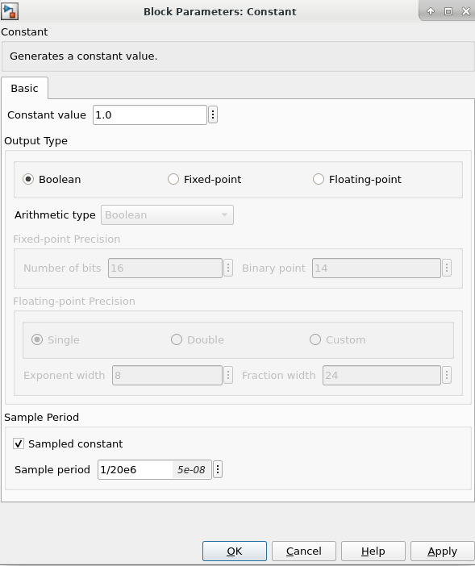

9. Click **Apply** and **OK**.

10. Connect the input and output ports of FIR Compiler as shown below:

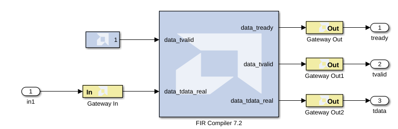

11. Go one level up and double click on the **Vitis Model Composer Hub** block. Select **HDL_DUT**.

12. Make sure **FPGA Clock Period(ns)** is set to `10`, and **Simulink System Period** is set to `1/100e6` or `10e-9` in the Hub block.

13. Click **Apply** and **OK**.

14. Run the design to observe the FIR Compiler output signals.

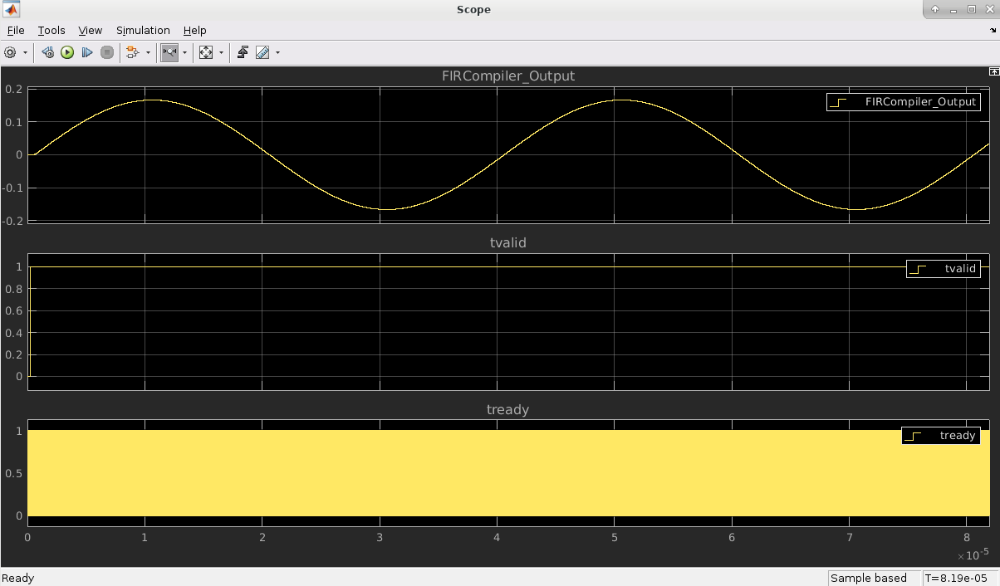

The input sample rate to the filter is 20 MHz and the expected output sample rate is 100MHz (Interpolation with rate change value: 5). Observe the output sample rate in the spectrum analyzer, it should be 100MHz.

> **NOTE:** We can also select any existing hardware oversampling specification format for this design.

### Updating FIR Compiler block settings to use Output_Sample_Period format:

15. Double click on FIR Compiler block. Switch to the **Channel Specification** tab. Change the **Hardware Oversampling** specification settings as shown below:

* **Select Format**: Output_Sample_Period
* **Sample Period**: 1

16. Click **Apply** and **OK**.

When you select **Output_Sampling_Period** format, the **Sample Period** parameter indicates the number of Simulink System Periods between two output samples.

```
Sample Period = {(Expected Output Sampling Period / Simulink System Period)/number of input channels}

Sample Period = (10ns/10ns)/(1) = 1.
```

17. Run the design. We should have the same FIR Compiler output response with this format also.

## Step 3: FIR Compiler with a Fixed-Fractional rate change

1. Double-click **Lab7_3.slx** in the Current Folder browser.

2. Lab7_3 opens as shown in figure below:

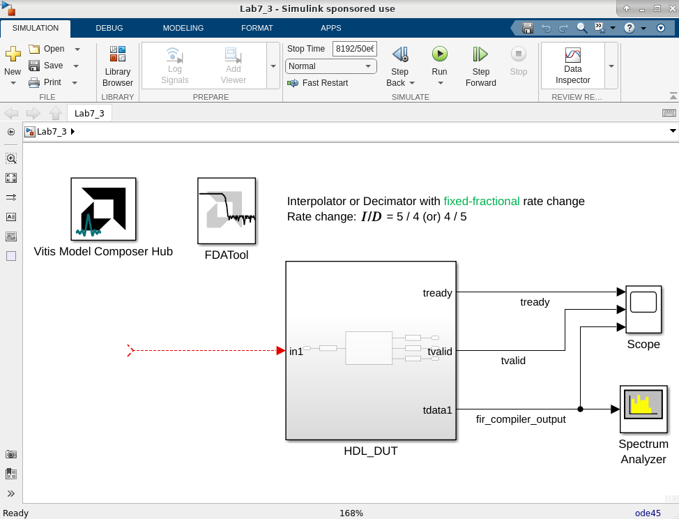 

3. Add a Sine Wave as an input:

  - Double click on canvas and type `sine`
  - Select **Sine Wave** to add it to the design

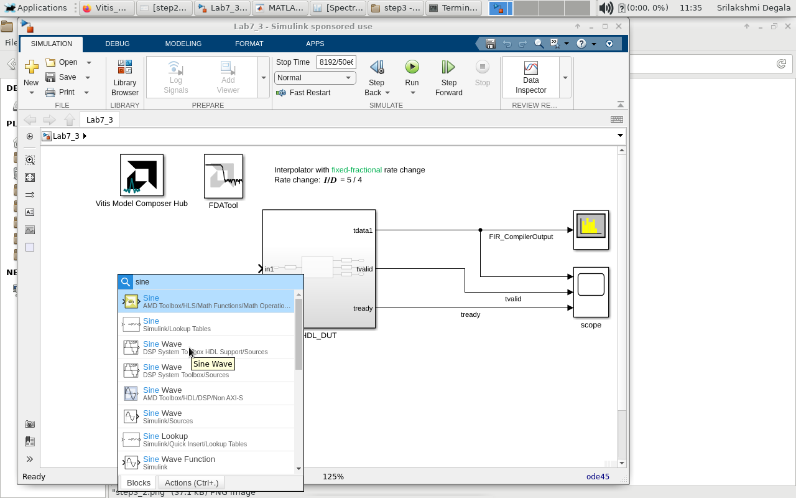 

4. Generate signal with 50MHz input sample rate by double click on the sine wave and add the settings as shown in figure below:

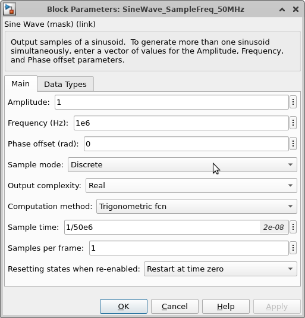 

5. Click **Apply**.

6. Connect the **Sine Wave** block to the **HDL_DUT** input.

7. Double click on the **HDL_DUT** subsystem.

**HDL_DUT** opens as shown below:

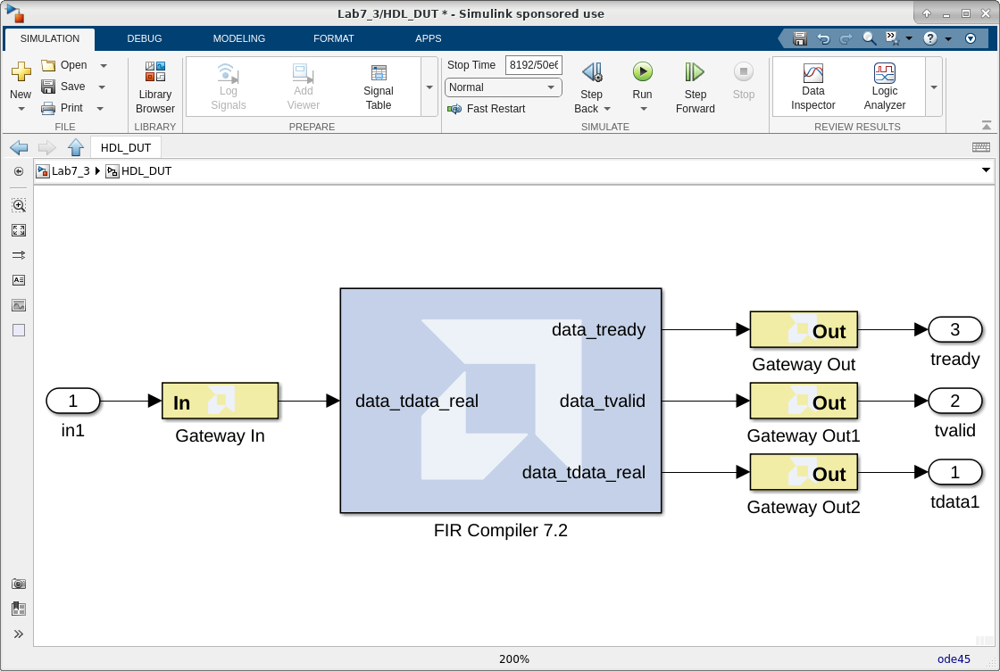 

8. Double click on **FIR Compiler 7.2** block and make the settings as shown below:

* **Filter Type**: Interpolation
* **Rate Change Type**: Fixed_Fractional
* **Interpolation Rate Value**: I = 5
* **Decimation Rate Value**: D = 4

9. Click **Apply**.

10. Switch to **Channel Specification** tab, and select **Maximum_Possible** format under **Hardware Oversampling Specification**.

11. Click **Apply** and **OK**.

This design has an input with 50MHz sample rate. The expected output sample rate is calculated as shown below:

* **Input Sample Rate**: 50MHz (Input Sample Period: 1/50MHz = 20ns)
* **Expected Output Sample Rate**: (Input Sample Rate) * (Rate change value) = 50MHz * (5/4) = 62.5MHz (Output Sample Period: 1/62.5MHz = 16ns).

12. Go one level up and double click on Vitis Model Composer Hub block. Select **HDL_DUT**.

13. Set **Simulink System Period** to `1/250e6` or `4e-9` in the Hub block.

Simulink System Period is set based on the formula as explained in Step 1 and Step 2 of this Lab.

```
gcd(Input Sample Period, Output Sample Period) = gcd(20,16) = 4.
```

**Simulink System Period** in the Hub block: (4e-9) or 1/250e6.

14. Click **Apply** and **OK**.

15. Run the design to observe the FIR Compiler output signals.

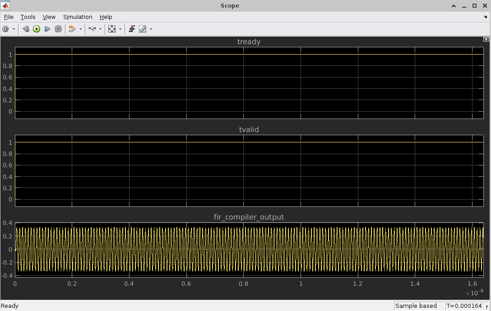 

16. Observe the output sample rate in the **Spectrum Analyzer**; it should be 62.5 MHz.

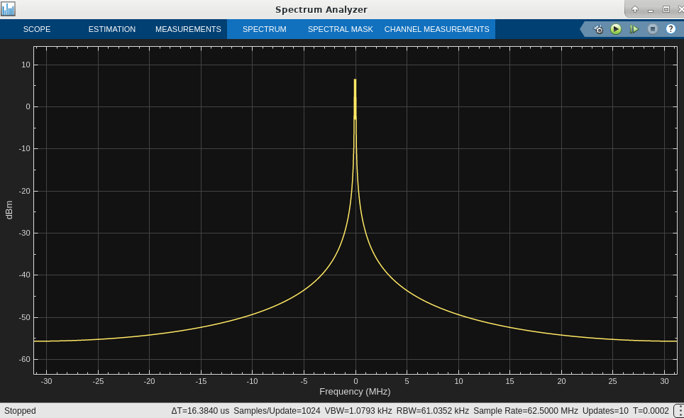 


### Updating the design to configure FIR Compiler as a Decimator:

17. Open **HDL_DUT**, double click on **FIR Compiler 7.2** block and change the **Filter Type** to Decimator.

18. Change **Interpolation Rate Value** to `4` and **Decimation Rate Value** to `5`.

19. Click **Apply** and **OK**.

20. Double click on **Gateway In** block and make sure **Sample Period** is set to `1/50e6`. Click **OK**.

This design has an input with 50MHz sample rate. The expected output sample rate is calculated as shown below:

* **Input Sample Rate**: 50MHz (Input Sample Period: 1/50MHz = 20ns)

* **Expected Output Sample Rate**: (Input Sample Rate) * (Rate change value) = 50MHz * (4/5) = 40MHz (Output Sample Period: 1/40MHz = 25ns).

21. Go one level up and double click on **Vitis Model Composer Hub** block. Select **HDL_DUT**.

22. Set **Simulink System Period** to `1/200e6` or `5e-9` (`gcd(20,25) = 5`) in the Hub block.

23. Click **Apply** and **OK**.

24. Double click on **FDATool**, set **Fs** to 200, click on **Design Filter** and close it.

25. Run the design to observe the FIR Compiler output signals.

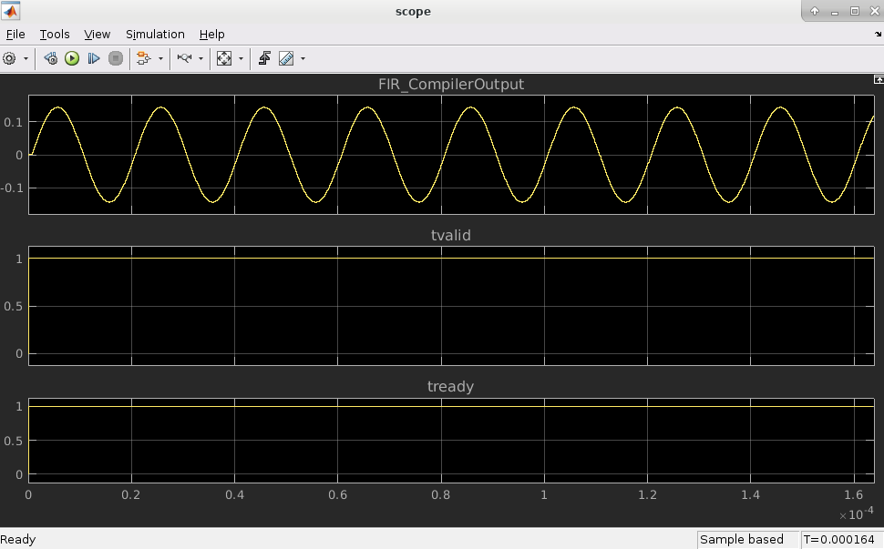

26. Observe the output sample rate in the Spectrum Analyzer; it should be 40 MHz.

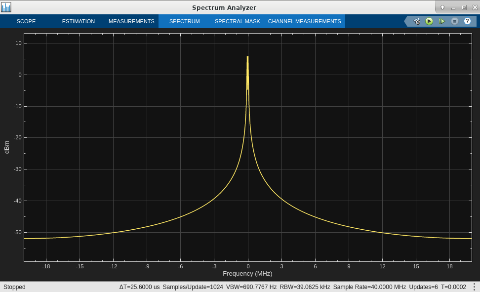

## Summary

In this lab, you learned how to configure the FIR Compiler block and Simulink System Period to implement single-rate and multi-rate FIR filters.

--------------
Copyright 2024 Advanced Micro Devices, Inc.

Licensed under the Apache License, Version 2.0 (the "License");
you may not use this file except in compliance with the License.
You may obtain a copy of the License at

    http://www.apache.org/licenses/LICENSE-2.0

Unless required by applicable law or agreed to in writing, software
distributed under the License is distributed on an "AS IS" BASIS,
WITHOUT WARRANTIES OR CONDITIONS OF ANY KIND, either express or implied.
See the License for the specific language governing permissions and
limitations under the License.
