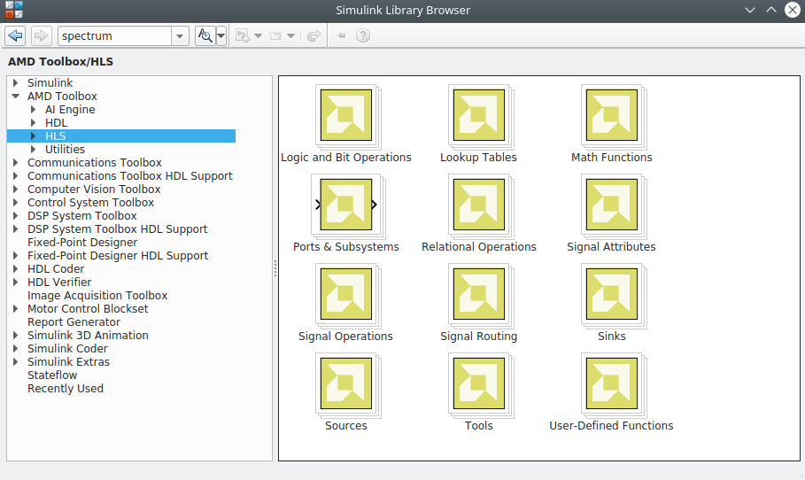
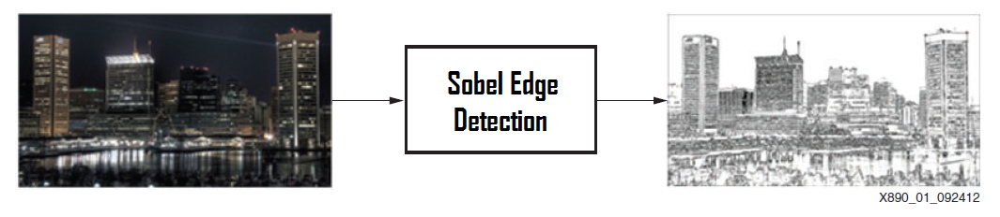
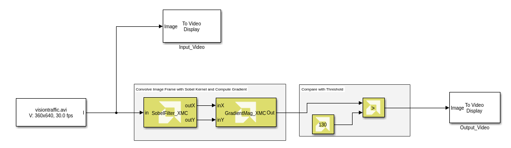
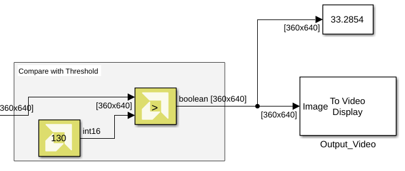
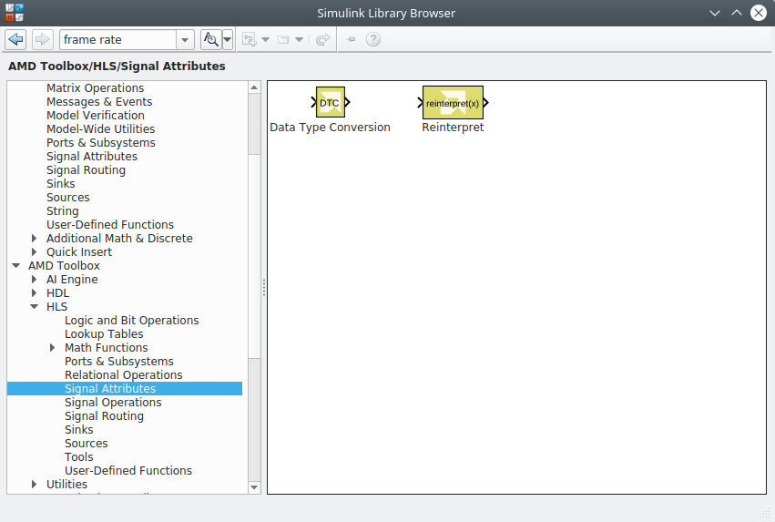
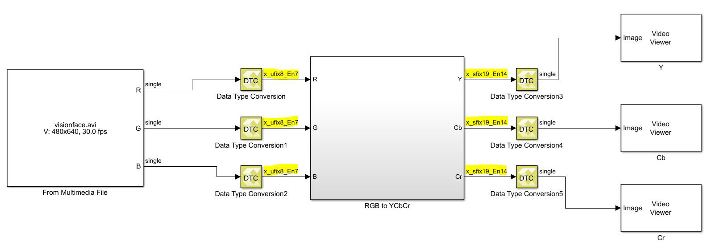

# Lab 1: Introduction to Model Composer HLS Library

This tutorial shows how you can use the Vitis™ Model Composer HLS Library for rapid algorithm design and simulation in the Simulink® environment.

### Procedure

This lab has the following steps:
 * In Step 1, you examine the Vitis Model Composer HLS library.
 * In Step 2, you build a simple design using HLS blocks to see how Model Composer blocks integrate with native Simulink blocks and supported Signal Dimensions.
 * In Step 3, you look at data types supported by Vitis Model Composer and the conversion between data types.

## Step 1: Review the HLS Library

In this step you see how Vitis Model Composer fits into the Simulink environment, and then review the categories of blocks available in the HLS library.

### Access the HLS Library

Vitis Model Composer provides an HLS Library for use within the Simulink environment. You can access these from within the Simulink Library Browser:

1. At the MATLAB command prompt, type: `slLibraryBrowser`

2. In the browser, navigate to the HLS library in the AMD Toolbox .

The HLS blocks are organized into subcategories based on functionality. Spend a few minutes navigating through the sub-libraries and familiarizing yourself with the available blocks.

## Step 2: Build Designs with HLS Blocks

In this step, you build a simple design using the existing HLS blocks.

### Sobel Edge Detection: Algorithm Overview

Sobel edge detection is a classical algorithm in the field of image and video processing for the extraction of object edges. Edge detection using Sobel operators works on the premise of computing an estimate of the first derivative of an image to extract edge information.

<b> Sobel Edge Detection </b>


### Implementing Algorithms in Vitis Model Composer

1. In the MATLAB Current Folder, navigate to ` \HLS_Library\Lab1\Section1. `

2. Double-click the `Sobel_Edge_Detection_start.slx` model.

This model already contains source and sink blocks to stream video files as input directly into your algorithm and view the results. The model also contains some of the needed HLS blocks required for this section. Note the difference in appearance for the HLS blocks in the design versus the Simulink blocks.

3. Double-click `Sobeledge_lib.slx` library model and drag the SobelFilter_XMC block into the area labeled Convolve Image Frame with Sobel Kernel and Compute Gradient as shown in the following figure and connect the input of this block to the output of the From Multimedia File block.

4. Select the **GradientMag_XMC** block from the ` Sobeledge_lib.slx ` file and drag it into the model, and connect the X and Y outputs of the Sobel Filter block to the input of this block.

5. Connect the rest of the blocks to complete the algorithm as shown in the following figure.

> 📝 Note: The blocks SobelFilter_XMC and GradientMag_XMC have been generated using the `xmcImportFunction` feature.

<ul>  </ul>

6. Select the **Simulation > Run** command to simulate the model and view the results of the Sobel Edge Detection algorithm.
<br><br>
<br><br> One way to assess the simulation performance of the algorithm is to check the video frame rate of the simulation. Do the following:

7. Add the Frame Rate Display block from the Simulink Computer Vision Toolbox (under the Sinks category) and connect it to the output of the algorithm as shown in the following figure.

8. Simulate the model again to see the number of video frames processed per second.
<br><br>

9. Try changing the input video through the From Multimedia File block by double-clicking the block and changing the File Name field to select a different video. Notice that changing the video resolution in the Source block does not require any structural modifications to the algorithm itself.

> 📝 **Note:** You must stop simulation before you can change the input file. MP4 files are not supported.

## Step 3: Work with Data Types

In this step, you become familiar with the supported data types for Vitis Model Composer and conversion from floating to fixed-point types.

This exercise has two primary parts, and one optional part:
 * Review a simple floating-point algorithm using Vitis Model Composer.
 * Look at Data Type Conversions in Vitis Model Composer designs.

### Work with Native Simulink Data Types

1. In the MATLAB Current Folder, navigate to the `HLS_Library\Lab1\Section2 ` folder.

2. Double-click **Colorspace_Conversion.slx** to open the design.
<br><br>This is a Color Space conversion design, built with basic Vitis Model Composer blocks, that performs a RGB to YCbCr conversion.

3. Update the model (**Ctrl+D**) and observe that the Data Types, Signal Dimensions and Sample Times from the Source blocks in Simulink all propagate through the Vitis Model Composer blocks. Note that the design uses single precision floating point data types.

4. Simulate the model and observe the results from simulation.

### Convert Data Types

To convert the previous design to use AMD Fixed Point types:

> 📝 **Note:** Fixed point representation helps to achieve optimal resource usage and performance for a usually acceptable trade-off in precision, depending on the dataset/algorithm.

1. Double-click **Colorspace_Conversion_fixed_start.slx** in the Current Folder to open the design.

2. Open the **HLS** library in the Simulink Library Browser.

3. Navigate to the Signal Attributes sub-library, select the **Data Type Conversio**n block, and drag it into the empty slots in the designs, before and after the RGB to YCbCr subsystem.
<br><br>
<br><br>

4. Open the Data Type Conversion blocks at the inputs of the RGB to YCbCr Subsystem, and do the following:
    - Change the **Output data type** parameter to **fixed**.
    - Set the **Signedness** to **Unsigned**.
    - Set the **Word length** to **8**.
    - Set **Fractional length** to **7**.
    - Click **Apply**, and close the dialog box.
<br><br>

5. Add the Data Type Conversion blocks at the output of the RGB to YCbCr Subsystem and set the **Output data type** parameter to **single**. This will enable connecting the output signals to the Video Viewer blocks for visualization.
<br><br>

6. Double-click the **RGB** to **YCbCr** subsystem to descend the hierarchy and open the model. Within the RGB to YCbCr subsystem, there are subsystems to calculate Y, Cb, and Cr components using Gain and Constant blocks.
<br><br> You can control the fixed point types for the gain parameter in the Gain blocks and the value in the Constant blocks. You can do this by opening up the **Calculate_Y**, **Calculate_Cb**, and **Calculate_Cr** blocks and setting the data types as follows.
<br><br> For Gain blocks, set the Gain data type to fixed. For Constant blocks, on the Data Types tab set the Output data type to fixed. The following options appear:
    - **Signedness** to **Signed**
    - **Word length** to **8**
    - **Fractional length** to **7**
> ⭐ **Tip**: You can use the **View > Property Inspector** command to open the Property Inspector window. When you select the different Gain or Constant blocks, you can see and modify the properties on the selected block.
<ul>
<br><br>Ensure you do this for all the Constant and Gain blocks in the design. Update the model (Ctrl+D) and observe the fixed point data types being propagated along with automatic bit growth in gain blocks and adder trees in the design as shown in the following figure:
<br><br>
<br><br>T he general format used to display the AMD fixed point data types is as follows:
<br><br> ` x_[u/s]fix[wl]_En[fl] `
<br><br> <b>u</b>: Unsigned
<br><br> <b>s</b>: Signed
<br><br> <b>wl</b>: Word Length
<br><br> <b>fl</b>: Fractional Length
<br><br> For example, ` x_sfix16_En8 ` represents a signed fixed point number with Word Length=16 and Fractional Length=8.

You can view a completed version of the design here: ` HLS_Library\Lab1\Section2\solution\Colorspace_Conversion_fixed.slx `
</ul>

### Convert Data Types (Alternative)

Vitis Model Composer supports Data Type Expressions that make it easier to change data types and quickly explore the results from your design.

1. Double-click **Colorspace_Conversion_expression.slx** in the Current Folder to open the design.

2. Notice that the Data Type Conversion blocks at the Input of the RGB to YCbCr Subsystem, the Gain blocks and Constant blocks within the Subsystem have Output data type and Gain data type set to data type expression.
<br><br>
<br><br> This enables HLS blocks to control the data types in the design using workspace variables, in this case `InputDataType` and `FDataType` that you can easily change from the MATLAB command prompt.

3. Update the model (**Ctrl+D**) and observe the fixed-point data types propagated through the blocks.
<br><br>The other HLS blocks in the design will automatically take care of the bit-growth in the design. If you want more control over the fixed point data types at other intermediate portions of the design, you can insert Data Type Conversion blocks wherever necessary.

4. To change the fixed point types in the Gain, Constant, and DTC blocks, and Input data type in DTC blocks, type the following at the MATLAB command prompt:
```
>> FDataType = 'x_sfix8_En6'
>> InputDataType = 'x_ufix8_En6'
```
<ul>`'x_sfix8_En6' ` represents a signed fixed point number with Word Length 8 and Fractional Length 6.
<br><br>Now update the model (<b>Ctrl+D</b>) and observe how the fixed-point data types have changed in the design.</ul>

5. Simulate the model and observe the results from the design. Try further changing `InputDataType` and `FDataType` variables through command line and iterate through multiple word lengths and fractional lengths. See the Additional Details section below for information on specifying rounding and overflow modes.

### Additional Details

In the example above, we only specified the Word Length and Fractional Length of the fixed point data types using data type expressions. However, for greater control over the fixed point types in your design, you can also specify the Signedness, Rounding, and Overflow. In general the format used for specifying fixed point data types using the data type expression is
```
x_[u/s]fix[wl]_En[fl]_[r<round>w<overflow>]
```
<br><br> <b>u</b>: Unsigned
<br><br> <b>s</b>: Signed
<br><br> <b>wl</b>: Word Length
<br><br> <b>fl</b>: Fractional Length

`<round>`: Specify the corresponding index from the following table. This is optional. If not specified, the default value is 6 (Truncation to minus infinity). Note that for the rounding cases (1 to 5), the data is rounded to the nearest value that can be represented in the format. When there is a need for a tie breaker, these particular roundings behave as specified in the Meaning column.

**Table: Rounding Index**

| Index | Meaning |
| ----- | ------- |
| 1 | Round to Plus Infinity |
| 2 | Round to Zero |
| 3 | Round to Minus Infinity |
| 4 | Round to Infinity |
| 5 | Convergent Rounding |
| 6 | Truncation to Minus Infinity |
| 7 | Truncation to Zero |

`<overflow>`: Specify the corresponding index from table below. It's optional. If not specified, default value is 4 (Wrap around).
 
**Table: Overflow Index**

| Index | Meaning |
| ----- | ------- |
| 1 | Saturation |
| 2 | Saturation to Zero |
| 3 | Symmetrical Saturation |
| 4 | Wrap Around |
| 5 | Sign-Magnitude Wrap Around |

Example: `x_ufix8_En6_r6w4` represents a fixed point data type with:

**Signedness**: Unsigned

**Word Length**: 8

**Fractional Length**: 6

**Rounding Mode**: Truncation to Minus Infinity

**Overflow Mode**: Wrap Around

### Conclusion

In this lab, you learned:
 * How to connect HLS blocks directly to native Simulink blocks.
 * How the HLS blocks support Vectors and Matrices, allowing you to process an entire frame of an image at a time without converting it from a frame to a stream of pixels at the input.
 * How to work with different data types.
 * How to use the Data Type Conversion block to control the conversion between data types, including floating-point to fixed-point data types.

> 📝 **Note**: Vitis Model Composer supports the same floating and integer data types as Simulink blocks and also supports AMD fixed point data types.

The following solution directories contain the final Vitis Model Composer files for this lab:
 * ` \HLS_Library\Lab1\Section1\solution `
 * ` \HLS_Library\Lab1\Section2\solution `


--------------
Copyright 2024 Advanced Micro Devices, Inc.

Licensed under the Apache License, Version 2.0 (the "License");
you may not use this file except in compliance with the License.
You may obtain a copy of the License at

    http://www.apache.org/licenses/LICENSE-2.0

Unless required by applicable law or agreed to in writing, software
distributed under the License is distributed on an "AS IS" BASIS,
WITHOUT WARRANTIES OR CONDITIONS OF ANY KIND, either express or implied.
See the License for the specific language governing permissions and
limitations under the License.


