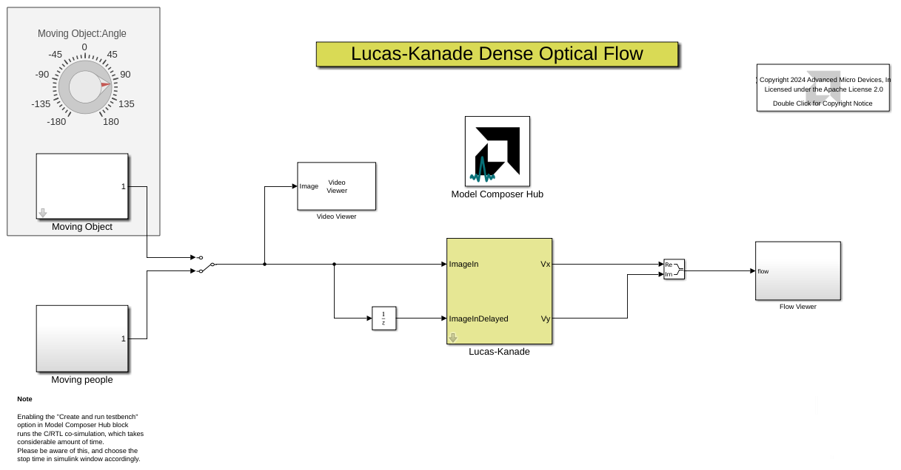
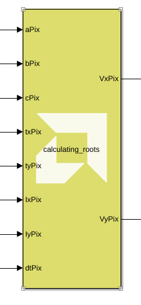
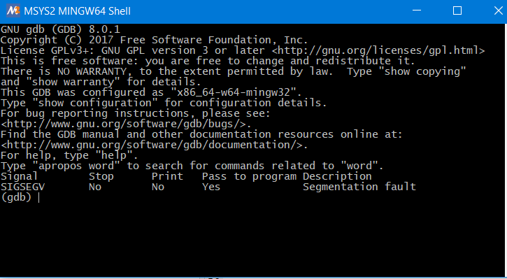
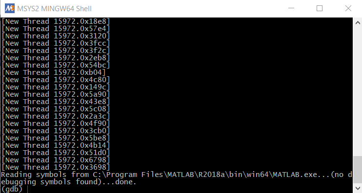

# Lab 3: Debugging Imported C/C++ Code Using GDB Debugger

Model Composer provides the ability to debug `C/C++` code that has been imported as a block using the `xmcImportFunction` command, while simulating the entire design in Simulink®.

The debug flow in Vitis Model Composer is as follows:

1. Specify the debug tool using the `xmcImportFunctionSettings` command.
2. Launch the debugging tool.
3. Add a breakpoint in the imported function.
4. Attach to the MATLAB® process.
5. Start Simulink simulation.
6. Debug the imported function during simulation.

This lab has two steps:
 * Step 1 introduces you to the Optical Flow demo design example in GitHub. It shows you how to identify the custom library block, created using the `xmcImportFunction` feature.
 * Step 2 shows you how to debug `C/C++` code using the GDB tool.

For more details and information about how to create custom blocks, refer to the Vitis Model Composer User Guide (UG1483).

## Step 1: Set Up the Example to Debug the Import Function

1. Type the following at the MATLAB command prompt:
``` 
xmcOpenExamples;
```

4. Under **Examples**, click **HLS** under heading Table of Contents. 

5. Click the **Optical Flow**. A description of the example displays.


6. Click Click **Open Design** at the top left corner. This opens the example design.



7. Right-click on the **Lucas-Kanade** subsystem and select **Mask > Look Under Mask** to observe the calculating-roots block.



> 📝 **Note:** This block has been generated using the `xmcImportFunction` feature. Its function declaration can be seen by double-clicking on the block.


8. To view the function definition of `calculating_roots`, navigate to the current folder in the MATLAB window and double-click on ` calculating_roots.h `.


The setup is now ready for you to debug your `C/C++` code. In the next step, you will see how to debug the code using GDB tool debugger.

## Step 2: Debugging C/C++ Code Using GDB Debugger
 
1. Specify the debug tool using the `xmcImportFunctionSettings` command. At the MATLAB® command prompt, type the following command:

```
>> xmcImportFunctionSettings('build', 'debug');
```

> ⭐ **Tip**: You can restore the release build environment, using the `release` value of the `build` option: `xmcImportFunctionSettings('build','release')`.

2. Press Enter to see the applied settings in command window, as shown in the following figure.


Note the gdb link that you will use to invoke the debugger tool, and the MATLAB process ID that you will use to attach the process to the debugger.

3. Click on the **gdb** link, to invoke the terminal and launch gdb.



 4. At the terminal, use the following command to specify the breakpoint in the ` calculating_roots.h ` file where you want the code to stop executing. Press **Enter** to run the command.

```
(gdb) break calculating_roots.h:53 

```

> 📝 **Note**: The “53” in the above command, tells the GDB debugger to stop the simulation at line 53 of your program.


5. Once the command runs, you can see a pending breakpoint in the terminal. This is shown in the following figure.


If you see any questions from GDB, answer “yes” and press Enter.

6. To attach the MATLAB process to the GDB debugger, type the following:

```
(gdb) attach <process_ID> 
```

Enter the <process ID you saw in step 2. For example “15972”. As soon as the MATLAB process is attached, the MATLAB application gets frozen and becomes unresponsive. 


 
> 📝 **Note** : During the debug process, if prompted to press 'c' to continue, type 'c' and hit Enter.

7. Type `cont` in the terminal.


8. Now go to the Simulink® model and run the simulation by clicking the **Run** button.


9. The model takes some time to initialize. As the simulation starts, you see the simulation come to the breakpoint at line 53 in the terminal window.


Now, type the command list to view the lines of code around line 53.

```
(gdb) list
```

10. Now, type command step to continue the simulation one line to the next step.

```
(gdb) step
```

> ❗❗ **Important:** The following are some useful GDB commands for use in debugging:
> * (gdb) list
> * (gdb) next (step over)
> * (gdb) step (step in) * 
> * (gdb) print \<variable>
> * (gdb) watch \<variable>

11. Type `print r` to view the values of variables at that simulation step. This gives the result as shown in the following figure.

```
(gdb) print r
$1 = 421
```

12. You can try using more gdb commands to debug and once you are done, type `quit` to exit GDB, and observe that the Simulink model continues to run.

### Conclusion

In this lab, you learned:

 * How to use a third party debugger (GDB debugger) and control the debug mode using `xmcImportFunctionSettings`.
 * How to debug source code associated with your custom blocks using the GDB debugger, while leveraging the stimulus vectors from Simulink.

--------------
Copyright 2024 Advanced Micro Devices, Inc.

Licensed under the Apache License, Version 2.0 (the "License");
you may not use this file except in compliance with the License.
You may obtain a copy of the License at

    http://www.apache.org/licenses/LICENSE-2.0

Unless required by applicable law or agreed to in writing, software
distributed under the License is distributed on an "AS IS" BASIS,
WITHOUT WARRANTIES OR CONDITIONS OF ANY KIND, either express or implied.
See the License for the specific language governing permissions and
limitations under the License.


