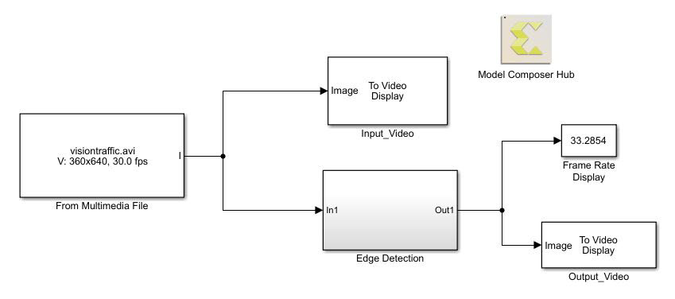
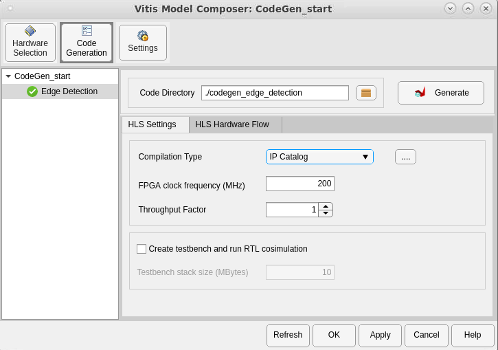
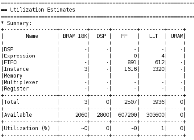
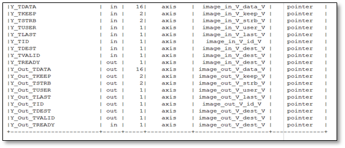
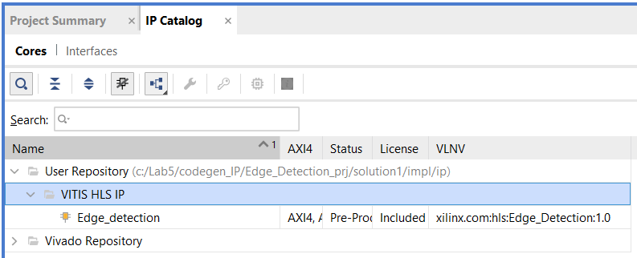
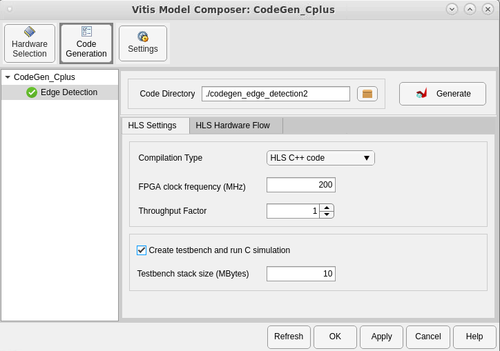
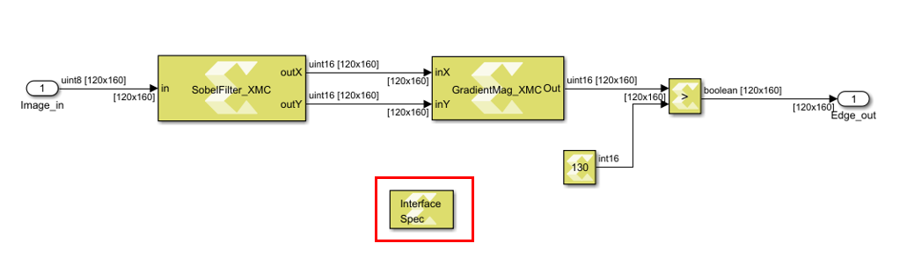
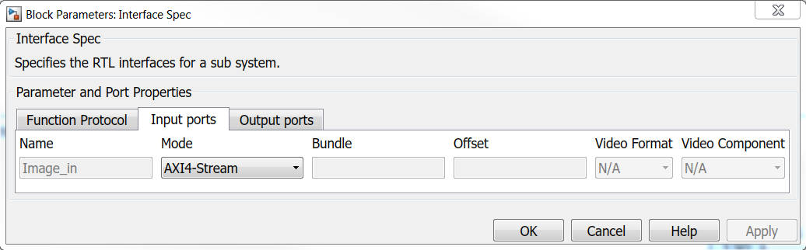

# Lab 4: Automatic Code Generation

In this lab, you look at the flow for generating output from your Vitis Model Composer model and moving it into downstream tools like Vitis™ HLS for RTL synthesis, or into System Generator, or the Vivado® Design Suite for implementation into a Xilinx device.

### Procedure
 
This lab has five steps:
 * In Step 1, you will review the requirements for automatic code generation.
 * In Step 2, you will look at how to map Interfaces in your design.
 * In Step 3, you will look at the flow for generating an IP from your Vitis Model Composer HLS design.
 * In Step 4, you will look at the flow for generating HLS Synthesizable C++ code from the Vitis Model Composer HLS design.
 * In Step 5, you will look at the flow to port a Vitis Model Composer HLS design back into Model Composer HDL design as a block.

## Step 1: Review Requirements for Generating Code

In this step, you review the three requirements to move from your algorithm in Simulink to an implementation through automatic code generation.

1. In the MATLAB Current Folder, navigate to the <samp> \HLS_Library\Lab4 </samp> directory.

2. Double-click **CodeGen_start.slx** to open the model.
<br><br>To prepare for code generation, you will enclose your Vitis Model Composer design in a subsystem.

3. Right-click the **Edge Detection** area, and select **Create Subsystem from Area.**

> 📝 **Note**: For code generation to work, all the blocks within the enclosed subsystem should only be from the Vitis Model Composer HLS library, with the exception of the Simulink blocks noted below. Subsystems with unsupported blocks will generate errors during code generation. The Simulink diagnostic viewer will contain error messages and links to the unsupported blocks in the subsystem.
 
> 📝 **Note**: In addition to the base Vitis Model Composer HLS blocks, a subset of native Simulink blocks such as From, Goto, Bus Creator, Bus Selector, If, and others, are supported. The supported Simulink blocks appear within the HLS libraries as well.

<ul> Next, you add the Model Composer Hub block at the top level of your design. </ul>

4. Open the Simulink Library Browser and navigate to **Xilinx Toolbox > HLS > Tools** sub-library.

5. Find the Model Composer Hub block, and add it into the design as shown in the following figure. 
<br><br>
<br><br>Next, you use the Model Composer Hub block to select the code generation options for the design.

6. Double-click the block to open the block interface and set up as shown in the following figure.


7. On the Code Generation tab, you can set the following options as shown in the previous figure:
<br><br> **Code Directory**: In this case, use ./codegen_edge_detection for the generating code.
<br><br> **Compilation Type**: This option determines what you want to convert your design into. In this case IP Catalog. You can select other compilation targets from the drop-down.
    - Vitis HLS Synthesizable C++ code.
<br><br> **FPGA clock frequency (MHz)**: The default value is 200 MHz.

8. Click **Apply** then **OK**.

## Step 2: Mapping Interfaces

1. Double-click the **CodeGen_Interface.slx** model in your Current Folder to open the design for this lab section.
<br><br>This is a slightly modified version of the Edge Detection algorithm that uses the YCbCr video format at the input and output.

2. Simulate the model to see the results in the Video Viewer blocks. Stop simulation before continuing to the next step.

3. Open the Simulink Library browser, navigate to the **Xilinx Toolbox > HLS > Tools** sub-library and add the Interface Spec block inside the Edge Detection subsystem as shown in the following figure.


4. Double-click the **Interface Spec** block to open the block interface.
<br><br>The Interface Spec block allows you to control what RTL interfaces should be synthesized for the ports of the subsystem in which the block is instantiated. This affects only code generation; it has no effect on Simulink simulation of your design.
<br><br>The information gathered by the Interface Spec block consists of three parts (represented as three Tabs on the block).
<br><br>
<br><br> **Function Protocol**: This is the block-level Interface Protocol which tells the IP when to start processing data. It is also used by the IP to indicate whether it accepts new data, or whether it has completed an operation, or whether it is idle.
<br><br> **Input Ports**: Detects the Input ports in your subsystem automatically and allows specifying the port-level Interface Protocol for each input port of the subsystem.
<br><br> **Output Ports**: Similar to the Input Ports tab, this tab detects the Output ports in the subsystem, and allows specifying the port-level Interface Protocol for each output port of the subsystem.

5. For this design, leave the Function Protocol mode at the default AXI4-Lite Slave and configure the Input ports and Output ports tabs as shown in the following figures.
<br><br>
<br><br>
    - The Bundle parameter is used in conjunction with the AXI4-Lite or AXI4-Stream (video) interfaces to indicate that multiple ports should be grouped into the same interface. It lets you bundle multiple input/output signals with the same specified bundle name into a single interface port and assigns the corresponding name to the RTL port. <br> For example in this case, the specified settings on the Input ports tab result in the YCbCr inputs being mapped to AXI4-Stream (video) interfaces and bundled together as an image_in port in the generated IP while the YCbCr outputs are bundled together as an image_out port.
    - The Video Format drop-down menu lets you select between the following formats:
      - YUV 4:2:2
      - YUV 4:4:4 
      - RGB
      - Mono/Sensor
    - The Video Component drop-down menu is used to subsequently select the right component: R, G, B, Y, U, V.

## Step 3: Generate IP from the Vitis Model Composer Design
    
Using the same example, you will generate an IP from the Edge Detection algorithm.

1. Double-click the **CodeGen_IP.slx** model in the Current Folder.

2. Double-click into the **Edge Detection** subsystem and review the settings on the Interface Spec block. Based on the previous lab, this block has already been set up to map the input and output ports to AXI4-Stream Video interface, and to use the YUV 4:2:2 video format.

3. Double-click the **Model Composer Hub** block, and set the following on the Code Generation tab:
<br><br> **Code Directory**: `./codegen_IP`
<br><br> **Compilation Type** : IP Catalog

4. To generate an IP from this design, click the **Apply** button in the Model Composer Hub block dialog box to save the settings. Then click the **Generate** button to start the code generation process.
<br><br> Vitis Model Composer opens a progress window to show you the status. After completion, click OK and you will see the new codegen_IP/Edge_Detection_prj folder in the Current Folder, which contains the generated IP solution1 folder.
<br><br>
<br><br> At the end of the IP generation process, Vitis Model Composer opens the Performance Estimates and Utilization Estimates (from the Vitis HLS Synthesis report) in the MATLAB Editor, as shown in the following figures.
<br><br>
<br><br>
<br><br> You can also see a summary of the generated RTL ports and their associated protocols at the bottom of the report.
> 📝 **Note**: The actual timing and resource utilization estimates may deviate from above mentioned values, based on the Vitis HLS build you choose.

<ul><br><br>
<br><br> </ul>

5. Launch Vivado IDE and perform the following steps to add the generated IP to the IP catalog.

6. Create a Vivado RTL project.
When you create the Vivado RTL project, specify the Board as **Kintex-7 KC705 Evaluation Platform** (which is the same as the default Board in the Model Composer Hub block).

7. In the Project Manager area of the Flow Navigator pane, click **Settings**.
    - From **Project Settings > IP > Repository**, click the + button and browse to <samp> codegen_IP\Edge_Detection_prj\solution1\impl\ip. </samp>
    - Click **Select** and see the generated IP get added to the repository.
    - Click **OK**.
<br><br>

8. To view the generated Edge_detection IP in the IP catalog, search for “Edge_Detection”. The generated Edge_detection IP, now appears in the IP catalog under Vitis HLS IP as shown in the following figure.
<br><br>
<br><br> You can now add this IP into an IP integrator block diagram, as shown in the following figure.
<br><br>

## Step 4: Generate HLS Synthesizable Code

In this section you will generate HLS Synthesizable code from the original Edge Detection design. Use the <samp>  CodeGen_Cplus.slx </samp> design for this lab. Simulate the model and ensure that algorithm is functionally correct and gives you the results you would expect.

1. Open the Model Composer Hub block dialog box, and set the following:
<br><br> **Code Directory**: <samp> ./codegen_edge_detection </samp> 
<br><br> **Compilation Type**: HLS C++ code

2. Click the **Apply** button on the Model Composer Hub block dialog box to save the settings and then click the **Generate** button to start the code generation process.
<br><br>

3. At the end of code generation, observe the Current Folder in MATLAB.
<br><br> You should now see a new folder: <samp> codegen_edge_detection </samp> in your Current Folder.
<br><br> When you click **Generate** on the Model Composer Hub block, Vitis Model Composer first simulates the model, then generates the code and places the generated code files in the folder that was specified in the Code directory setting. At the end of the code generation process, the window showing the progress of the code generation process tells you where to look for your generated code.

4. Open the <samp> codegen_edge_detection </samp> folder and explore the generated code files highlighted in the following figure.
<br><br>

> 📝 **Note:**
>  - Edge_Detection.cpp is the main file generated for the subsystem.
>  - run_hls.tcl is the Tcl file needed to create the Vitis HLS project and synthesize the design.

5. Navigate back to the directory where the Simulink file is present, open the Model Composer Hub block dialog box and modify the block settings as shown in the following figure.
    - Check the Create and run testbench check box.
    - Modify the Code Directory folder.
<br><br>

6. Click **Apply** and regenerate the code by clicking the **Generate** button. Click **OK** after you see Done Verification in the status bar.
<br><br> You should now see a new folder, <samp> codegen_edge_detection2 </samp>, in your Current Folder.

7. Open the <samp> codegen_edge_detection2 </samp> folder and explore the generated code files
<br><br>
<br><br> With the **Create and run testbench** option selected on the Model Composer Hub block, Vitis Model Composer logs the inputs and outputs at the boundary of the Edge Detection subsystem and saves the logged stimulus signals in the <samp> signals.stim </samp> file. The tb.cpp file is the automatically-generated test bench that you can use for verification in Vitis HLS. At the end of the code generation process, Vitis Model Composer automatically verifies that the output from the generated code matches the output logged from the simulation and reports any errors.

## Step 5: Port a Vitis Model Composer HLS Design to HDL Design

Using Vitis Model Composer, you can package a model for integration into a HDL model, which is especially useful if you are an existing Vitis Model Composer HDL user. This allows you to take advantage of both the high level of abstraction and simulation speed provided by Vitis Model Composer for portions of your HLS design, and the more architecture-aware environment provided by Vitis Model Composer HDL design.

**Figure:** IP Catalog Export Type


Choosing **IP Catalog** as the Target, and clicking **Generate**, creates a synthesized RTL block that you can directly add to a Vitis Model Composer HDL design using the Vitis HLS block in the HDL Library.

In this lab, you create an IP using Vitis Model Composer HLS Design and then use the synthesized RTL as a block in a Vitis Model Composer HDL design.

1. In the <samp> HLS_Library\Lab4\HLS_to_HDL </samp> folder, double-click **HLS_design.slx** to see the Model Composer HLS design. The design is configured to have AXI4-Stream interfaces at both the input and output. This is done through the Interface Spec block within the <samp> HLS_Design </samp> subsystem. Note that there are no structural changes required at the Simulink level to change interfaces for the IP.
<br><br>
<br><br>
<br><br>

2. Open the **followme_script.m** in MATLAB. This script will guide you through all the steps to import the Vitis Model Composer HLS generated solution as a block in Vitis Model Composer HDL.

3. Read the comments at the start of each section (labeled Section 1 to Section 8) in the MATLAB script and execute each section one at a time (the start of each section is marked by a `%%` sign). You can click on **Run and Advance** to step through each section in the script. The sections are as follows:
   - Section 1: Set up. <br><br> Open MATLAB for Vitis Model Composer and choose a video file as an input.
```
v = VideoReader(video_filename);
frame_height = v.Height;
frame_width = v.Width;
save video_handle v
```
   - Section 2: Creating a Vitis Model Composer HDL solution from a Vitis Model Composer HLS design. <br><br> Vitis Model Composer allows you to export a HLS design as a block into HDL design. The result of exporting a design from Vitis Model Composer HLS to HDL is a solution folder that you will import into the HDL design using the Vitis HLS block in HDL library.
```
open_system('HLS_design');
xmcGenerate('HLS_design');
```
   - Section 3:  Serializing the input video. <br><br> Serialize the input video which is required for use with the Vitis Model Composer HDL design which will do pixel-based processing.
```
stream_in = zeros(ceil(v.FrameRate*v.Duration*v.Height*v.Width),1);

i = 1;
while hasFrame(v)
    frame = rgb2gray(readFrame(v));
    a = reshape(frame',[],1);
    stream_in(i:i+length(a)-1) = a;
    i = i + length(a);
end

save stream_in stream_in
```
   - Section 4: Import the generated solution into a Vitis Model Composer HDL design.<br><br>Set up the Vitis HLS block in the Vitis Model Composer HDL design to point to the correct solution folder generated in Section 2
```
open_system('HDL_AXI');
```
   - Section 5: Simulate the Vitis Model Composer HDL design. <br><br>Simulate the Vitis Model Composer HDL design and save the outputs into a MAT file. Note that the simulation will be slower than the Vitis Model Composer HLS design since we are simulating the generated RTL and are doing an element-by-element based processing.
```
sim('HDL_AXI');
```
   - Section 6: De-serializing the output of the Vitis Model Composer HDL design. <br><br> This is a post-processing step that creates a frame-based video for playback using the outputs logged from the Vitis Model Composer HDL simulation.
``` 
load stream_out
load video_handle

disp(['Length of input stream is ',num2str(length(stream_in))])
disp(['Lenght of output stream is ',num2str(length(stream_out))])


outputVideo = VideoWriter('stream_out.avi');
outputVideo.FrameRate = v.FrameRate;
open(outputVideo)

%The output is boolean. This is why we multiply the img by 255 so that
%implay shows the image. 
for i = 1:length(stream_out)/v.Height/v.Width
   img = reshape(stream_out((i-1)*v.Height*v.Width+1:i*v.Height*v.Width),v.Width,v.Height);
   writeVideo(outputVideo,255*img')
end
close(outputVideo);
```
   - Section 7: Play the de-serialized output using `implay`.
```
implay('stream_out.avi')
```

4. The AXI4-Stream uses three signals, `DATA`, `READY`, and `VALID`. The `READY` signal is a back pressure signal from the slave side to the master side indicating whether the slave side can accept new data.
<br><br> As you examine the Vitis Model Composer HDL model in Section 4, pay attention to the labels on blocks for each signal to help you understand how the model is designed. For example, whenever the IP can no longer accept input, the `READY` signal (top right of the Vitis HLS block) puts pressure on the master side of the input AXI FIFO by resetting the `READY` signal. Likewise, the input AXI FIFO pressures the input stream by resetting its `READY` signal.

> 📝 **Note:** In Simulink all the inputs to a block are to one side of the block, and all the outputs are on the opposite side. As such, all the slave or master signals are not bundled together on one side of the block as you might expect.

<ul></ul>

### Conclusion

In this lab, you learned:
 * About the Interface Spec block terminology and parameter names.
 * How to specify interfaces and to map them directly from the Simulink environment using the Interface Spec block.
 * How Vitis Model Composer enables push button IP creation from your design in Simulink with the necessary interfaces.
 * How the Model Composer Hub block in Vitis Model Composer helps move from algorithm to implementation.
 * How to generate code files from the Model Composer Hub block and read them.
 * How to set compilation targets to `C++` code, IP Catalog and System Generator.

Some additional notes about Vitis Model Composer:
 * Vitis Model Composer takes care of mapping interfaces as part of the code generation process and you don’t have to take care of interleaving and de-interleaving color channels and interface connections at the design level.
 * An Interface Spec block must be placed within the subsystem for which you intend to generate code.
 * For the C++ code compilation target, Vitis Model Composer generates everything you would need to further optimize and synthesize the design using Vitis HLS.
 * Vitis Model Composer automatically generates the test vectors and test benches for C/RTL cosimulation in Vitis HLS.
 * Vitis Model Composer provides an option to export a design back into HDL model through the Vitis HLS block

The following solution directory contains the final Vitis Model Composer (`*.slx`) files for this lab.
<samp> \HLS_Library\Lab4\solution </samp>

