# Things you need to know about Simulink before you start using Vitis Model Composer

## 0-The very basics
This 8-minute [video](https://www.mathworks.com/videos/getting-started-with-simulink-part-1-building-and-simulating-a-simple-simulink-model-1508442030520.html) goes over the very basic of opening Simulink and putting a very simple design together. 

## 1-Sample time
On the block GUI for any source block in Simulink there is a "Sample time" field. Sample time is the time between two samples on a signal. There is no unit for this, but for the sake of this discussion let's assume the unit is in seconds. Note that this is simulation time and not wall time.

For example, here is the block GUI for the "Constant" source block:

This indicates the block's sample time is 1/20e6 seconds, which corresponds to a sample rate of 20 MHz.

### How to display sample time?
To view the sample times for signals in your design, follow these steps:

1. Right-click anywhere on your design.
1. From the context menu, select "Sample time display".
1. In the sub-menu, click on "All".
1. Once selected, the signals in your design will be color-coded.
1. Signals with the same sample time will have the same color.
1. The signal with the smallest sample time will be colored in red.
1. You can click the 1/P button to view sample rates instead of sample times.

This method allows you to easily visualize the different sample times of signals in your design.

For example, for the constant block above, you see the sample time in the "Timing Legend". (1/20e6 = 5e-8)

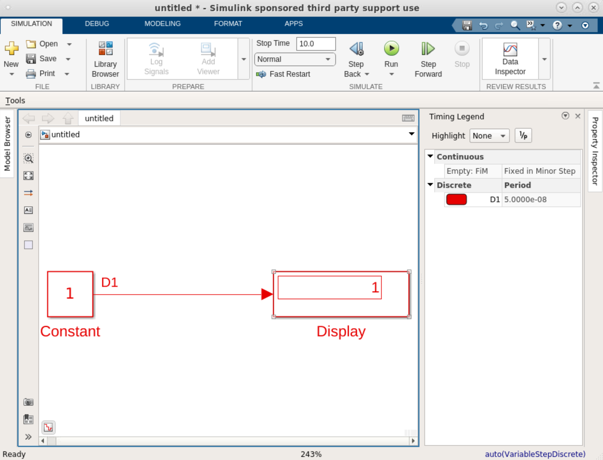

## 2-Stop time
The "Stop time" field allows you to determine the duration for which the simulation will run. Let's say your design has a sample time of 1. If you set the stop time to 10, Simulink will iterate over the blocks for a total of 11 times (10 + 1). The blocks are initially executed at sample time 0, and then at each subsequent time step, they are executed again until the stop time of 10 is reached.

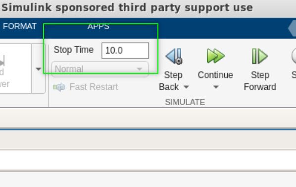

The duration of your design's execution is determined by the smallest sample time in your design and the value specified for the stop time. It's important to note that these two factors work together to determine the overall runtime of your design. 

## 3-Frame
Some blocks in the DSP System Toolbox allow you to create a frame of samples. The "Signal from Workspace" block is one of them:

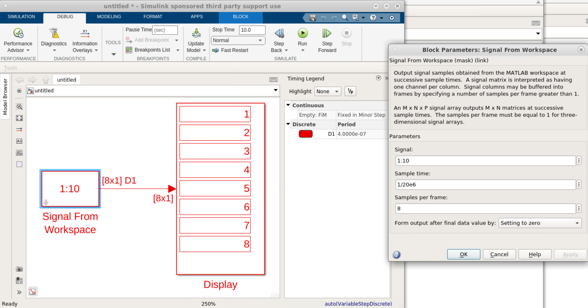

Please note that in this scenario, the block's output has a dimension of 8x1. In order to form a frame consisting of 8 samples, we have to wait long enough to collect 8 samples. Consequently, the frames are generated every 8 sample times. This information is reflected in the "Timing Legend," where the period of each output sample is calculated as 8x(1/20e6) = 4e-7.

### Another example for Samples and Frames
In the example below, we are using the "Signal From Workspace" block three times. The parameter values for each block is specified under each instance of the block.

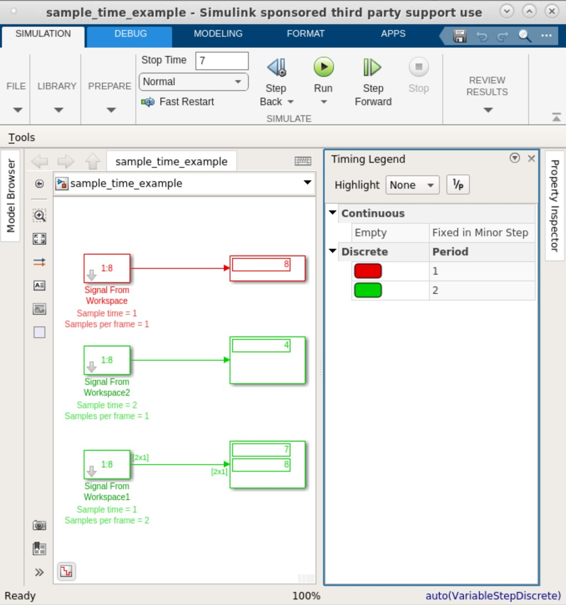

A timing diagram for the three outputs in the design above is depicted below:

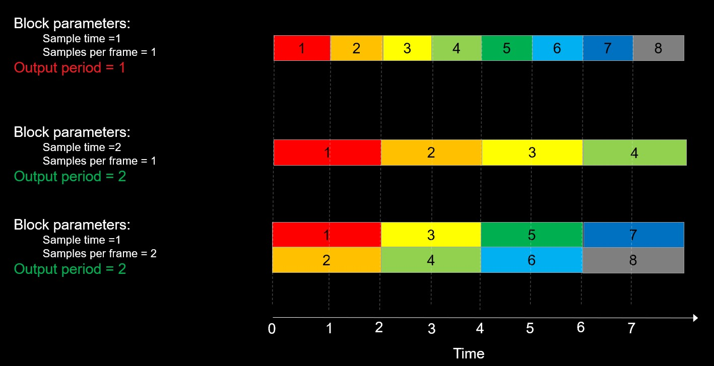

## 4-Displaying Signal Dimensions and Port Data Types
One of the most important things to be aware of when you are putting your design together is the Signal Dimensions and the Port Data Types. To do that:

1. Right-click anywhere on your design.
1. From the context menu, select "Signal & Ports".
1. Check, "Signal dimensions" and "Port Data Types".
1. Once selected, the signal dimensions and port data types are displayed at every port.

## 5-Variable Size Signals
These signals are used for AI Engines and the HLS Kernel block. During simulation, the number of samples in these signals can range from zero to their maximum capacity. To learn more about variable size signals, please refer to [this](https://github.com/Xilinx/Vitis_Model_Composer/tree/HEAD/QuickGuides/Variable_Size_Signals) resource.

## 6-Most commonly used source blocks

| Block    | Description |
| ----------- | ----------- |
|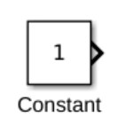    | Create a signal with a value that does not vary over the course of the simulation. |
|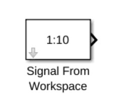  | This block offers great versatility. Although its name may imply that it only accepts signals from the workspace, it actually allows you to input values directly on the block's mask using MATLAB expressions. For example, as shown in the image, the block generates numbers 1 to 10 specified on the mask.|
|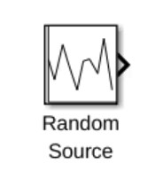|This block is part of the DSP System Toolbox. It comes handy for designs with digital filters where you need to view the spectrum of the signal.|
|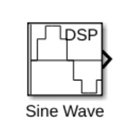|This block is part of the DSP System Toolbox. It outputs discrete sinusoids that can be real or complex.|
|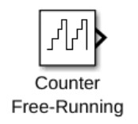|This blocks is useful when debugging a design where you need a predictable input.|

## 7-Most commonly used sink blocks
| Block    | Description |
| ----------- | ----------- |
|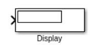    |This block is very handy for debugging. It is also very useful if you would like to see numbers in hexadecimal format. Right click on the block -> Block parameters (Display) and select "hex" for "Numeric Display format"|
|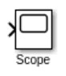  | This block is the primary block to view signals. You must change the "Input processing" to "Columns as Channels (frame based)" to view frame based signals.   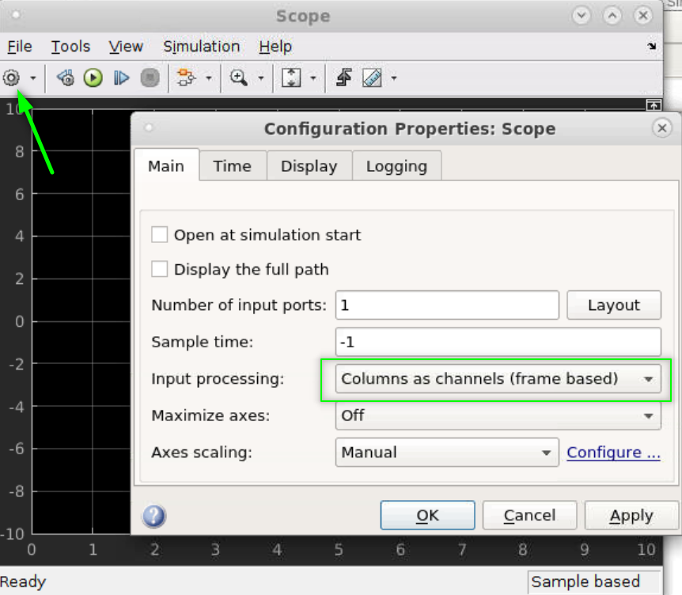|
||This block allows you to log a signal data into MATLAB workspace for further processing in MATLAB.|
|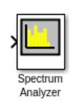|This block is part of the DSP System Toolbox. It is a very easy way to see the spectrum of a signal.|
## 8-Creating a Subsystem
To generate HDL, HLS, or AI Engine code for a DUT, Vitis Model Composer requires the blocks to be organized into a subsystem. To create a subsystem, follow these steps:

* Left-click and drag to create a boundary around all the blocks you want to include in the subsystem.
* Locate the three dots that appear on the lower right corner of the boundary.
* Click on the first icon from the left to finalize the creation of the subsystem.

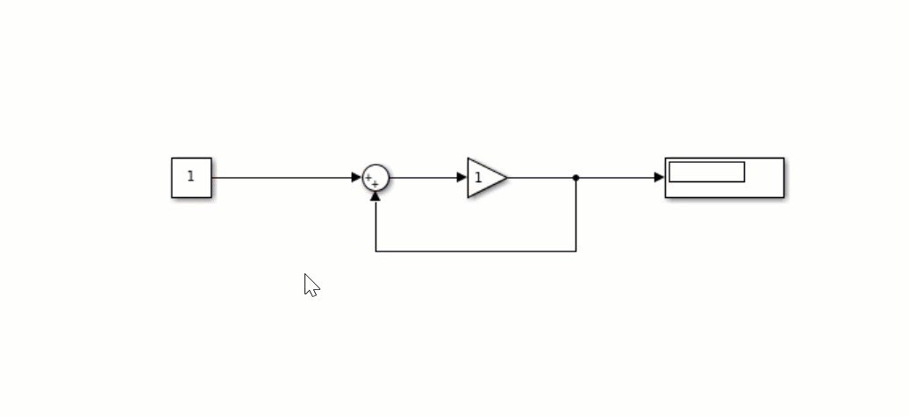

A subsystem created in this way is called a _virtual subsystem_. Virtual subsystems organize the blocks into a hierarchy, but they do not affect the output of the simulation.

## 9-Stepping through your design
Instead of executing your entire design at once, you have the option to proceed incrementally. This approach proves valuable while troubleshooting a design as it allows you to inspect Display blocks that are positioned at various parts of your design, providing visibility at each step.

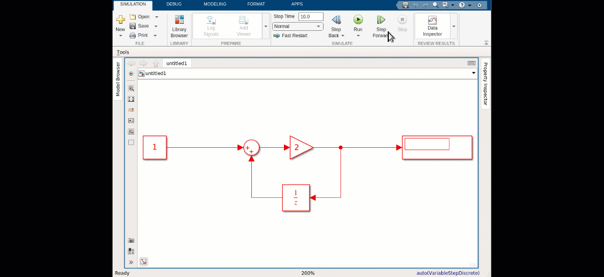
