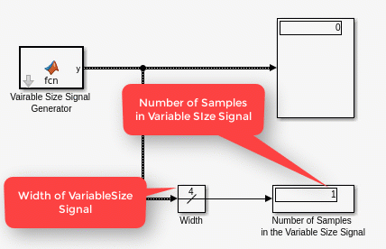
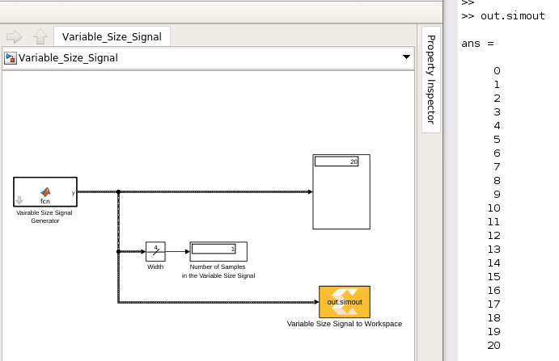

# Variable Size Signals
## Introduction
At every invocation of an AI Engine kernel, the number of output samples may depend on different factors such as the input signal or a Run Time Parameter (RTP) trigger. For example, if a kernel with a synchronized window input does not receive enough input samples (equal to the size of the widow size set for the kernel), it will produce no output. In Model Composer, this behavior is modeled as a variable size signal. A Simulink variable-size signal is a signal whose size (the number of elements in a dimension), in addition to its values, can change during a model simulation. All AI engine blocks can consume and produce variable size signals. Look at the video below that showcases a variable size signal:

## Knowledge nuggets

:bulb: Use the Simulink *Width* block to see the number of elements in the variable size signal.

:bulb: All AI Engine blocks can consume variable size signals and also produce variable size signals.

:bulb: Note how a varrable signal looks different than a fixed size signal in Simulink.

## Viewing variable size signals

You can view variable size signals with a display block or a scope block. Note if the variable size signal is not full, the scope shows empty spaces.

### Knowledge nuggets

:bulb: You can view variable size signals using a display block, a scope block, or write them into the MATLAB workspace. 

## Converting variable size signals to fixed size signals

At times you need to convert a variable size signal to a fixed size signal. This is necessary if you need to use a block that does not support variable size signals. In such cases, you can use the *To Fixed Size* block. However, this block will introduce zeros for the missing elements if the variable size signal is not full (see the image below). Usage of this block is mostly for cases when the variable size signal is full. The "status" output of the To Fixed Size block indicates if the input variable size signal is full or not. You can monitor this output during simulation by say connecting it to a scope block. The status output is an optional output that you can enable or disable on the mask.

## Write a variable size signal to MATLAB workspace

You can write a variable size signal to MATLAB workspace using *Variable Size Signal to Workspace* block. From there, you can post process the data. Note that the data will be concatenated and unlike the "To Fixed Size" block, no zeros are introduced.

