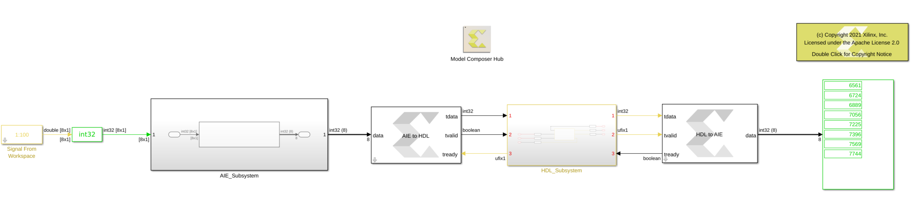

# Designs with AI Engine and HDL blocks

In this example, we are connecting an AI Engine block to an *AXI FIFO* HDL block. Note that the output of the AI Engine 
block is a vector of size 8 with and a period of 8 (i.e. one sample per second).

## Knowledge nuggets

:bulb: The inputs to the HDL domain and the outputs of the HDL domain are always scaler signals. 

:bulb: When the output of the AI Engine block is a vector, the HDL domain must be sampled at a higher sampling rate or else the internal memory of the AIE to HDL block will overflow.
In this example, the HDL domain is sampled at 8 times higher than the AI Engine domain. The sampling time of the HDL domain is set at the Gateway In blocks that should also match the *Output Sample Time* field of the *AIE to HDL block* block. 

------------
Copyright 2020 Xilinx

Licensed under the Apache License, Version 2.0 (the "License");
you may not use this file except in compliance with the License.
You may obtain a copy of the License at

    http://www.apache.org/licenses/LICENSE-2.0

Unless required by applicable law or agreed to in writing, software
distributed under the License is distributed on an "AS IS" BASIS,
WITHOUT WARRANTIES OR CONDITIONS OF ANY KIND, either express or implied.
See the License for the specific language governing permissions and
limitations under the License.
